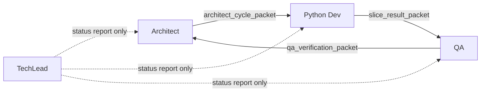
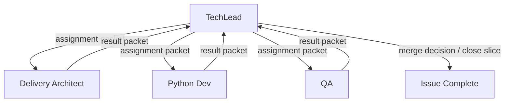

# Current Mesh vs TechLead Hub-and-Spoke Workflow

## Purpose

Compare the current Fractal Core consumer-side workflow pattern against the proposed TechLead-centered hub-and-spoke model, using the live PAA control-plane schema and data as the baseline.

This note is intentionally grounded in the real PAA database because PAA is the workflow control spine.
The question is not only how we want the workflow to feel; it is how the live schema, packet routes, handoffs, and persisted state already work and how they should adapt.

## Executive Summary

The live workflow today is a mesh-shaped packet chain:

- `Architect -> Python Dev -> QA -> Architect`

TechLead exists in the model, persists reports, and evaluates status, but does not currently control routing.

The proposed workflow is a hub-and-spoke pattern:

- `TechLead -> Delivery Architect`
- `TechLead -> Python Dev`
- `TechLead -> QA`
- each role returns a constrained result packet back to `TechLead`
- `TechLead` decides every next assignment and owns the canonical issue branch and issue lifecycle through merge

The good news is that the current PAA schema already has most of what is needed.
This is primarily a workflow-routing and ownership change, not a greenfield schema rewrite.

## Current Live Workflow Pattern

## Current role set in PAA

Live `paa.roles` currently contains:

- `Architect`
- `Product Owner`
- `Project Designer`
- `Python Dev`
- `QA`
- `TechLead`

## Current persisted packet routes

Live `paa.handoffs` route counts show the current effective workflow:

- `Architect -> Python Dev` via `architect_cycle_packet`: `3`
- `Python Dev -> QA` via `slice_result_packet`: `11`
- `QA -> Architect` via `qa_verification_packet`: `8`

That is the current consumer-side mesh in practice.

## Current packet compilation activity

Live `paa.automation_runs.trigger_type` counts show:

- `packet_compilation:slice_result_packet`: `11`
- `packet_compilation:qa_verification_packet`: `9`
- `packet_compilation:architect_cycle_packet`: `4`
- `techlead_status_report`: `7`

This means:
- packet compilation is already real and persisted
- TechLead reporting is real and persisted
- TechLead is currently observational, not the routing hub

## Current work item state shape

Live `paa.work_items` entries currently show accepted issues such as:

- `69`
- `71`
- `73`
- `101`
- `103`
- `106`
- `201`

Typical policy shape includes:
- `merge_policy = qa_required`
- `requires_qa = true`

So the current schema already expects QA-gated lifecycle progression.

## Current workflow shape

## Current strengths

- packet compilation exists
- queue/handoff persistence exists
- acceptance persistence exists
- TechLead reporting exists
- traceability view exists

## Current weaknesses

- routing responsibility is distributed
- branch ownership is unclear
- multiple roles can implicitly influence next-step decisions
- reset/rework decisions are not centralized
- automations need broader workflow intelligence than they should
- branch/worktree control is too hard to manage in a mesh

## Proposed TechLead Hub-and-Spoke Workflow

## Core proposal

TechLead becomes the single consumer-side workflow hub.

Responsibilities:
- create canonical issue branch `issue-<issue_number>`
- manage issue branch lifecycle through merge
- create or authorize role worktree branches when needed
- receive all result packets
- record status and decisions
- choose the next assignment every time
- decide rework, reset, requeue, escalation, or merge readiness

Other roles become bounded spoke workers.
They do not own routing.
They do not own issue lineage.
They do not invent branch strategy.

## Proposed workflow shape

## Canonical branch ownership in the new model

Canonical issue branch:
- `issue-<issue_number>`

Owner:
- `TechLead`

If concurrent worktrees are needed:
- `issue-<issue_number>-delivery`
- `issue-<issue_number>-dev`
- `issue-<issue_number>-qa`
- `issue-<issue_number>-techlead`

These are derived branches in the same issue lineage.
They do not replace the canonical issue branch.

## Role outputs in the new model

### Delivery Architect
Receives:
- TechLead assignment packet

Returns one constrained result type such as:
- `ready_for_dev`
- `narrow_scope`
- `reject_scope`
- `request_reset`
- `needs_authority_clarification`

### Python Dev
Receives:
- TechLead assignment packet

Returns one constrained result type such as:
- `implemented_ready_for_qa`
- `blocked`
- `needs_clarification`
- `cannot_complete_without_scope_change`

### QA
Receives:
- TechLead assignment packet

Returns one constrained result type such as:
- `pass`
- `fail_fixable`
- `fail_scope`
- `needs_human_review`

### TechLead
Receives:
- all role result packets

Returns routing decisions such as:
- `assign_delivery_architect`
- `assign_dev`
- `assign_qa`
- `return_to_dev`
- `return_to_delivery_architect`
- `reset_branch`
- `prepare_merge`
- `close_slice`

## What the DB already supports

The current PAA schema is already strong enough for most of this model.

## Tables that already fit the hub-and-spoke model

### `paa.work_items`
Already provides the slice anchor:
- issue identity
- status
- merge policy
- QA requirement

This can remain the central work item spine.

### `paa.design_packages`
Already provides the assignment basis for a slice.
No fundamental change required.

### `paa.coder_run_briefs`
Already provides scoped implementation assignments.
No fundamental change required.

### `paa.coder_brief_sequence_states`
Already provides readiness/blocking state.
This is useful for TechLead routing decisions.

### `paa.verification_obligations`
Already provides acceptance gating criteria.
This remains central for TechLead deciding whether QA outcomes are sufficient.

### `paa.handoffs`
Already models:
- `from_role_id`
- `to_role_id`
- `handoff_type`
- `status`
- timing

This table can represent the hub-and-spoke routes without schema redesign.
The main change is route policy, not table shape.

### `paa.queue_messages`
Already provides queue transport persistence per handoff.
No fundamental shape change required.

### `paa.automation_runs`
Already provides:
- packet compilation persistence
- TechLead report persistence
- work item linkage
- handoff linkage

This is a strong basis for a TechLead-controlled audit trail.

### `paa.acceptance_events`
Already provides the terminal acceptance record.
No major redesign required.

## What changes in the DB model are conceptual, not structural

The main live shift is this:

### Current route policy
- `Architect -> Python Dev`
- `Python Dev -> QA`
- `QA -> Architect`

### Target route policy
- `TechLead -> Delivery Architect`
- `Delivery Architect -> TechLead`
- `TechLead -> Python Dev`
- `Python Dev -> TechLead`
- `TechLead -> QA`
- `QA -> TechLead`

That can already be represented with existing:
- `paa.roles`
- `paa.handoffs`
- `paa.queue_messages`

So the first change is operational policy and packet contract, not schema surgery.

## Where the DB likely needs extension or stricter usage

The schema can support the new model now, but a cleaner hub-and-spoke implementation will likely benefit from explicit new metadata or tables.

## 1. Branch/worktree metadata

Current schema does not appear to have a first-class branch lifecycle table.
Right now branch facts are mostly inferred from:
- packet payload JSON
- GitHub PR state
- TechLead report logic

For the new model, TechLead ownership suggests we may want structured branch lineage persistence such as:
- canonical issue branch
- active role worktree branch
- branch owner role
- branch base SHA
- branch superseded/reset state

This could begin as `metadata_json` on:
- `paa.work_items`
- or `paa.handoffs`
- or `paa.automation_runs`

A dedicated branch/worktree table may eventually be cleaner, but it is not required for phase one.

## 2. Explicit assignment and result packet vocabulary

Today `handoff_type` is packet-shaped:
- `architect_cycle_packet`
- `slice_result_packet`
- `qa_verification_packet`

That matches the current mesh.

In the hub-and-spoke model, packet vocabulary likely needs to become more explicit about:
- assignment packet type
- result packet type
- route decision type
- reset/rework decision type

This may require:
- new packet schema types
- new `handoff_type` values
- no major relational redesign

## 3. TechLead-controlled transition semantics

Today TechLead mostly reports.
In the new model, TechLead becomes the transition authority.

That means we should treat TechLead persistence as workflow control, not only reporting.

Likely consequences:
- more `automation_runs` with TechLead trigger types beyond `techlead_status_report`
- more explicit decision metadata in `artifacts_json`
- possibly explicit decision rows in:
  - `paa.design_decisions`
  - or a new workflow-decision surface

## 4. Delivery Architect role naming

Today the DB role is `Architect`.
If we split producer Authority Architect from consumer Delivery Architect more sharply, we need to decide whether:
- keep DB role name `Architect` and reinterpret it operationally
- or add a new role `Delivery Architect`

For clarity, I recommend eventually adding an explicit consumer-side role name rather than overloading `Architect`.
But this is a transition design decision, not a blocker.

## Recommended phased adaptation

## Phase A: Workflow policy change without schema rewrite

Do first:
- redefine routing policy around TechLead as hub
- redefine branch/worktree ownership around TechLead
- redefine packet/result vocabulary
- update automation prompts and runbooks
- reuse existing tables

## Phase B: Persist branch lineage more explicitly

Then add structured persistence for:
- canonical issue branch
- role worktree branches
- reset/superseded status
- branch ownership

## Phase C: Add clearer packet and decision contracts

Then formalize:
- assignment packet types
- result packet types
- TechLead route-decision packet types

## Phase D: Rename or split consumer-side Architect role

Finally decide whether the DB role model should explicitly reflect:
- `Authority Architect` on producer side
- `Delivery Architect` on consumer side

## Bottom Line

The proposed hub-and-spoke model is compatible with the current PAA control spine.

What already exists and can be reused:
- work items
- design packages
- coder briefs
- readiness states
- verification obligations
- handoffs
- queue messages
- automation run persistence
- acceptance events

What really changes first:
- routing authority
- branch ownership
- packet/result vocabulary
- TechLead’s role from observer to controller

So the real migration is not “replace the database.”
It is:
- keep the control spine
- change the workflow topology
- then add explicit branch and decision persistence where the new model benefits from it
