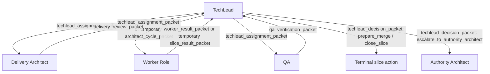

# TechLead Hub State And Routing Contract

## Purpose

Turn the TechLead hub packet vocabulary into an executable workflow contract.

This note defines:

1. allowed route matrix
2. per-role allowed result transitions
3. TechLead decision-to-next-packet mapping
4. branch/worktree actions tied to those decisions

It is intentionally grounded in the current PAA control spine.
The goal is to change workflow topology and packet routing without pretending the database must be redesigned first.

Related notes:
- `docs/2_Design/2026-05-04-current-mesh-vs-techlead-hub-spoke.md`
- `docs/2_Design/2026-05-04-techlead-hub-packet-and-decision-vocabulary.md`
- `docs/6_Deploy/2026-05-03-worktree-branch-strategy.md`

## Control-spine assumptions

The live PAA control plane already provides the statuses we should respect:

### `paa.work_item_status`
- `draft`
- `authorized`
- `in_progress`
- `ready_for_verification`
- `in_qa`
- `ready_for_acceptance`
- `accepted`
- `rejected`
- `superseded`
- `deferred`
- `blocked`

### `paa.handoff_status`
- `pending`
- `claimed`
- `completed`
- `blocked`
- `requeued`
- `abandoned`

### `paa.queue_message_status`
- `prepared`
- `sent`
- `claimed`
- `acknowledged`
- `requeued`
- `dead_lettered`
- `blocked`

This means the routing contract should primarily define:
- who may send what to whom
- what result types are legal
- what TechLead may decide next
- which existing work-item status should be set when that happens

Notably, we do **not** need new work-item statuses to start the hub migration.

## Core workflow rule

Consumer-side routing is hub-and-spoke.

Only `TechLead` may create the next assignment for another consumer-side role.

Allowed consumer-side spoke roles:
- `Delivery Architect`
- `Python Dev`
- `QA`
- future worker roles such as `Frontend Dev`, `Backend Dev`, `Infra Dev`, `Docs Dev`

Disallowed routing pattern:
- spoke role directly assigning another spoke role
- spoke role directly closing the slice
- spoke role directly choosing the next issue
- worker role inventing branch lineage

## Canonical route matrix

## Route families

There are only four route families in the target model:

1. `TechLead -> spoke assignment`
2. `spoke -> TechLead result`
3. `TechLead -> merge/closure action`
4. `TechLead -> Authority Architect escalation`

Everything else is disallowed.

## Allowed route matrix

| From role | To role | Allowed packet family | Allowed schema types now | Long-term schema target | Notes |
| --- | --- | --- | --- | --- | --- |
| `TechLead` | `Delivery Architect` | assignment | `techlead_assignment_packet` | `techlead_assignment_packet` | New hub assignment path. |
| `TechLead` | `Python Dev` | assignment | `architect_cycle_packet` or `techlead_assignment_packet` | `techlead_assignment_packet` | `architect_cycle_packet` is temporary only. |
| `TechLead` | `QA` | assignment | `techlead_assignment_packet` | `techlead_assignment_packet` | QA should no longer be fed directly by Dev. |
| `TechLead` | future worker role | assignment | `techlead_assignment_packet` | `techlead_assignment_packet` | Role carried as data, not schema fork. |
| `Delivery Architect` | `TechLead` | result | `delivery_review_packet` | `delivery_review_packet` | New specialized spoke result. |
| `Python Dev` | `TechLead` | result | `slice_result_packet` or `worker_result_packet` | `worker_result_packet` | `slice_result_packet` is temporary. |
| future worker role | `TechLead` | result | `worker_result_packet` | `worker_result_packet` | Generic worker-result pattern. |
| `QA` | `TechLead` | result | `qa_verification_packet` | `qa_verification_packet` | Existing QA schema retained. |
| `TechLead` | `Authority Architect` | escalation | `techlead_decision_packet` or explicit escalation artifact | `techlead_decision_packet` | Producer-side escalation, not consumer routing. |
| `TechLead` | terminal action | decision | `techlead_decision_packet` | `techlead_decision_packet` | Durable merge/close/reset decision artifact. |

## Explicitly disallowed routes

| Disallowed route | Reason |
| --- | --- |
| `Delivery Architect -> Python Dev` | Breaks hub ownership of routing. |
| `Delivery Architect -> QA` | Breaks hub ownership of routing. |
| `Python Dev -> QA` | This is the current mesh link and must be retired. |
| `QA -> Architect` | This is the current mesh link and must be retired. |
| `Python Dev -> Delivery Architect` | Spoke-to-spoke route. |
| `QA -> Python Dev` | QA may recommend rework, but TechLead assigns it. |
| any spoke -> `Authority Architect` | Consumer spoke roles escalate through TechLead. |

## Route matrix as a state diagram

## Per-role allowed result transitions

These transitions define what a result type means for the next workflow state.
The result itself does **not** execute the next route.
It constrains what `TechLead` may do next.

## Delivery Architect result transitions

| Result type | Meaning | Allowed next TechLead decisions | Typical work item status |
| --- | --- | --- | --- |
| `ready_for_dev` | scope and architecture are acceptable for implementation | `assign_worker` | `in_progress` |
| `narrow_scope` | slice should continue with reduced scope | `assign_delivery_architect`, `assign_worker`, `return_to_delivery_architect` | `in_progress` |
| `reject_scope` | current slice should not proceed as framed | `pause_slice`, `cancel_slice`, `escalate_to_authority_architect` | `blocked` or `deferred` |
| `request_reset` | branch or slice lineage should be reset before more work | `reset_branch`, `return_to_delivery_architect`, `assign_worker` | `blocked` then `in_progress` |
| `needs_authority_clarification` | producer-side authority decision required | `escalate_to_authority_architect`, `pause_slice` | `blocked` |
| `needs_human_architect_review` | human-level architectural acceptance needed before continuing | `escalate_to_authority_architect`, `pause_slice` | `blocked` |

## Worker result transitions

This applies to `Python Dev` now and future worker roles later.

| Result type | Meaning | Allowed next TechLead decisions | Typical work item status |
| --- | --- | --- | --- |
| `implemented_ready_for_qa` | implementation complete enough for verification | `assign_qa` | `ready_for_verification` |
| `blocked` | worker cannot continue without intervention | `return_to_delivery_architect`, `assign_worker`, `escalate_to_authority_architect`, `pause_slice` | `blocked` |
| `needs_clarification` | worker needs scope or design clarification | `return_to_delivery_architect`, `assign_worker`, `pause_slice` | `blocked` or `in_progress` |
| `cannot_complete_without_scope_change` | authorized slice is insufficient or wrong | `return_to_delivery_architect`, `escalate_to_authority_architect`, `pause_slice` | `blocked` |
| `superseded_by_branch_reset` | worker result invalidated by TechLead reset decision | `reset_branch`, `assign_worker` | `superseded` for old branch lineage; active slice remains `in_progress` |
| `implemented_ready_for_peer_review` | optional future intermediate review state | `assign_worker`, `assign_qa` | `in_progress` or `ready_for_verification` |
| `implemented_ready_for_multi_role_qa` | optional future multi-team verification gate | `assign_qa` | `ready_for_verification` |

## QA result transitions

| Result type | Meaning | Allowed next TechLead decisions | Typical work item status |
| --- | --- | --- | --- |
| `pass` | verification sufficient for acceptance path | `prepare_merge` | `ready_for_acceptance` |
| `fail_fixable` | implementation is fixable without reframing authority | `return_to_worker` | `in_progress` |
| `fail_scope` | verification found scope or contract violation | `return_to_delivery_architect`, `escalate_to_authority_architect`, `pause_slice` | `blocked` |
| `needs_human_review` | QA cannot safely auto-resolve the outcome | `return_to_delivery_architect`, `escalate_to_authority_architect`, `pause_slice` | `blocked` |
| `blocked` | QA could not finish review due to environment or missing prerequisites | `return_to_worker`, `assign_qa`, `pause_slice` | `blocked` |

## TechLead decision-to-next-packet mapping

This is the hub contract.
A TechLead decision determines the only legal next packet family and branch action.

| TechLead decision type | Triggered by | Next packet/action | Next target | Work item status target | Notes |
| --- | --- | --- | --- | --- | --- |
| `assign_delivery_architect` | initial slice activation, scope concern, architecture concern | `techlead_assignment_packet` | `Delivery Architect` | `in_progress` | Preferred first gate when architecture review is needed. |
| `assign_worker` | authorized slice ready for implementation | `techlead_assignment_packet` or temporary `architect_cycle_packet` | worker role | `in_progress` | Long-term assignment family should be generic. |
| `assign_qa` | worker result `implemented_ready_for_qa` | `techlead_assignment_packet` | `QA` | `in_qa` | Replaces old Dev -> QA direct route. |
| `return_to_delivery_architect` | scope/design ambiguity or QA scope failure | `techlead_assignment_packet` | `Delivery Architect` | `blocked` or `in_progress` | TechLead should include the triggering packet reference. |
| `return_to_worker` | QA `fail_fixable`, worker clarification follow-up | `techlead_assignment_packet` | prior or selected worker role | `in_progress` | Often same role branch reused unless reset required. |
| `return_to_qa` | verification rerun needed without worker handoff change | `techlead_assignment_packet` | `QA` | `in_qa` | Used after environment or evidence-only correction. |
| `escalate_to_authority_architect` | authority conflict, contract ambiguity, human architecture decision | `techlead_decision_packet` plus producer-side escalation record | `Authority Architect` | `blocked` | Consumer-side routing pauses until resolved. |
| `reset_branch` | bad lineage, stale branch, contaminated worktree, forced rewrite | `techlead_decision_packet` followed by new assignment packet | selected spoke role | `blocked` then `in_progress` | Canonical branch survives; role branch may be replaced. |
| `supersede_branch_lineage` | prior branch outcome invalidated and replaced | `techlead_decision_packet` then next assignment as needed | selected spoke role or none | `superseded` for old lineage context | Important for auditability, especially with worktrees. |
| `prepare_merge` | QA `pass` and acceptance gate satisfied | `techlead_decision_packet` | none or merge operator path | `ready_for_acceptance` | Merge itself may still be performed by TechLead or a designated acceptance operator. |
| `close_slice` | merge done and final acceptance recorded | `techlead_decision_packet` | none | `accepted` | Terminal success state. |
| `pause_slice` | human stop, unresolved blocker, waiting state | `techlead_decision_packet` | none | `blocked` or `deferred` | Explicit non-terminal hold. |
| `cancel_slice` | slice abandoned or invalidated | `techlead_decision_packet` | none | `rejected` or `superseded` | Use carefully; distinguish from reset. |

## Branch and worktree action contract

## Canonical branch rule

Every active slice has one canonical branch:
- `issue-<issue_number>`

Owner:
- `TechLead`

The canonical branch is the durable issue lineage.
It should survive worker resets unless the entire slice is canceled or superseded.

## Derived role branch rule

When isolated worktrees are required, role branches are derived from the canonical branch:
- `issue-<issue_number>-delivery`
- `issue-<issue_number>-dev`
- `issue-<issue_number>-qa`
- `issue-<issue_number>-<future-worker-role>`

Role branches are disposable execution surfaces.
They are not independent truth lines.

## Decision-to-branch action mapping

| TechLead decision type | Canonical branch action | Role branch action | Worktree action |
| --- | --- | --- | --- |
| `assign_delivery_architect` | create if missing; otherwise keep current tip | create or refresh `issue-<n>-delivery` if isolated worktree needed | create or reuse Delivery worktree |
| `assign_worker` | create if missing; otherwise keep current tip | create or refresh `issue-<n>-<worker-role>` | create or reuse worker worktree |
| `assign_qa` | keep canonical branch unchanged | create or refresh `issue-<n>-qa` if isolated worktree needed | create or reuse QA worktree |
| `return_to_delivery_architect` | keep canonical branch; do not advance until review outcome | reuse or recreate delivery branch based on decision context | reuse unless contaminated |
| `return_to_worker` | keep canonical branch; do not advance until fix ready | usually reuse worker branch; recreate only if reset required | reuse unless contaminated |
| `return_to_qa` | keep canonical branch | reuse QA branch | reuse QA worktree |
| `reset_branch` | keep canonical issue branch as the durable lineage root unless explicit cancellation | delete and recreate affected role branch from canonical branch | delete and recreate affected worktree |
| `supersede_branch_lineage` | keep canonical branch and record superseded lineage in metadata | retire old role branch; create replacement branch if new work continues | delete old worktree after evidence capture |
| `prepare_merge` | fast-forward or reconcile accepted work into canonical branch | role branches should be considered frozen | worktrees become read-only or disposable |
| `close_slice` | canonical branch may be merged and deleted per repo policy | delete stale role branches | delete stale worktrees |
| `pause_slice` | no branch movement | no branch mutation unless needed for hygiene | worktrees may remain parked |
| `cancel_slice` | canonical branch retained or deleted per audit policy | delete derived role branches after evidence capture | delete derived worktrees after evidence capture |

## Worktree hygiene rules

1. Only `TechLead` authorizes creation of a new role branch lineage.
2. Spoke roles do not invent new branch names.
3. Worktree resets should preserve any needed evidence before deletion.
4. A role worktree should be recreated after contamination, stale base, or explicit `reset_branch`.
5. Canonical issue branch should remain the stable anchor even when role branches are recycled.

## Minimal transition contract

If we want the smallest viable change from today:

### Step 1
- keep `slice_result_packet`
- route it to `TechLead`, not `QA`
- keep `qa_verification_packet`
- route it to `TechLead`, not `Architect`

### Step 2
- let `TechLead` emit every next assignment
- use temporary `architect_cycle_packet` only where the new assignment packet is not ready yet

### Step 3
- introduce `techlead_assignment_packet`
- introduce `techlead_decision_packet`

### Step 4
- replace `slice_result_packet` with `worker_result_packet`
- add `delivery_review_packet`
- generalize to more worker roles

## Practical control-plane adaptation

## What changes now

Operational policy changes:
- allowed route matrix
- queue destination rules
- packet compiler destination role rules
- TechLead as the only consumer-side routing authority

Persisted-data changes that can happen without new tables:
- new `schema_type` values in queue payloads
- new `handoff_type` values in `paa.handoffs`
- branch lineage metadata in `metadata_json`
- new `automation_runs.trigger_type` values for TechLead assignment and decision compilation

## What can wait

These can be deferred until the hub workflow is proven:
- dedicated branch lineage table
- dedicated TechLead decision table
- new work-item statuses
- role table renaming from `Architect` to `Delivery Architect`

## Bottom line

The state-and-routing contract for the TechLead hub is:

1. only `TechLead` may route between consumer-side roles
2. spoke roles return constrained result packets only to `TechLead`
3. `TechLead` decisions determine the only legal next packet and branch action
4. canonical branch `issue-<n>` is owned by `TechLead`
5. role branches and worktrees are disposable execution surfaces under that canonical lineage

That gives us a workflow contract we can automate, test, and evolve to future worker roles without reintroducing mesh chaos.
