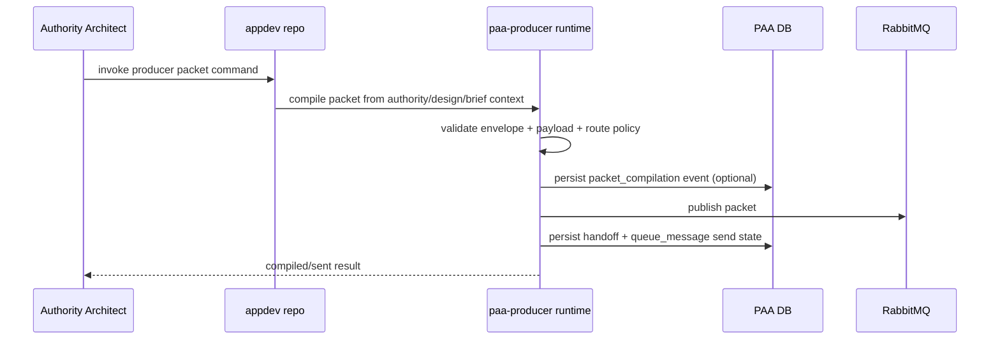
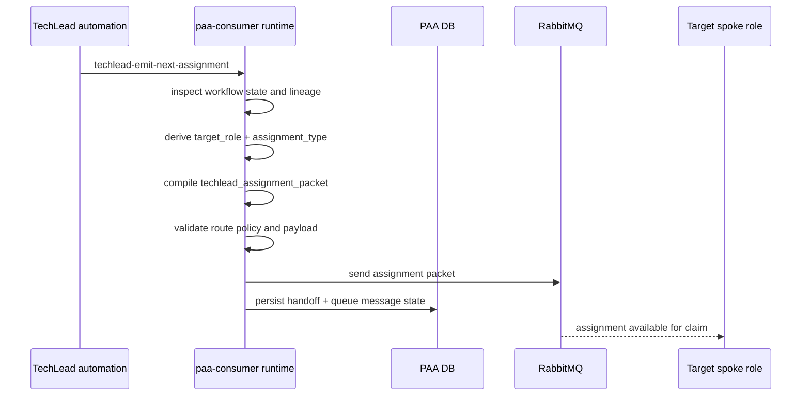
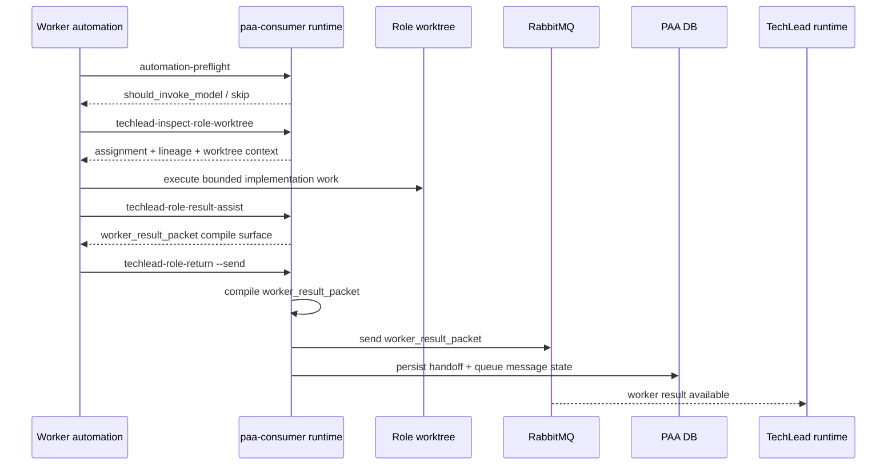
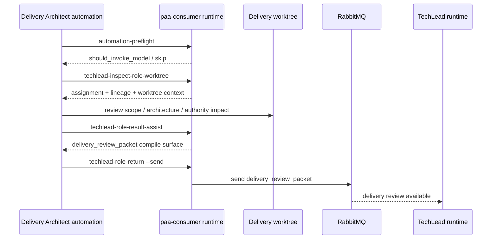
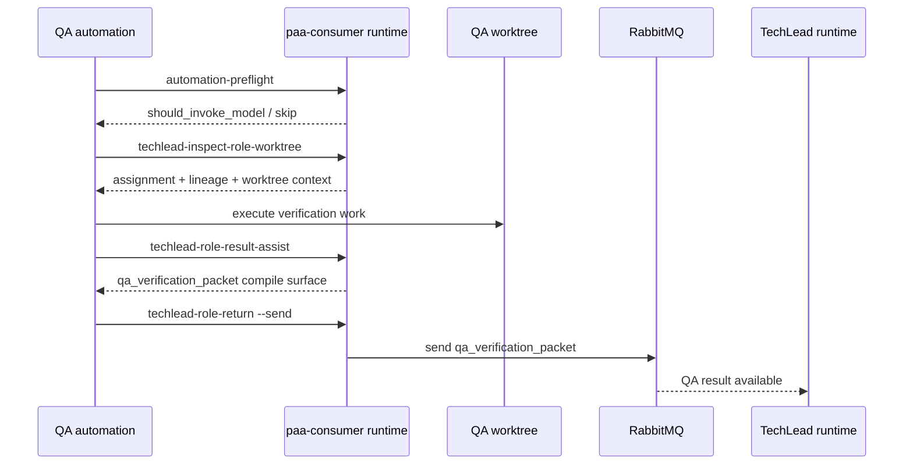
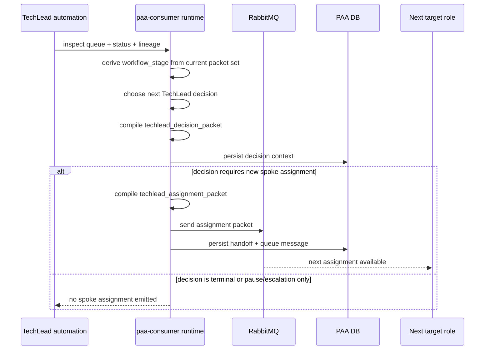
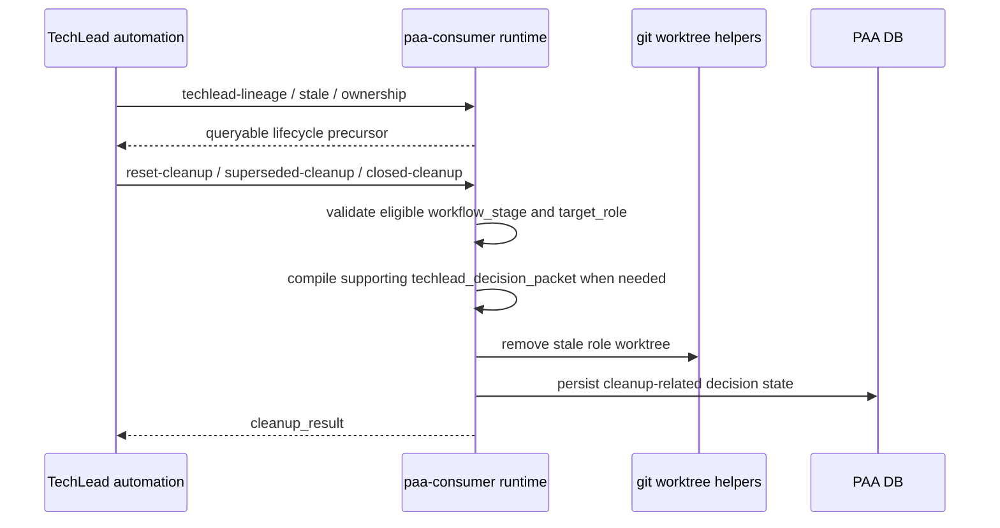
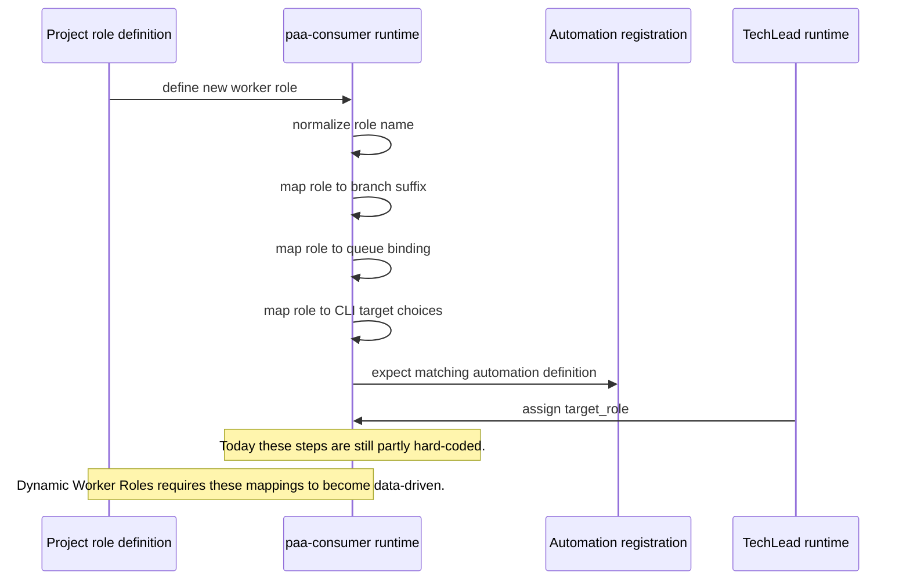

# PAA Sequence Diagrams

## Purpose

Show the major call chains in the PAA system so design work can reason about runtime ownership, side effects, and hard-coded seams.

These sequences focus on the current target architecture:
- Authority Architect producer flow
- TechLead assignment flow
- generic worker return flow
- Delivery Architect return flow
- QA return flow
- lifecycle cleanup flow

## 1. Producer Packet Compilation And Send

## 2. TechLead Assignment Flow

## 3. Generic Worker Role Return Flow

## 4. Delivery Architect Return Flow

## 5. QA Return Flow

## 6. TechLead Decision And Next Routing Flow

## 7. Lifecycle Cleanup Flow

## 8. Dynamic Worker Role Stress Point Sequence

This sequence shows where the current system stops being dynamic.

## Sequence Summary

The call chains are already structurally sound.
The main non-dynamic seams are not the DB or the packet envelope.
They are:
- role discovery
- route-policy derivation
- queue binding derivation
- branch suffix derivation
- automation-definition derivation
- CLI and helper-role enumeration
