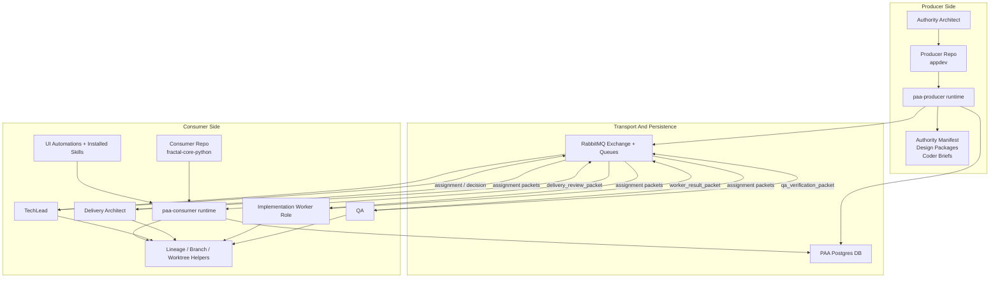

# PAA System Component Diagram

## Purpose

Provide one visible system-level view of the current PAA architecture so future design work, especially Dynamic Worker Roles, is grounded in the real component boundaries.

Primary updated system-design view:
- `docs/2_Design/2026-05-13-paa-system-component-diagram-v2.md`

This note focuses on:
- system components
- control-plane relationships
- transport relationships
- runtime ownership boundaries
- current hard-coded seams that will matter for dynamic worker-role design

## System Components

## Component Roles

### Producer side

#### `Authority Architect`
Owns:
- published authority
- next-issue selection
- design package and brief production
- producer-side acceptance / merge governance

#### Producer repo
Current proving repo:
- `<producer_repo_root>`

Holds:
- authority-facing skills
- repo-local producer runtime install
- producer-side prompts / automation surfaces

#### `paa-producer runtime`
Primary responsibilities:
- compile producer-side packets
- validate packet envelopes and payloads
- persist packet-compilation events to DB
- publish packets to RabbitMQ
- translate authority/design context into packet payloads

### Transport and persistence

#### RabbitMQ
Responsibilities:
- handoff transport
- queue visibility
- claim / ack flow
- cross-role packet delivery

Current queue model:
- `fractal-core-architecture`
- `fractal-core-python`
- `fractal-core-qa`

#### PAA Postgres DB
Responsibilities:
- durable control-plane history
- project / role / work-item persistence
- handoff persistence
- queue-message persistence
- automation run persistence
- design package and brief persistence

Important current property:
- `paa.roles` is row-based and generic
- the DB can store arbitrary roles per project
- the DB is not the current blocker for dynamic roles

### Consumer side

#### Consumer repo
Current proving repo:
- `<consumer_repo_root>`

Holds:
- repo-local consumer runtime install
- installed project-pack automations and skills
- consumer-side runtime state
- prepared role worktrees

#### `paa-consumer runtime`
Primary responsibilities:
- read and validate queue packets
- inspect current workflow state
- emit TechLead assignment / decision packets
- manage lineage / branch / worktree helpers
- provide role bridge helper commands
- drive automation preflight and role-entry surfaces

#### `TechLead`
Owns:
- consumer-side routing hub behavior
- assignment emission
- decision emission
- canonical branch / lineage authority
- lifecycle decisions
- merge-readiness and closure decisions on the consumer side

#### `Delivery Architect`
Specialized spoke role:
- architectural review
- scoped route-shaping back to `TechLead`
- returns `delivery_review_packet`

#### `Implementation Worker Role`
Generalized worker lane:
- bounded implementation work
- returns `worker_result_packet`
- currently proven for `Python Dev`
- intended to expand to future worker roles

#### `QA`
Specialized spoke role:
- verification and acceptance-readiness review
- returns `qa_verification_packet`

#### Lineage / branch / worktree helpers
Responsibilities:
- canonical branch and role-branch inspection
- worktree ownership and staleness reporting
- lifecycle cleanup helpers
- role worktree preparation and inspection

#### UI automations + installed skills
Responsibilities:
- app-visible automation registration
- automation launch surface
- role-specific instructions and execution prompts
- no-work preflight gating before model invocation

## Component Relationships That Matter For Dynamic Worker Roles

### DB vs runtime

The DB already models roles generically.
The runtime does not.

That means Dynamic Worker Roles is not primarily a schema-table problem.
It is a:
- runtime contract problem
- route-policy problem
- automation-definition problem
- role-discovery problem

### Current hard-coded seams

These are the main places where worker roles are still enumerated in code:
- role normalization
- route policy
- branch suffix mapping
- CLI `--target-role` choices
- automation naming / registration assumptions
- queue-topology assumptions

### Current generic seams

These are the places already compatible with dynamic design direction:
- `paa.roles`
- `paa.handoffs`
- `paa.queue_messages`
- packet payload fields such as `target_role`, `worker_role`, and `worker_family`

## Design Implication

Dynamic Worker Roles should be designed as a system-wide contract across:
- project role definitions
- queue routing
- assignment vocabulary
- branch / worktree naming
- automation registration and launch
- role bridge helper behavior

If we only change packet payloads and leave the rest hard-coded, we will still not have a dynamic role system.
