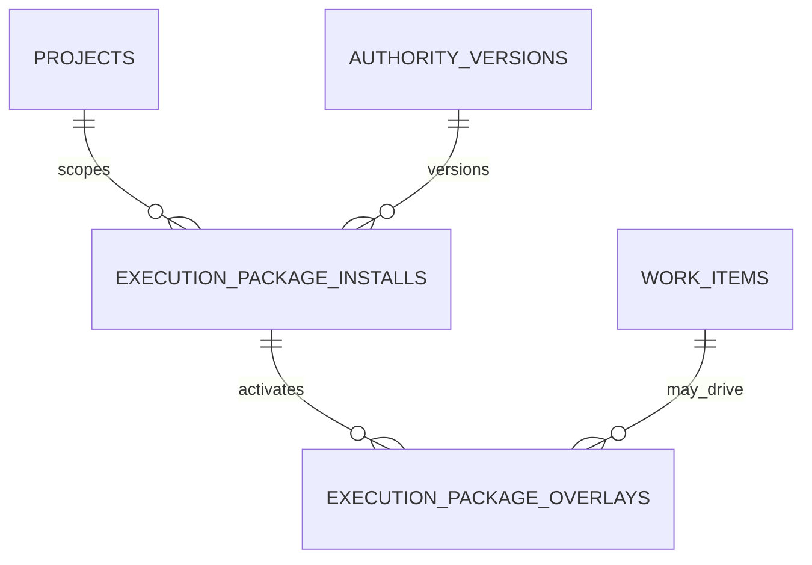

# Final Execution-Package Registration Entity Design

Date: 2026-05-13

## Purpose

Finalize the DB-primary entity design for installed execution-package registration state in PAA.

This note defines the missing DB entities that answer these questions directly:
- which Installed Execution Package is currently active for a given consumer execution surface
- which overlays are currently active on that installed package
- what package and overlay history led to the current execution-time truth

This is a DB entity design note.
It is not yet a Data Access Layer note and not yet an implementation note.

## Related Notes

Read alongside:
- `/Users/billyweisberg/Repos/billyweisberg/paa-platform/docs/3_Plan/2026-05-13-paa-db-model-completion-plan.md`
- `/Users/billyweisberg/Repos/billyweisberg/paa-platform/docs/2_Design/2026-05-13-paa-stable-table-classification-and-ownership-map.md`
- `/Users/billyweisberg/Repos/billyweisberg/paa-platform/docs/2_Design/2026-05-13-paa-db-primary-data-consolidation-audit.md`
- `/Users/billyweisberg/Repos/billyweisberg/paa-platform/docs/2_Design/2026-05-13-paa-db-model-diagram-and-gap-analysis.md`
- `/Users/billyweisberg/Repos/billyweisberg/paa-platform/docs/2_Design/2026-05-13-paa-runtime-consolidation-design-correction.md`
- `/Users/billyweisberg/Repos/billyweisberg/paa-platform/docs/2_Design/2026-05-13-paa-v2-component-relationships.md`

## Design Status

This note provides the final DB entity-shape baseline for the execution-package registration layer identified in the DB Model Completion Plan.

It resolves the structural choices that were still implicit in earlier notes.

## Final Decisions

This note locks the following decisions:

1. `paa.execution_package_installs` will be a dedicated table.
2. `paa.execution_package_overlays` will be a dedicated table.
3. `paa.execution_package_installs` will represent install registrations as historical rows with an active-state flag and uniqueness constraints that allow one active install per execution surface.
4. `paa.execution_package_overlays` will represent overlay activation history as historical rows with an active-state flag and uniqueness constraints that allow one active overlay row per overlay key within one active install.
5. package files under `.project/data/paa/authority/current/` remain local installed runtime inputs, but they are not the canonical source of install truth.
6. overlay metadata files remain local installed package artifacts, but they are not the canonical source of overlay activation truth.
7. consumer runtime must be able to answer current install and overlay state from DB without needing local metadata files as the primary source.

## Why These Decisions Are Final

### Why `execution_package_installs` is a dedicated table

The system needs a DB-primary answer to:
- what package is installed here now
- which authority version it came from
- when it was installed
- whether it is still active
- what it replaced

That is operational truth.
It should not be reconstructed only from:
- `.project/data/paa/authority/current/package-metadata.json`
- `.codex/paa/install-metadata.json`

So install registration belongs in a dedicated DB table.

### Why `execution_package_overlays` is a dedicated table

Overlay activation changes execution-time truth.
That makes overlay activation operational truth too.

It should not be reconstructed only from:
- `.project/data/paa/authority/current/overlays/**/overlay-metadata.json`
- `.project/data/paa/authority/current/overlays/**/manifest-task.json`

So overlay activation belongs in a dedicated DB table tied to a specific install registration.

### Why these are historical rows, not one mutable singleton record

Install and overlay state both need provenance.
We need to preserve:
- prior installs
- prior replacements
- prior overlay activations
- removals and deactivations

So the model keeps historical rows and marks the current active rows explicitly, rather than storing truth in a single mutable file or a single overwritten row.

## Entity 1: `paa.execution_package_installs`

## Role

Represent the DB-primary registration of an Installed Execution Package on a specific consumer execution surface.

## Ownership

Semantic owner:
- `Installed Execution Package Manager`

Writers:
- execution-package install and refresh flows
- execution-package removal or replacement flows
- repair tooling for explicit install-state repair

Readers:
- runtime lifecycle entry points when package identity matters
- workflow-state resolution when package/brief context must be resolved
- reporting and traceability
- operator tooling

## Primary key and uniqueness

### Primary key
- `execution_package_install_id`

### Required uniqueness
- at most one row with `install_status = active` for a given `execution_surface_key`

This means one consumer execution surface has one current active install registration at a time.

## Required columns

### Identity and scoping
- `execution_package_install_id`
- `project_id`
- `authority_version_id`
- `installed_by_agent_id`
- `installed_by_role_id`

### Execution surface identity
- `execution_surface_type`
- `execution_surface_key`
- `repo_root_path`
- `runtime_root_path`
- `install_slot_name`

### Package identity
- `package_name`
- `package_version`
- `package_build_ref`
- `package_hash`
- `package_schema_version`

### Install state
- `install_status`
- `installed_from_source`
- `superseded_by_install_id`
- `replaced_install_id`
- `deactivation_reason_code`
- `deactivation_reason_text`

### Package content pointers
- `installed_manifest_path`
- `installed_package_metadata_path`
- `installed_docs_root_path`
- `installed_artifacts_root_path`

### Timing
- `installed_at`
- `activated_at`
- `deactivated_at`
- `created_at`
- `updated_at`

### Metadata
- `metadata_json`

## Enumerations

### `execution_surface_type`
Final target values:
- `consumer_repo_runtime`
- `repo_local_runtime`
- `test_fixture_runtime`
- `repair_runtime`

### `install_status`
Final target values:
- `active`
- `superseded`
- `removed`
- `failed`
- `repaired`

### `installed_from_source`
Final target values:
- `published_authority_package`
- `published_authority_package_with_overlay`
- `pilot_fixture_overlay_install`
- `manual_repair_install`

## Invariants

1. there may be many install rows over time for one execution surface, but at most one active install row at a time
2. `install_status = active` requires `activated_at`
3. `install_status = superseded` requires `deactivated_at`
4. if `replaced_install_id` is set, it must point to an older install row for the same `execution_surface_key`
5. if `superseded_by_install_id` is set, it must point to a newer install row for the same `execution_surface_key`
6. `authority_version_id` must always be present for a valid install registration
7. file paths stored here are pointers to installed artifacts, not the canonical truth themselves

## Entity 2: `paa.execution_package_overlays`

## Role

Represent DB-primary activation history for overlays applied to an installed execution package.

## Ownership

Semantic owner:
- `Installed Execution Package Manager`

Writers:
- overlay install flows
- overlay removal flows
- repair tooling for explicit overlay-state repair

Readers:
- runtime lifecycle entry points when overlay-adjusted execution truth matters
- reporting and traceability
- operator tooling

## Primary key and uniqueness

### Primary key
- `execution_package_overlay_id`

### Required uniqueness
- at most one row with `overlay_status = active` for a given pair of:
  - `execution_package_install_id`
  - `overlay_key`

This allows multiple active overlays on one install, but not duplicate active rows for the same overlay key.

## Required columns

### Identity and linkage
- `execution_package_overlay_id`
- `execution_package_install_id`
- `project_id`
- `authority_version_id`
- `work_item_id`
- `activated_by_agent_id`
- `activated_by_role_id`

### Overlay identity
- `overlay_key`
- `overlay_type`
- `overlay_name`
- `overlay_version`
- `overlay_hash`
- `overlay_schema_version`

### Overlay state
- `overlay_status`
- `overlay_source`
- `replaced_overlay_id`
- `superseded_by_overlay_id`
- `deactivation_reason_code`
- `deactivation_reason_text`

### Overlay content pointers
- `overlay_root_path`
- `overlay_metadata_path`
- `overlay_manifest_task_path`
- `overlay_summary_path`

### Timing
- `activated_at`
- `deactivated_at`
- `created_at`
- `updated_at`

### Metadata
- `metadata_json`

## Enumerations

### `overlay_type`
Final target values:
- `pilot_fixture`
- `task_override`
- `authority_patch`
- `repair_overlay`

### `overlay_status`
Final target values:
- `active`
- `superseded`
- `removed`
- `failed`
- `repaired`

### `overlay_source`
Final target values:
- `published_package_overlay`
- `pilot_fixture_overlay_install`
- `manual_repair_overlay`

## Invariants

1. an overlay row must always point to an existing `execution_package_install_id`
2. an active overlay requires its parent install row to be active
3. there may be many overlay rows over time for one overlay key on one install, but at most one active row for that overlay key on that install
4. `overlay_status = active` requires `activated_at`
5. `overlay_status = superseded` requires `deactivated_at`
6. a removed or superseded install may not gain new active overlays
7. file paths stored here are pointers to installed overlay artifacts, not canonical truth themselves

## Relationship Map

## Current-State Query Rules

The DB-primary answer to these questions should be:

### Current installed package for a consumer execution surface
Query:
- `execution_package_installs`
- filtered by `execution_surface_key`
- with `install_status = active`

### Current active overlays for that install
Query:
- `execution_package_overlays`
- filtered by `execution_package_install_id`
- with `overlay_status = active`

That means local filesystem metadata is no longer the authoritative answer.
It is only an artifact pointer and inspection aid.

## What Stays Outside These Entities

These entities do not replace:
- the installed package files under `.project/data/paa/authority/current/`
- the installed overlay artifact files under `.project/data/paa/authority/current/overlays/`
- source-controlled schema files
- design packages or coder briefs

Those remain necessary.

But none of them should again be treated as the canonical answer to:
- what package is installed now
- what overlays are active now

That answer belongs to these DB entities.

## Interaction With Existing Tables

### Consumes but does not replace
- `paa.projects`
- `paa.authority_versions`
- `paa.work_items`
- `paa.design_packages`
- `paa.coder_run_briefs`

### Why `work_item_id` is on overlays but not required on installs
An install can represent a general authority-package install or refresh event.
An overlay is more likely to be tied to one specific disposable slice or repair action.

So:
- install rows are package-surface registrations
- overlay rows may additionally carry slice-specific linkage

## Transaction Boundary Rule

For any install refresh or replacement that changes current execution-package truth:
1. create the new `execution_package_installs` row
2. mark the replaced install row as superseded or removed if applicable
3. create any new `execution_package_overlays` rows tied to the new install
4. mark replaced overlay rows as superseded or removed if applicable
5. do all of this inside one DB transaction boundary

This is the anti-drift rule for install truth.

## Migration Guidance From This Final Design

The next DB migration design should implement:
- one `execution_package_installs` table with uniqueness enforcement for one active install per execution surface
- one `execution_package_overlays` table with uniqueness enforcement for one active overlay per overlay key per install

The migration should also introduce:
- foreign-key links to `paa.projects`, `paa.authority_versions`, `paa.work_items`, `paa.roles`, and `paa.agents` where appropriate
- indexes on active-install queries, install history queries, active-overlay queries, and work-item overlay queries

## Hard Conclusion

The execution-package registration layer is now simple enough to implement without fuzzy semantics:
- one install-registration table
- one overlay-activation table
- active state is DB-primary
- file metadata becomes artifact pointers, not truth

That is the final V2 execution-package registration entity design baseline.
