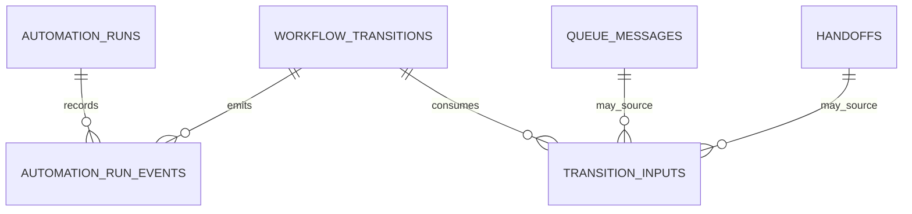

# Final Runtime Input And Run-Event Entity Design

Date: 2026-05-13

## Purpose

Finalize the DB-primary entity design for the remaining runtime-event gaps in the PAA data model:
- structured transition inputs
- structured automation run events

This note defines the DB entities that answer these questions directly:
- what structured transition input materially participated in a workflow transition
- what structured milestones and outcomes occurred during an automation run
- which parts of runtime history belong in DB rows versus raw file logs

This is a DB entity design note.
It is not yet a Data Access Layer note and not yet an implementation note.

## Related Notes

Read alongside:
- `/Users/billyweisberg/Repos/billyweisberg/paa-platform/docs/3_Plan/2026-05-13-paa-db-model-completion-plan.md`
- `/Users/billyweisberg/Repos/billyweisberg/paa-platform/docs/2_Design/2026-05-13-final-workflow-state-entity-design.md`
- `/Users/billyweisberg/Repos/billyweisberg/paa-platform/docs/2_Design/2026-05-13-final-execution-package-registration-entity-design.md`
- `/Users/billyweisberg/Repos/billyweisberg/paa-platform/docs/2_Design/2026-05-13-paa-stable-table-classification-and-ownership-map.md`
- `/Users/billyweisberg/Repos/billyweisberg/paa-platform/docs/2_Design/2026-05-13-paa-db-primary-data-consolidation-audit.md`
- `/Users/billyweisberg/Repos/billyweisberg/paa-platform/docs/2_Design/2026-05-12-paa-handoff-execution-contract.md`

## Final Decisions

This note locks the following decisions:

1. `paa.transition_inputs` will be a dedicated table.
2. `paa.automation_run_events` will be a dedicated append-only table.
3. `paa.transition_inputs` will store structured transition input facts only when those facts are operationally significant to workflow transition semantics, recovery, or audit.
4. `paa.automation_run_events` will store structured milestones and outcomes, not raw log streams.
5. queue packet payload JSON remains in `paa.queue_messages.payload_json`, but this does not eliminate the need for `paa.transition_inputs`.
6. repo-local report JSON and file-only run summaries are demoted to projections or raw evidence, not canonical runtime truth.

## Why These Decisions Are Final

### Why `transition_inputs` is a dedicated table

The system needs a DB-primary answer to:
- which structured input was used to produce or validate a transition
- which reviewed result input or role input the runtime relied on
- which transition-relevant structured facts are recoverable even if local report files disappear

That cannot rely only on:
- `.project/data/paa/reports/role-result-input.*.json`
- `.project/data/paa/reports/*.json`
- packet payloads alone

Packet payloads are necessary, but they are not enough for all transition-input provenance.

So `paa.transition_inputs` becomes the canonical row-level registration of transition-relevant structured inputs.

### Why `automation_run_events` is a dedicated table

The system needs DB-queryable answers to:
- what meaningful milestones a run passed through
- whether preflight, claim, execution, validation, send, ack, merge, or closeout succeeded
- what failure or compensation event occurred

That should not require parsing only:
- `.project/data/paa/logs/automations/*/summary.json`
- `.project/data/paa/logs/automations/*/events.jsonl`

So `paa.automation_run_events` becomes the structured milestone history for automation runs.

## Entity 1: `paa.transition_inputs`

## Role

Represent the DB-primary registration of structured transition inputs that materially affect runtime transition behavior.

## Ownership

Semantic owner:
- `Runtime Lifecycle Engine`

Writers:
- runtime paths that generate or consume transition-relevant structured inputs
- repair tooling for transition-input registration repair

Readers:
- `Workflow State Machine`
- runtime lifecycle closeout and repair flows
- reporting/traceability
- operator tooling

## Primary key
- `transition_input_id`

## Required columns

### Identity and scoping
- `transition_input_id`
- `project_id`
- `work_item_id`
- `workflow_state_id`
- `workflow_transition_id`
- `automation_run_id`

### Input identity
- `input_type`
- `input_schema_type`
- `input_source_surface`
- `input_key`
- `input_hash`

### Source linkage
- `source_queue_message_id`
- `source_handoff_id`
- `source_message_id_external`
- `source_report_path`

### Content registration
- `payload_json`
- `content_summary_json`
- `schema_version`

### Timing
- `captured_at`
- `created_at`

### Metadata
- `metadata_json`

## Enumerations

### `input_type`
Final target values:
- `assignment_input`
- `role_result_input`
- `delivery_review_input`
- `qa_verification_input`
- `decision_input`
- `repair_input`

### `input_source_surface`
Final target values:
- `queue_packet`
- `runtime_report_artifact`
- `generated_runtime_input`
- `repair_tool`

## Invariants

1. every `transition_inputs` row must tie to exactly one work item
2. a transition input may be recorded before its linked `workflow_transition_id` is known, but it must later be attachable to one specific transition if it materially contributed to that transition
3. `payload_json` is canonical structured input content; file paths are secondary pointers only
4. a transition input row is not a projection and must remain queryable even if local report files are removed

## Entity 2: `paa.automation_run_events`

## Role

Represent structured, append-only milestone and outcome events for one automation run.

## Ownership

Semantic owner:
- `Runtime Lifecycle Engine`

Writers:
- automation execution paths
- repair tooling for explicit run-event repair when necessary

Readers:
- reporting/traceability
- operator tooling
- recovery/repair tooling
- future analytics tooling

## Primary key and ordering

### Primary key
- `automation_run_event_id`

### Ordering rule
- event order for one `automation_run_id` is defined by `event_recorded_at`, with a stable tie-breaker on `automation_run_event_id`

## Required columns

### Identity and scoping
- `automation_run_event_id`
- `automation_run_id`
- `project_id`
- `work_item_id`
- `workflow_state_id`
- `workflow_transition_id`

### Event definition
- `event_type`
- `event_status`
- `event_phase`
- `event_reason_code`
- `event_reason_text`

### Runtime linkage
- `role_id`
- `agent_id`
- `handoff_id`
- `queue_message_id`
- `queue_claim_id`
- `message_id_external`

### Event content
- `event_summary_json`
- `evidence_ref`
- `raw_log_pointer`

### Timing
- `event_recorded_at`
- `created_at`

### Metadata
- `metadata_json`

## Enumerations

### `event_type`
Final target values:
- `run_started`
- `preflight_completed`
- `claim_acquired`
- `worktree_prepared`
- `execution_started`
- `validation_completed`
- `result_compiled`
- `result_sent`
- `source_packet_acked`
- `transition_applied`
- `merge_completed`
- `issue_closed`
- `run_blocked`
- `run_failed`
- `run_completed`
- `manual_repair_event`

### `event_status`
Final target values:
- `info`
- `success`
- `warning`
- `failure`
- `compensated`

### `event_phase`
Final target values:
- `preflight`
- `claim`
- `prepare`
- `execute`
- `validate`
- `return`
- `closeout`
- `repair`

## Invariants

1. `automation_run_events` is append-only
2. structured milestones that matter to runtime recovery or operator status must be recorded here, not only in local files
3. raw append-only logs may remain outside the DB, but major event milestones must remain queryable here
4. if an event references a queue claim or workflow transition, that referenced row must exist

## What Stays In Raw Logs Instead Of DB Events

The DB should not try to store every low-level log line.
These stay in raw log files:
- verbose stdout/stderr output
- step-by-step shell chatter
- large unstructured command traces
- append-only debug streams

The DB should store only:
- run milestone identity
- structured outcome classification
- references to evidence or raw log pointers

## Relationship Map

## Interaction With Existing Tables

### Consumes but does not replace
- `paa.queue_messages`
- `paa.handoffs`
- `paa.automation_runs`
- `paa.execution_records`
- `paa.evidence`
- `paa.workflow_states`
- `paa.workflow_transitions`

### Why `queue_messages.payload_json` is still not enough

`queue_messages.payload_json` stores packet payloads.
That is necessary transport persistence.

But transition-relevant structured inputs can also come from:
- generated role result input records
- repair inputs
- closeout decision inputs
- future non-packet structured runtime inputs

So `transition_inputs` still has a valid independent role.

## Transaction Boundary Rules

### Transition input registration
For a workflow transition that materially depends on structured input:
1. register or link the relevant `transition_inputs` row
2. append the `workflow_transitions` row
3. update the `workflow_states` row
4. do this inside one DB transaction boundary where possible

### Automation milestone registration
For a major automation milestone or outcome:
1. append one `automation_run_events` row
2. link it to any relevant queue, claim, transition, or evidence rows
3. do not rely on file-only summaries for milestone truth

## Migration Guidance From This Final Design

The next DB migration design should implement:
- one `transition_inputs` table keyed to work item, workflow state, and optionally workflow transition
- one append-only `automation_run_events` table keyed to `automation_run_id`

The migration should also introduce:
- foreign-key links to `paa.projects`, `paa.work_items`, `paa.automation_runs`, `paa.handoffs`, `paa.queue_messages`, `paa.workflow_states`, and `paa.workflow_transitions`
- indexes for work-item lookup, run lookup, transition lookup, and major event-type filtering

## Hard Conclusion

The runtime-event gap is now closed at the entity-design level:
- one table for structured transition inputs
- one table for structured automation-run milestones
- raw files remain logs and exports, not primary runtime truth

That is the final V2 runtime-input and run-event entity design baseline.
