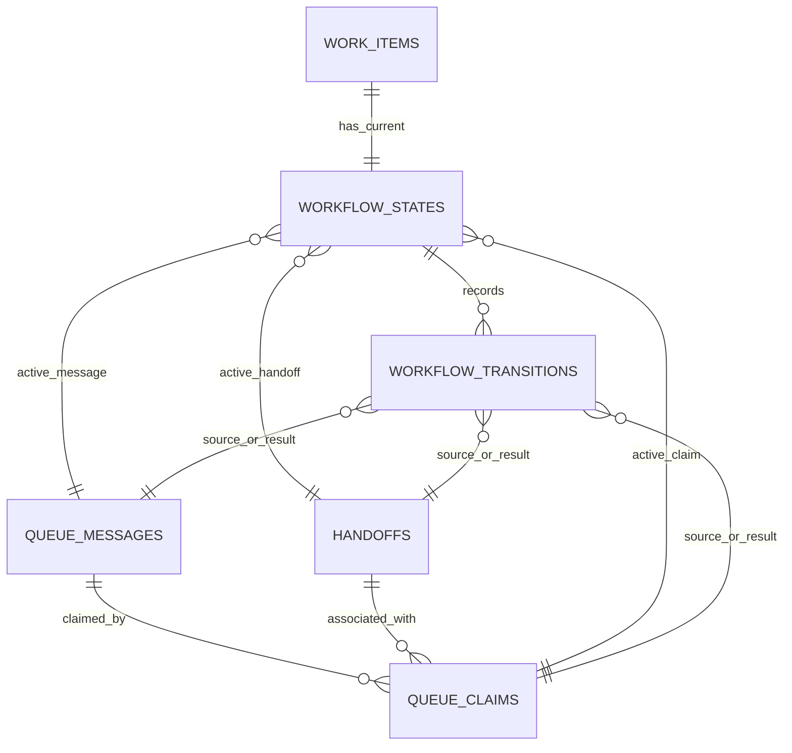

# Final Workflow State Entity Design

Date: 2026-05-13

## Purpose

Finalize the DB-primary entity design for the V2 `Workflow State Machine` from the baseline established in:
- the DB Model Completion Plan
- the stable table classification and ownership map
- the earlier Workflow State Machine draft data contract

This note resolves the open structural questions rather than leaving them as options.

## Related Notes

Read alongside:
- `/Users/billyweisberg/Repos/billyweisberg/paa-platform/docs/3_Plan/2026-05-13-paa-db-model-completion-plan.md`
- `/Users/billyweisberg/Repos/billyweisberg/paa-platform/docs/2_Design/2026-05-13-paa-stable-table-classification-and-ownership-map.md`
- `/Users/billyweisberg/Repos/billyweisberg/paa-platform/docs/2_Design/2026-05-13-workflow-state-machine-data-contract.md`
- `/Users/billyweisberg/Repos/billyweisberg/paa-platform/docs/2_Design/2026-05-13-paa-db-primary-data-consolidation-audit.md`
- `/Users/billyweisberg/Repos/billyweisberg/paa-platform/docs/2_Design/2026-05-13-paa-v2-component-relationships.md`
- `/Users/billyweisberg/Repos/billyweisberg/paa-platform/docs/2_Design/2026-05-12-paa-handoff-execution-contract.md`

## Design Status

This note supersedes the earlier draft-level open choices in:
- `/Users/billyweisberg/Repos/billyweisberg/paa-platform/docs/2_Design/2026-05-13-workflow-state-machine-data-contract.md`

That earlier note remains useful as rationale and field inventory.
This note is the final entity-shape decision baseline.

## Final Decisions

This note locks the following decisions:

1. `paa.workflow_states` will be a dedicated table.
2. `paa.workflow_transitions` will be a dedicated append-only table.
3. `paa.queue_claims` will be a dedicated table, not an overloaded extension of `paa.queue_messages`.
4. `paa.workflow_states` will keep one current row per `work_item_id`, including terminal snapshots.
5. historical workflow changes will live in `paa.workflow_transitions`, not in versioned copies of `paa.workflow_states`.
6. `paa.queue_claims` is runtime-event support state, but it must still be DB-primary.
7. projections and repo-local status artifacts will be derived from these tables, never the other way around.

## Why These Decisions Are Final

### Why one current row per work item

The system needs one canonical answer to:
- who owns this slice now
- what stage it is in now
- whether it is blocked, closed, superseded, or waiting

That answer should not require:
- scanning queue state
- reconstructing a latest transition by inference
- reading repo-local reports

So `paa.workflow_states` is the current-state anchor.

### Why not version `workflow_states`

We already need append-only transition history.
Duplicating that history in versioned state rows would blur the roles of the two entities and make reporting harder.

So:
- `paa.workflow_states` = current truth
- `paa.workflow_transitions` = historical truth of how current truth changed

### Why `queue_claims` is a dedicated table

A queue message can have multiple meaningful claim-related facts over time:
- initial claim
- release or expiration
- re-claim
- ack outcome
- compensation / repair path

That is a separate history from the queue message row itself.
Trying to flatten it into `paa.queue_messages` or `paa.handoffs` would make lease history brittle and hard to query.

So `paa.queue_claims` is its own event table.

## Entity 1: `paa.workflow_states`

## Role

Represent the single current authoritative workflow state for one PAA work item.

## Ownership

Semantic owner:
- `Workflow State Machine`

Writers:
- only runtime lifecycle paths that successfully apply a legal transition through the `Workflow State Machine`

Readers:
- TechLead status
- role preflight
- acceptance/closeout flow
- reporting/traceability projection
- operator tooling

## Primary key and uniqueness

### Primary key
- `workflow_state_id`

### Required uniqueness
- unique `work_item_id`

This enforces one current workflow-state row per work item.

## Required columns

### Identity and authority context
- `workflow_state_id`
- `project_id`
- `work_item_id`
- `authority_version_id`
- `design_package_id`
- `coder_run_brief_id`

### Current workflow truth
- `workflow_stage`
- `current_owner_role_id`
- `lineage_state`
- `blocking_reason_code`
- `blocking_reason_text`
- `terminal_decision`
- `state_consistency`

### Active execution context
- `current_issue_number`
- `current_pr_number`
- `canonical_branch`
- `active_role_branch`

### Active transport context
- `active_handoff_id`
- `active_queue_message_id`
- `active_message_id_external`
- `active_assignment_role_id`
- `active_result_role_id`
- `active_queue_claim_id`

### Timestamps
- `state_entered_at`
- `last_transition_at`
- `closed_at`
- `created_at`
- `updated_at`

### Metadata
- `metadata_json`

## Enumerations

### `workflow_stage`
Final target values:
- `authorized_not_assigned`
- `delivery_review_pending`
- `delivery_review_in_progress`
- `techlead_delivery_review_pending`
- `worker_assignment_pending`
- `worker_execution_in_progress`
- `techlead_worker_review_pending`
- `qa_assignment_pending`
- `qa_execution_in_progress`
- `techlead_qa_review_pending`
- `acceptance_in_progress`
- `techlead_decision_recorded`
- `blocked`
- `superseded`
- `closed`

### `lineage_state`
Final target values:
- `not_started`
- `active`
- `awaiting_result`
- `awaiting_acceptance`
- `closed`
- `superseded`

### `state_consistency`
Final target values:
- `consistent`
- `missing_upstream_context`
- `missing_transport_record`
- `missing_execution_record`
- `conflicting_transition_evidence`
- `manual_repair_required`

### `terminal_decision`
Final target values:
- `none`
- `accepted`
- `rejected`
- `needs_changes`
- `blocked`
- `needs_human_review`
- `superseded`

## Invariants

1. exactly one `workflow_states` row exists per `work_item_id`
2. `current_owner_role_id` must always be non-null unless the slice is explicitly terminal and ownerless by policy
3. `workflow_stage = closed` requires `closed_at` and `terminal_decision != none`
4. `workflow_stage = superseded` requires `lineage_state = superseded`
5. `state_consistency = consistent` requires any referenced active handoff / queue message / queue claim rows to exist
6. `active_role_branch` may be null when no spoke execution is in progress

## Entity 2: `paa.workflow_transitions`

## Role

Represent the append-only history of workflow-state changes.

## Ownership

Semantic owner:
- `Workflow State Machine`

Writers:
- only runtime lifecycle paths that request and successfully apply a legal workflow transition
- repair tooling for explicit `manual_repair` transitions

Readers:
- reporting/traceability projection
- repair tooling
- operator inspection
- diagnostics

## Primary key and ordering

### Primary key
- `workflow_transition_id`

### Ordering rule
- transition order for one work item is defined by `transition_applied_at`, with a stable tie-breaker on `workflow_transition_id`

## Required columns

### Identity and scope
- `workflow_transition_id`
- `workflow_state_id`
- `project_id`
- `work_item_id`

### Transition definition
- `transition_type`
- `transition_status`
- `from_workflow_stage`
- `to_workflow_stage`
- `from_owner_role_id`
- `to_owner_role_id`
- `reason_code`
- `reason_text`

### Source references
- `source_handoff_id`
- `source_queue_message_id`
- `source_queue_claim_id`
- `source_message_id_external`
- `source_packet_schema_type`
- `source_role_id`
- `source_transition_input_id`

### Result references
- `result_handoff_id`
- `result_queue_message_id`
- `result_queue_claim_id`
- `result_message_id_external`
- `result_packet_schema_type`
- `result_role_id`

### Execution context
- `performed_by_role_id`
- `performed_by_agent_id`
- `automation_run_id`
- `error_code`
- `error_details`

### Timing
- `transition_requested_at`
- `transition_applied_at`
- `created_at`

### Metadata
- `metadata_json`

## Enumerations

### `transition_type`
Final target values:
- `assignment_emitted`
- `assignment_claimed`
- `delivery_review_returned`
- `worker_result_returned`
- `qa_result_returned`
- `assignment_advanced`
- `accept_and_merge_completed`
- `decision_recorded`
- `slice_closed`
- `slice_blocked`
- `slice_superseded`
- `manual_repair`

### `transition_status`
Final target values:
- `applied`
- `failed`
- `compensated`
- `cancelled`

## Invariants

1. `workflow_transitions` is append-only
2. a transition row may never be updated to represent a different transition event
3. `transition_status = applied` requires both `from_workflow_stage` and `to_workflow_stage`
4. a successful transition that changes current truth must also update the linked `workflow_states` row in the same transaction boundary
5. `manual_repair` transitions must include `reason_text`

## Entity 3: `paa.queue_claims`

## Role

Represent DB-primary claim/lease history for queue-message lifecycle.

## Ownership

Semantic owner:
- `Runtime Lifecycle Engine`

Consumed by:
- `Workflow State Machine`
- role-return closeout logic
- TechLead assignment-advance closeout logic
- repair tooling

## Primary key
- `queue_claim_id`

## Required columns

### Identity and linkage
- `queue_claim_id`
- `queue_message_id`
- `handoff_id`
- `project_id`
- `work_item_id`

### Claim actor context
- `claimed_by_role_id`
- `claimed_by_agent_id`
- `claim_attempt_source`

### Claim state
- `claim_status`
- `ack_outcome`
- `release_reason_code`
- `release_reason_text`

### Timing
- `claimed_at`
- `lease_expires_at`
- `released_at`
- `acked_at`
- `created_at`

### Metadata
- `metadata_json`

## Enumerations

### `claim_status`
Final target values:
- `active`
- `released`
- `expired`
- `acked`
- `abandoned`
- `superseded`

### `ack_outcome`
Final target values:
- `none`
- `acked_source_message`
- `ack_failed`
- `not_required`

### `claim_attempt_source`
Final target values:
- `role_preflight`
- `role_return_closeout`
- `techlead_advance_closeout`
- `repair_tool`
- `manual_operator_action`

## Invariants

1. a queue message may have multiple claim rows over time but at most one active claim at a time
2. `claim_status = active` requires `claimed_at` and a non-null claimant
3. `claim_status = acked` requires `acked_at`
4. `ack_outcome = acked_source_message` requires `claim_status = acked`
5. `claim_status` changes are modeled by new or updated claim rows according to migration choice, but the historical claim record must remain queryable

## Relationship Map

## Transaction Boundary Rule

For any applied workflow transition that changes current state:
1. append one `workflow_transitions` row
2. update the one current `workflow_states` row
3. write any associated `queue_claims` change if claim lifecycle changed
4. do all three inside one DB transaction boundary

This is the key anti-drift rule.

Without it, the system falls back into split truth.

## What Stays Outside These Entities

These entities do not replace:
- `paa.handoffs`
- `paa.queue_messages`
- `paa.automation_runs`
- `paa.acceptance_events`
- `paa.design_packages`
- `paa.coder_run_briefs`
- `paa.evidence`

Those remain important tables.
They are inputs, references, and evidence.

But none of them should again be treated as the canonical answer to:
- current owner
- current stage
- current blocked/closed state

That answer belongs to `paa.workflow_states`.

## What This Note Resolves From The Earlier Draft

Compared to the earlier draft contract, this note resolves:

1. `queue_claims` is definitely a dedicated table
2. `workflow_states` is definitely one current row per work item, including closed rows
3. transition history definitely belongs in `workflow_transitions`, not state-row versioning
4. `queue_claims` is semantically owned by runtime lifecycle, not by workflow state
5. workflow-state truth and transport history are explicitly separated but transactionally linked

## Migration Guidance From This Final Design

The next DB migration design should implement:
- one `workflow_states` table with unique `work_item_id`
- one append-only `workflow_transitions` table keyed to `workflow_states`
- one `queue_claims` table with uniqueness rules that prevent more than one active claim per queue message

The migration should also introduce:
- foreign-key links to `paa.projects`, `paa.work_items`, `paa.roles`, `paa.handoffs`, `paa.queue_messages`, and `paa.automation_runs`
- indexes on current-owner queries, current-stage queries, work-item lookups, and active-claim lookups

## Hard Conclusion

The final workflow-state layer is now simple enough to implement without more conceptual churn:
- one current-state table
- one transition-history table
- one dedicated claim-history table

That is the final V2 workflow-state entity design baseline.
