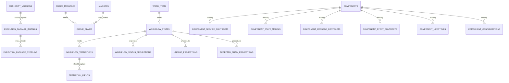

# PAA DB Model Diagram And Gap Analysis

Date: 2026-05-13

## Purpose

Provide one explicit DB model view for PAA that shows:
- the current persisted entities/tables
- the important relationships between them
- the missing entities and record families identified during the V2 System Design work

This note is intended to become the shared reference point for:
- Data Access Layer design
- future DB migrations
- Component Design work
- reporting/projection work
- workflow-state refactoring

## Related Notes

Read alongside:
- `docs/2_Design/2026-05-13-paa-schema-and-data-surface-audit.md`
- `docs/2_Design/2026-05-13-paa-db-primary-data-consolidation-audit.md`
- `docs/2_Design/2026-05-13-existing-component-design-model-audit.md`
- `docs/2_Design/2026-05-13-paa-data-access-layer-design.md`
- `docs/2_Design/2026-05-13-workflow-state-machine-data-contract.md`
- `docs/2_Design/2026-05-13-workflow-state-machine-foundation-mapping.md`
- `docs/2_Design/2026-05-13-paa-system-component-diagram-v2.md`
- `docs/2_Design/2026-05-13-paa-v2-component-relationships.md`
- `docs/3_Plan/2026-05-13-paa-db-model-completion-plan.md`

## Scope

This note covers the persisted PAA DB model defined in:
- `migrations/postgres/001-step1-control-plane.sql`
- `migrations/postgres/002-step2-verification-recovery.sql`
- `migrations/postgres/003-step3-knowledge-graph.sql`
- `migrations/postgres/004-step4-coder-briefs.sql`
- `migrations/postgres/005-step5-design-packages-and-sequencing.sql`

It focuses on the operational model and design-related tables that matter most to the current PAA System Design.

It does not attempt to show every enum or every column.
It shows the important entities and foreign-key relationships.

## Reading Guide

The model is best understood in five layers:
1. control plane
2. runtime execution and transport
3. knowledge graph / authority graph
4. component design and slice derivation
5. reporting/projection gaps still missing from the DB model

## Current DB Entity Model

```mermaid
erDiagram
    PROJECTS ||--o{ ROLES : has
    PROJECTS ||--o{ AUTHORITY_VERSIONS : publishes
    PROJECTS ||--o{ WORK_ITEMS : scopes
    PROJECTS ||--o{ AGENTS : hosts
    PROJECTS ||--o{ SOURCE_ARTIFACTS : owns
    PROJECTS ||--o{ REQUIREMENTS : owns
    PROJECTS ||--o{ DESIGN_DECISIONS : owns
    PROJECTS ||--o{ SPEC_FRAGMENTS : owns
    PROJECTS ||--o{ COMPONENTS : owns
    PROJECTS ||--o{ DESIGN_PACKAGES : owns
    PROJECTS ||--o{ COMPONENT_DEPENDENCY_EDGES : owns
    PROJECTS ||--o{ CODER_BRIEF_SEQUENCE_STATES : owns
    PROJECTS ||--o{ VERIFICATION_OBLIGATIONS : owns
    PROJECTS ||--o{ EVIDENCE : owns
    PROJECTS ||--o{ ACCEPTANCE_EVENTS : owns

    AUTHORITY_VERSIONS ||--o{ WORK_ITEMS : authorizes
    AUTHORITY_VERSIONS ||--o{ AUTHORITY_VERSION_FRAGMENTS : links
    AUTHORITY_VERSIONS ||--o{ AUTHORITY_VERSION_TARGETS : links
    AUTHORITY_VERSIONS ||--o{ DESIGN_PACKAGES : versions
    AUTHORITY_VERSIONS ||--o{ CODER_RUN_BRIEFS : versions

    WORK_ITEMS ||--o{ EXECUTION_RECORDS : materializes
    WORK_ITEMS ||--o{ HANDOFFS : routes
    WORK_ITEMS ||--o{ AUTOMATION_RUNS : drives
    WORK_ITEMS ||--o{ VERIFICATION_OBLIGATIONS : requires
    WORK_ITEMS ||--o{ EVIDENCE : proves
    WORK_ITEMS ||--o{ ACCEPTANCE_EVENTS : closes
    WORK_ITEMS ||--o{ DESIGN_PACKAGES : derives
    WORK_ITEMS ||--o{ CODER_RUN_BRIEFS : derives

    ROLES ||--o{ AGENTS : backs
    ROLES ||--o{ HANDOFFS : sends
    ROLES ||--o{ HANDOFFS : receives
    ROLES ||--o{ DESIGN_DECISIONS : owns
    ROLES ||--o{ DESIGN_PACKAGES : creates
    ROLES ||--o{ DESIGN_PACKAGE_SIGNOFFS : signs
    ROLES ||--o{ CODER_RUN_BRIEFS : creates
    ROLES ||--o{ ACCEPTANCE_EVENTS : decides

    AGENTS ||--o{ AUTOMATION_RUNS : executes
    AGENTS ||--o{ EVIDENCE : captures
    AGENTS ||--o{ ACCEPTANCE_EVENTS : records
    AGENTS ||--o{ DESIGN_PACKAGES : creates
    AGENTS ||--o{ CODER_RUN_BRIEFS : creates

    HANDOFFS ||--o{ QUEUE_MESSAGES : transports
    HANDOFFS ||--o{ AUTOMATION_RUNS : relates
    HANDOFFS ||--o{ ACCEPTANCE_EVENTS : references

    VERIFICATION_OBLIGATIONS ||--o{ EVIDENCE : satisfied_by

    SOURCE_ARTIFACTS ||--o{ SOURCE_STATEMENTS : contains
    REQUIREMENTS ||--o{ REQUIREMENT_SOURCES : traced_to
    SOURCE_STATEMENTS ||--o{ REQUIREMENT_SOURCES : supports
    DESIGN_DECISIONS ||--o{ DECISION_REQUIREMENTS : responds_to
    REQUIREMENTS ||--o{ DECISION_REQUIREMENTS : constrains
    SPEC_FRAGMENTS ||--o{ SPEC_FRAGMENT_REQUIREMENTS : contains
    REQUIREMENTS ||--o{ SPEC_FRAGMENT_REQUIREMENTS : required_by
    SPEC_FRAGMENTS ||--o{ SPEC_FRAGMENT_DECISIONS : shaped_by
    DESIGN_DECISIONS ||--o{ SPEC_FRAGMENT_DECISIONS : informs
    SPEC_FRAGMENTS ||--o{ IMPLEMENTATION_TARGETS : becomes
    SPEC_FRAGMENTS ||--o{ AUTHORITY_VERSION_FRAGMENTS : selected
    IMPLEMENTATION_TARGETS ||--o{ AUTHORITY_VERSION_TARGETS : selected

    COMPONENTS ||--o{ COMPONENT_SURFACES : exposes
    COMPONENTS ||--o{ COMPONENT_RELATIONSHIPS : from
    COMPONENTS ||--o{ COMPONENT_RELATIONSHIPS : to
    COMPONENTS ||--o{ DESIGN_PACKAGES : primary_for
    COMPONENTS ||--o{ CODER_RUN_BRIEFS : primary_for
    COMPONENTS ||--o{ COMPONENT_DEPENDENCY_EDGES : from
    COMPONENTS ||--o{ COMPONENT_DEPENDENCY_EDGES : to
    COMPONENTS ||--o{ CODER_BRIEF_SEQUENCE_STATES : primary_for

    SPEC_FRAGMENTS ||--o{ DESIGN_PACKAGES : scoped_by
    IMPLEMENTATION_TARGETS ||--o{ DESIGN_PACKAGES : targets
    SPEC_FRAGMENTS ||--o{ CODER_RUN_BRIEFS : scoped_by
    IMPLEMENTATION_TARGETS ||--o{ CODER_RUN_BRIEFS : targets

    DESIGN_PACKAGES ||--o{ DESIGN_PACKAGE_SIGNOFFS : reviewed_by
    DESIGN_PACKAGES ||--o{ COMPONENT_DEPENDENCY_EDGES : defines
    DESIGN_PACKAGES ||--o{ CODER_BRIEF_SEQUENCE_STATES : sequences
    CODER_RUN_BRIEFS ||--o{ CODER_BRIEF_SEQUENCE_STATES : sequenced_as
```

## Entity Layer Summary

### 1. Control plane and runtime execution

These tables already form a substantial operational substrate:
- `paa.projects`
- `paa.roles`
- `paa.authority_versions`
- `paa.work_items`
- `paa.execution_records`
- `paa.handoffs`
- `paa.queue_messages`
- `paa.agents`
- `paa.automation_runs`
- `paa.verification_obligations`
- `paa.evidence`
- `paa.acceptance_events`

This is the layer most people intuitively think of as the runtime control plane.

### 2. Knowledge graph / authority graph

These tables already model upstream structured authority:
- `paa.source_artifacts`
- `paa.source_statements`
- `paa.requirements`
- `paa.requirement_sources`
- `paa.design_decisions`
- `paa.decision_requirements`
- `paa.spec_fragments`
- `paa.spec_fragment_requirements`
- `paa.spec_fragment_decisions`
- `paa.implementation_targets`
- `paa.authority_version_fragments`
- `paa.authority_version_targets`

This is much richer than the current runtime typically acts like it is.

### 3. Component design and slice-derivation model

These tables already form a partial Component Design substrate:
- `paa.components`
- `paa.component_surfaces`
- `paa.component_relationships`
- `paa.design_packages`
- `paa.design_package_signoffs`
- `paa.coder_run_briefs`
- `paa.component_dependency_edges`
- `paa.coder_brief_sequence_states`

This is the layer we have been discussing as the existing but incomplete DB-backed Component Design model.

## Strong Parts Of The Current Model

### 1. The DB already models upstream authority structure

The DB already has first-class records for:
- requirements
- design decisions
- spec fragments
- implementation targets
- authority-version bindings

That means PAA is already beyond a naive issue/queue-only system.

### 2. The DB already models stable components and derivative artifacts separately

We already have a meaningful separation between:
- stable component records
- per-slice design packages
- per-slice coder briefs
- per-slice sequencing/readiness state

That is a solid foundation.

### 3. The DB already models runtime transport and acceptance history

We already have first-class records for:
- handoffs
- queue messages
- automation runs
- acceptance events
- evidence

That means the missing workflow-state layer is an additive correction, not a fresh invention.

## Gaps In The Current DB Model

These are the important gaps identified during the System Design work.

## Gap 1: No canonical workflow-state tables

### Missing entities
- `paa.workflow_states`
- `paa.workflow_transitions`

### Why this matters

Today, current workflow truth is still reconstructed from a mixture of:
- queue state
- runtime events
- report artifacts
- GitHub state

The DB has the ingredients, but it does not yet have the canonical owner/stage state machine tables.

### Relationship impact

Without these tables:
- `paa.handoffs` and `paa.queue_messages` are over-interpreted as workflow truth
- reporting views have to infer too much
- projections and local files become accidental state carriers

## Gap 2: No DB-primary queue claim / lease model

### Missing entity
- `paa.queue_claims`
  - or equivalent queue lease records extending `paa.queue_messages` and `paa.handoffs`

### Why this matters

Claim/ack state is still partly file-primary.
That is incompatible with a DB-primary workflow model.

### Relationship impact

Without a claim/lease table:
- transport lifecycle is split across DB and local claim JSON
- the future `Workflow State Repository` cannot rely only on DB truth

## Gap 3: No explicit execution-package install/activation records

### Missing entities
- `paa.execution_package_installs`
- `paa.execution_package_overlays`

### Why this matters

The installed execution package is already a real execution-time truth surface, but the DB does not yet model:
- which package version is installed where
- which overlay is active
- when install/overlay state changed

### Relationship impact

Without these records:
- package activation remains partly file-primary
- execution-package history is not queryable in DB

## Gap 4: No explicit workflow projection/read-model tables

### Missing entities
Likely future projection tables such as:
- `paa.workflow_status_projections`
- `paa.lineage_projections`
- `paa.accepted_chain_projections`

### Why this matters

Today reporting is handled through views and report artifacts.
That works, but it does not yet give us a clean DB-backed projection layer that is clearly separate from primary truth.

### Relationship impact

Without explicit projection tables or materialized views:
- reporting may keep drifting back toward ad hoc status synthesis

## Gap 5: No explicit transition-input / structured runtime input records

### Missing entity
A likely future table such as:
- `paa.transition_inputs`

### Why this matters

Structured files like:
- role result input JSON
- assignment input JSON
- review input JSON

still live mostly outside the DB.

### Relationship impact

Without canonical transition-input records:
- structured runtime inputs remain harder to audit and correlate to transitions

## Gap 6: Stable component model and newer slice artifacts are not fully aligned

### Missing integrity rule rather than just a table

The DB currently allows:
- design packages and coder briefs to load successfully
- even when `primary_component_id` cannot be resolved from `paa.components`

### Why this matters

This is the exact drift we identified:
- package/brief modeling is ahead of stable component-catalog fidelity

### Relationship impact

Without a stronger alignment rule:
- `paa.design_packages`
- `paa.coder_run_briefs`
- `paa.component_dependency_edges`

can keep drifting away from:
- `paa.components`
- `paa.component_surfaces`
- `paa.component_relationships`

## Gap 7: No first-class DB representation yet for all glossary-level Component Design elements

### Missing entity family
Not necessarily one table, but the current DB does not yet fully model the glossary’s fifteen Component Design elements for a reusable component.

Important missing structured areas include:
- component state model
- service contract
- messages received
- messages published
- event subscriptions
- events published
- lifecycle contract
- configuration contract

### Why this matters

The current component model is good for:
- identity
- surfaces
- relationships
- package/brief derivation

But not yet for full reusable Component Design authoring.

## Proposed Future Gap Overlay



Important note:
- this is a design gap overlay, not a migration commitment to create exactly these table names one-for-one
- it shows the missing entity families and relationship types we have identified

## Data Access Layer Interpretation

This DB model now maps naturally onto the Data Access Layer:

### `Component Design Repository`
Primary current tables:
- `paa.components`
- `paa.component_surfaces`
- `paa.component_relationships`
- `paa.design_packages`
- `paa.design_package_signoffs`
- `paa.coder_run_briefs`
- `paa.component_dependency_edges`
- `paa.coder_brief_sequence_states`

### `Runtime Event Repository`
Primary current tables:
- `paa.handoffs`
- `paa.queue_messages`
- `paa.automation_runs`
- `paa.acceptance_events`
- `paa.execution_records`
- `paa.evidence`
- `paa.verification_obligations`

### `Workflow State Repository`
Primary future tables:
- `paa.workflow_states`
- `paa.workflow_transitions`
- `paa.queue_claims`

### `Execution Package Repository`
Primary future DB registration tables:
- `paa.execution_package_installs`
- `paa.execution_package_overlays`

### `Projection Repository`
Primary future DB projection tables or materialized views:
- workflow status projections
- lineage projections
- accepted-chain projections

## Authority-Architect Interpretation

From an Authority Architect perspective, the DB model already tells us something important:

- PAA is not missing a database model
- PAA is missing the final normalization step that makes the model authoritative for runtime workflow and full reusable Component Design

That means the right next steps are:
1. add the missing workflow-state entities
2. add package install/overlay registration entities
3. strengthen component-model alignment rules for package/brief derivation
4. decide which full Component Design elements need first-class stable records

## Hard Conclusions

1. The current PAA DB model is already substantial and worth designing against directly.
2. The biggest structural gap is not the component graph; it is the missing workflow-state layer.
3. The second major gap is the lack of DB-primary execution-package install/overlay state.
4. The third major gap is incomplete normalization of full reusable Component Design records.
5. The schema is already rich enough that the next moves should be targeted additions and alignment rules, not another fresh reinvention.
