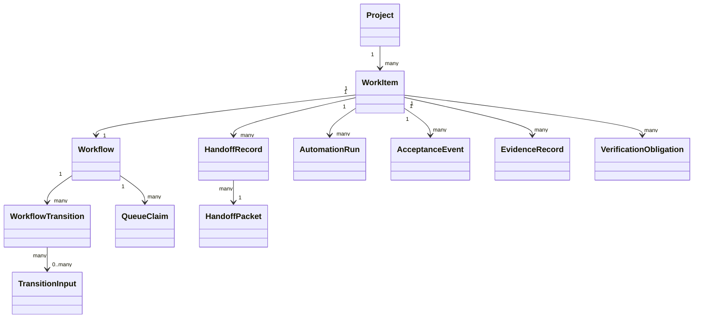
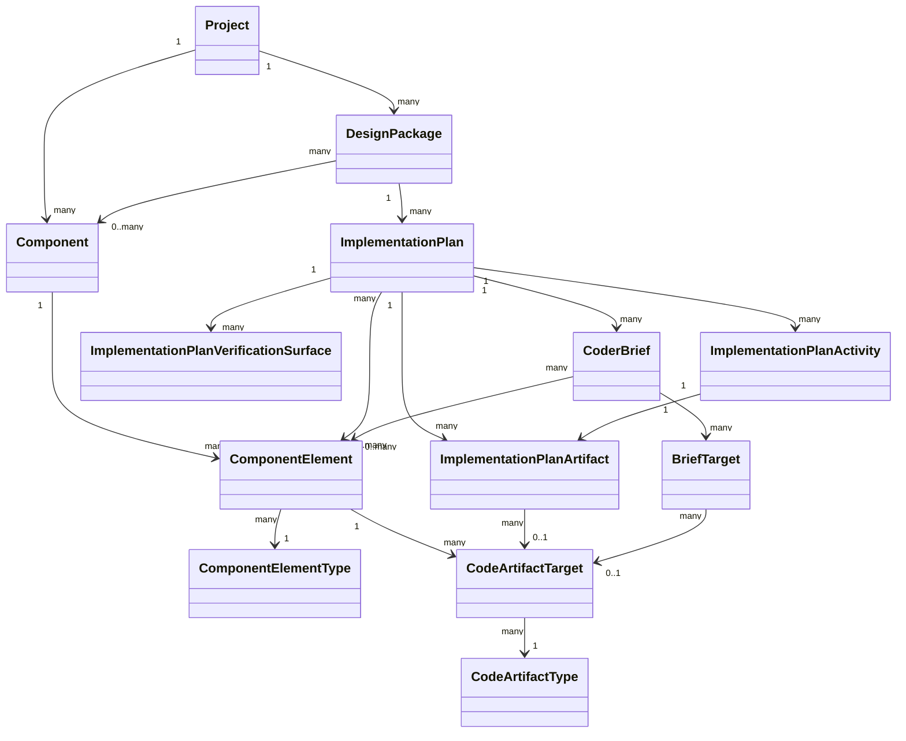
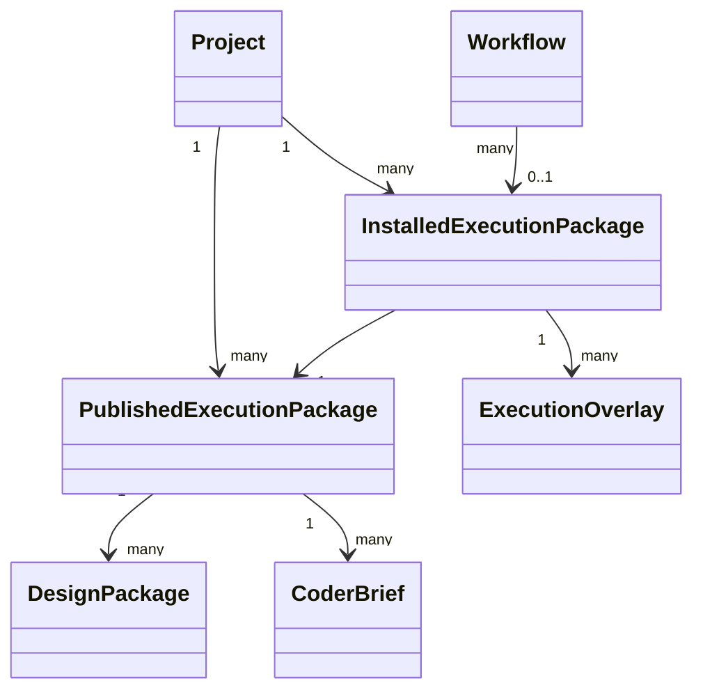

# PAA Domain Object Model And OO Component Decomposition

Date: 2026-05-13

## Purpose

Perform the next level of PAA System Analysis before further detailed component implementation.

This note establishes:
1. the core PAA domain objects
2. their relationships and ownership boundaries
3. the OO component decomposition that should be derived from that model

This note is intentionally positioned before further detailed component specs for major logic components such as `Workflow State Machine`.

## Why This Note Exists

We reached a point where repository contracts and DB entities exist, but the higher-level logic components are still at risk of being over-compressed or incorrectly decomposed.

The earlier system design work was necessary, but it is not sufficient on its own to safely finalize logic-component boundaries.

The missing layer is:
- a holistic domain object model
- explicit ownership and lifecycle rules
- OO component decomposition derived from those objects

Without this layer, terms like `Workflow State Machine` risk becoming oversized “fix-everything” abstractions.

## Related Notes

Read alongside:
- `/Users/billyweisberg/Repos/billyweisberg/paa-platform/docs/terminology/paa-engineering-terminology-glossary.md`
- `/Users/billyweisberg/Repos/billyweisberg/paa-platform/docs/2_Design/2026-05-13-paa-system-component-diagram-v2.md`
- `/Users/billyweisberg/Repos/billyweisberg/paa-platform/docs/2_Design/2026-05-13-paa-v2-component-relationships.md`
- `/Users/billyweisberg/Repos/billyweisberg/paa-platform/docs/2_Design/2026-05-13-paa-db-model-diagram-and-gap-analysis.md`
- `/Users/billyweisberg/Repos/billyweisberg/paa-platform/docs/2_Design/2026-05-13-paa-schema-and-data-surface-audit.md`
- `/Users/billyweisberg/Repos/billyweisberg/paa-platform/docs/2_Design/2026-05-13-paa-data-access-layer-design.md`
- `/Users/billyweisberg/Repos/billyweisberg/paa-platform/docs/2_Design/2026-05-13-component-design-repository-contract.md`
- `/Users/billyweisberg/Repos/billyweisberg/paa-platform/docs/2_Design/2026-05-13-workflow-state-repository-contract.md`
- `/Users/billyweisberg/Repos/billyweisberg/paa-platform/docs/2_Design/2026-05-13-runtime-event-repository-contract.md`
- `/Users/billyweisberg/Repos/billyweisberg/paa-platform/docs/2_Design/2026-05-13-execution-package-repository-contract.md`
- `/Users/billyweisberg/Repos/billyweisberg/paa-platform/docs/2_Design/2026-05-13-projection-repository-contract.md`

## Analysis Frame

This note treats PAA as a software system with:
- explicit domain objects
- bounded responsibilities
- lifecycle ownership
- persistence models
- orchestration and policy services

The goal is not to over-academize the design.
The goal is to prevent us from continuing to collapse multiple distinct responsibilities into one vague runtime script.

## Part 1. Core Domain Objects

The following objects appear to be the core object model for the current and intended PAA system.

## 1. Project

### Meaning
A top-level engineering system or product namespace managed by PAA.

### Examples
- `fractal-core`
- future self-hosted `paa-platform`

### Owns
- project-scoped roles
- project-scoped work items
- project-scoped execution packages
- project-scoped component catalogs

### Key identity
- `project_id`
- project key / slug

## 2. WorkItem

### Meaning
A discrete unit of planned and traceable engineering work.

### Examples
- one GitHub issue-aligned slice
- one issue / PR proving slice

### Owns
- current workflow
- design package selection
- coder brief selection
- assignment chain
- verification outcome

### Key identity
- `work_item_id`
- issue number
- project scope

### Important rule
`WorkItem` is the central operational unit for runtime orchestration.

## 3. Workflow

### Meaning
The authoritative lifecycle state of one `WorkItem` as it moves through assignment, execution, review, QA, and closeout.

### Owns
- current workflow stage
- current owner role
- lineage state
- blocking state
- terminal state

### Key identity
- one workflow per `WorkItem`

### Important rule
This is not the same as queue state, packet state, or PR state.
It is the internal domain truth of PAA lifecycle ownership.

## 4. WorkflowTransition

### Meaning
One authoritative state change applied to a `Workflow`.

### Owns
- from/to workflow state
- actor context
- source/result references
- reason / notes / repair metadata

### Important rule
This is append-only history that explains how workflow truth changed.

## 5. QueueClaim

### Meaning
A lifecycle record representing a role or automation’s claim against a queue-delivered packet.

### Owns
- claim status
- claim actor
- ack or requeue outcome
- repair / abandonment metadata

### Important rule
A `QueueClaim` is transport-execution support state, not workflow truth.

## 6. HandoffPacket

### Meaning
A structured transport payload that carries assignment, review, result, or decision context between roles.

### Variants
- architect cycle packet
- TechLead assignment packet
- worker result packet
- delivery review packet
- QA verification packet
- TechLead decision packet

### Important rule
A `HandoffPacket` is not the canonical record of engineering history.
It is a transport and execution-context object.

## 7. HandoffRecord

### Meaning
A durable runtime event record of packet send/claim/ack transport history.

### Owns
- send/claim/ack timestamps
- queue linkage
- message linkage
- runtime provenance

### Important rule
This is evidence of transport behavior, not workflow truth.

## 8. AutomationRun

### Meaning
One concrete execution attempt by a role automation or lifecycle command.

### Owns
- actor identity
- runtime metadata
- structured run events
- execution outcome summary

### Important rule
An `AutomationRun` is execution history, not state ownership.

## 9. TransitionInput

### Meaning
A structured DB-primary input bundle used to justify or support a workflow transition.

### Owns
- input classification
- normalized context summary
- links to source records used during transition evaluation

### Important rule
This separates structured transition evidence from markdown notes or ad hoc JSON files.

## 10. AcceptanceEvent
n
### Meaning
A durable record that acceptance, merge, rejection, or other terminal closeout semantics occurred.

### Owns
- acceptance decision
- merge / close timestamps
- terminal rationale

### Important rule
An `AcceptanceEvent` contributes to workflow terminal semantics but does not itself define current workflow truth.

## 11. PublishedExecutionPackage

### Meaning
The producer-side published package content that is eligible to become execution-time truth.

### Owns
- manifest
- published design package set
- published coder brief set
- publication provenance

### Important rule
This is publication-time truth, not installed execution-time truth.

## 12. InstalledExecutionPackage

### Meaning
The package currently installed into a consumer execution surface and used to constrain runtime behavior.

### Owns
- active package identity
- installed authority manifest
- installed design package artifacts
- installed coder brief artifacts
- active overlays

### Important rule
This is the consumer runtime’s execution-time truth.

## 13. ExecutionOverlay

### Meaning
A controlled modification or addition layered onto an installed execution package for a particular run, pilot, or test scenario.

### Owns
- overlay key / type
- activation state
- scope linkage
- install linkage

## 14. Component

### Meaning
A stable reusable system component in the PAA design model.

### Examples
- `Workflow State Machine`
- `Runtime Lifecycle Engine`
- `Workflow State Repository`
- `Execution Package Repository`

### Owns
- role statement
- stable design identity
- stable element catalog

## 15. ComponentElementType

### Meaning
A standardized assignment/category label that identifies what kind of design or code work is being targeted.

### Examples
- `Service Contract`
- `Component State Model`
- `Functions`
- `Event Subscriptions`

### Primary purpose
Provide controlled labels for coder-agent briefing and implementation targeting.

### Important rule
This is a taxonomy object, not a code artifact.

## 16. ComponentElement

### Meaning
A component-specific design element instance attached to a `Component`.

### Example
- `Service Contract` for `Workflow State Machine`
- `Functions` for `Workflow State Repository`

### Primary purpose
Represent structured design assignments that can later be turned into specific coding work.

## 17. CodeArtifactType

### Meaning
A standardized label for the concrete form of code expected from a coder-agent assignment.

### Examples
- `repository_interface`
- `concrete_repository_class`
- `dto`
- `event_handler`
- `mapper`

### Primary purpose
Constrain implementation form so coder agents are not forced to infer it loosely from prose.

## 18. CodeArtifactTarget

### Meaning
A component-specific target that ties a `ComponentElement` to an expected code-artifact form.

### Example
- `Interfaces` for `Workflow State Repository` -> `repository_interface`
- `Functions` for `Workflow State Repository` -> `concrete_repository_class`

### Primary purpose
Turn structured design into near-pseudocode implementation targets.

## 19. DesignPackage

### Meaning
A slice-scoped design artifact bundle describing what work is authorized and how it is framed for execution.

### Owns
- selected primary component
- package scope
- derivation state
- signoff state

## 20. ImplementationPlan

### Meaning
A consumer-specific, slice-scoped build plan derived from approved component design and active slice authority.

### Owns
- implementation-plan identity
- design-package binding
- implementation-target binding
- consumer target context
- authoritative activity list
- touch-surface plan
- dependency-aware build sequence
- proving and verification plan

### Important rule
This is the primary truth object for `Project Design`.
It is not just another expression of `ImplementationTarget`, and it is not a projection.

## 21. ImplementationPlanActivity

### Meaning
One build activity inside an `ImplementationPlan`.

### Owns
- activity identity
- activity title / kind
- sequence order
- activity state
- target path or module where applicable
- blocking reason when not executable

### Important rule
This is the authoritative project-activity list for the slice.

## 22. ImplementationPlanArtifact

### Meaning
One concrete code or build artifact produced or modified by an `ImplementationPlanActivity`.

### Owns
- artifact type
- target path or module
- sequence order
- realization binding where applicable

## 23. ImplementationPlanActivityDependency

### Meaning
One directed dependency edge between implementation-plan activities.

### Owns
- predecessor/successor relationship
- dependency kind
- critical-path implications

### Important rule
This is project-design sequencing truth, not workflow truth.

## 24. ImplementationPlanVerificationSurface

### Meaning
One proving or validation surface attached to an implementation plan.

### Owns
- surface kind
- target test or check reference
- sequence expectation
- required/optional status

## 25. CoderBrief

### Meaning
A coder-agent execution brief derived from a design package and shaped for a specific implementation run.

### Owns
- execution scope
- role target
- ordered coding targets
- contract context
- validation guidance

### Important rule
The `CoderBrief` is the direct assignment surface for a coder agent.

## 26. BriefTarget

### Meaning
A concrete, sequenced implementation assignment within a `CoderBrief`.

### Example
- implement `repository_interface`
- then implement `concrete_repository_class`

### Owns
- target intent
- target sequence
- dependency on prior targets
- contract context

### Important rule
This is one of the key objects for autonomous implementation control.

## 27. VerificationObligation

### Meaning
A required proof or validation expectation that must be satisfied before acceptance.

### Owns
- obligation type
- criteria
- status
- required-for-acceptance marker

## 28. EvidenceRecord

### Meaning
A durable record or reference to supporting evidence collected during execution or verification.

### Examples
- test run summary
- CI result linkage
- artifact proof reference

## 29. Projection

### Meaning
A derived read model or reporting view built from primary truth records.

### Examples
- top-level status summary
- accepted-chain traceability view
- readiness projection

### Important rule
A `Projection` is always downstream from primary truth.

## Part 2. Relationships And Ownership

This section defines how these objects relate and which ones own lifecycle decisions.

## Core operational chain

## Design and execution package chain

## Publication and installation chain

## Ownership summary

### Aggregate roots or root-like domain owners
- `Project`
- `WorkItem`
- `Workflow`
- `Component`
- `PublishedExecutionPackage`
- `InstalledExecutionPackage`
- `DesignPackage`
- `ImplementationPlan`
- `CoderBrief`

### Supporting entities
- `WorkflowTransition`
- `QueueClaim`
- `TransitionInput`
- `HandoffRecord`
- `AutomationRun`
- `AcceptanceEvent`
- `ExecutionOverlay`
- `ImplementationPlanActivity`
- `ImplementationPlanArtifact`
- `ImplementationPlanActivityDependency`
- `ImplementationPlanVerificationSurface`
- `ComponentElement`
- `CodeArtifactTarget`
- `BriefTarget`
- `VerificationObligation`
- `EvidenceRecord`

### Reference taxonomy objects
- `ComponentElementType`
- `CodeArtifactType`

## Key ownership rules

### Rule 1. `WorkItem` is the operational root of one slice
All active runtime orchestration ultimately happens in the context of a `WorkItem`.

### Rule 2. `Workflow` owns current lifecycle truth for a `WorkItem`
Queue state, PR state, and report state are supporting evidence, not workflow ownership.

### Rule 3. `HandoffPacket` is transport context, not engineering truth
Packets matter operationally, but they are not the final record of system truth.

### Rule 4. `InstalledExecutionPackage` owns execution-time authority context
Runtime logic must act within the bounds of the installed package.

### Rule 5. `ImplementationPlan` is the project-design bridge to coding
`ImplementationPlan` is the primary truth object that converts approved slice authority into a consumer-specific build plan.

### Rule 6. `ImplementationPlanActivity` is the authoritative activity list
Current, next, completed, and blocked project activities should derive from implementation-plan activity truth plus workflow/runtime state.

### Rule 7. `CoderBrief` and `BriefTarget` are coder-agent assignment objects
These objects are the direct bridge from system design into implementation runs.

### Rule 8. `ComponentElementType` and `CodeArtifactType` are taxonomies
They are controlled vocabularies used to reduce implementation drift.

### Rule 9. `Projection` is not a source of truth
It is a view derived from owned truth objects.

## Part 3. OO Component Decomposition Derived From The Model

This section derives the logic-component decomposition from the object model above.

## A. Domain logic components

These components own business semantics.

### 1. Work Item Coordination Service

**Primary objects**
- `WorkItem`
- `DesignPackage`
- `CoderBrief`
- `VerificationObligation`

**Role**
Coordinate the operational slice context for a work item without owning queue transport or workflow-state mutation rules.

### 2. Workflow Lifecycle Service

**Primary objects**
- `Workflow`
- `WorkflowTransition`
- `QueueClaim`
- `TransitionInput`
- `AcceptanceEvent`

**Role**
Own lifecycle semantics, transition legality, blocking rules, repair rules, and terminal decision rules.

### 3. Execution Package Resolution Service

**Primary objects**
- `PublishedExecutionPackage`
- `InstalledExecutionPackage`
- `ExecutionOverlay`

**Role**
Resolve the effective execution-time authority context for one work item and runtime surface.

### 4. Component Design Planning Service

**Primary objects**
- `Component`
- `ComponentElement`
- `ComponentElementType`
- `CodeArtifactTarget`
- `CodeArtifactType`

**Role**
Translate stable component design into structured implementation targets.

### 5. Brief Assembly Service

**Primary objects**
- `CoderBrief`
- `BriefTarget`
- `ComponentElement`
- `CodeArtifactTarget`

**Role**
Build sequenced coder-agent work assignments from structured design and package context.

### 6. Verification And Acceptance Service

**Primary objects**
- `VerificationObligation`
- `EvidenceRecord`
- `AcceptanceEvent`

**Role**
Evaluate whether slice work satisfies proof and acceptance requirements.

## B. Orchestration components

These coordinate domain services and infrastructure.

### 1. Runtime Lifecycle Engine

**Role**
Drive role-level runtime flows by coordinating:
- queue transport
- worktree policy
- GitHub state checks
- domain services

**Important note**
The `Runtime Lifecycle Engine` should not own workflow semantics internally.
It should call them.

### 2. TechLead Orchestration Service

**Role**
Coordinate TechLead-specific orchestration actions such as:
- assignment emission
- result review routing
- QA routing
- acceptance handoff

### 3. Role Return Orchestration Service

**Role**
Coordinate return-path operations for worker, delivery, and QA roles.

### 4. Worktree Preparation Service

**Role**
Prepare repo-local execution surfaces and branch/worktree contexts.

## C. Infrastructure-facing access components

These provide structured access, not business semantics.

### 1. Workflow State Repository
### 2. Runtime Event Repository
### 3. Execution Package Repository
### 4. Component Design Repository
### 5. Projection Repository

These remain repositories, not domain logic owners.

## D. Projection components

### 1. Status Projection Service
### 2. Traceability Projection Service
### 3. Readiness Projection Service

These derive read models from primary truth and event history.

## Preliminary Decomposition Conclusion For Workflow State Machine

The earlier placeholder concept `Workflow State Machine` appears to contain at least two separable concerns:

1. `Workflow Lifecycle Service`
- domain semantics for workflow truth and transitions

2. `Status / Traceability Projection Services`
- read-model generation and operator summaries

And in some existing runtime code it is also entangled with:
- TechLead orchestration
- queue-claim handling
- worktree repair reasoning

That means we should not automatically preserve `Workflow State Machine` as one giant concrete class.

The likely better OO decomposition is:
- a core `Workflow Lifecycle Service`
- possibly a narrower `Workflow Transition Policy`
- projection services downstream
- orchestration services upstream

So this note changes the question from:
- “How do we spec the Workflow State Machine?”

to:
- “Which precise logic components should replace the over-compressed Workflow State Machine idea?”

That is the more correct question.

## Practical Design Guidance

Before further detailed component specs, we should now:

1. confirm the decomposition of `Workflow State Machine` into smaller logic components
2. define the primary OO service boundaries for:
- `Workflow Lifecycle Service`
- `Execution Package Resolution Service`
- `Brief Assembly Service`
- `Verification And Acceptance Service`
3. then produce `Component Specs` for those concrete services

## Design Conclusions

1. PAA now has a usable first-pass domain object model.
2. The object model confirms that queue transport, workflow truth, coder briefing, execution package context, and reporting are distinct concerns.
3. `CoderBrief` plus `BriefTarget` should be treated as first-class assignment objects for autonomous coding.
4. `ComponentElementType` and `CodeArtifactType` are controlled vocabularies that reduce coder-agent drift.
5. The previous `Workflow State Machine` concept is probably too compressed and should be decomposed before final component implementation.
