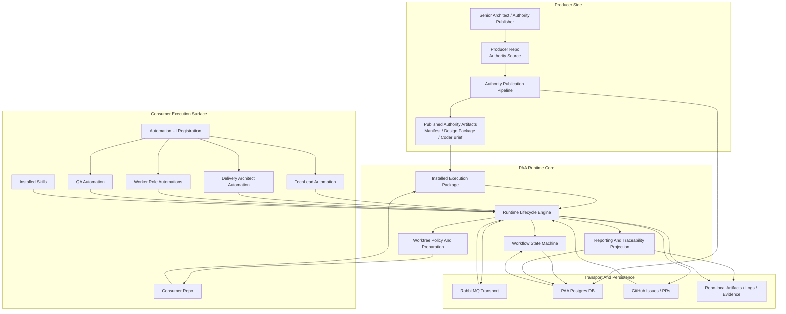

# PAA System Component Diagram V2

Date: 2026-05-13

## Purpose

Provide the revised system-level **Component Node Diagram** for the PAA system using the updated terminology and design conclusions from:
- `docs/terminology/paa-engineering-terminology-glossary.md`
- `docs/2_Design/2026-05-13-paa-hybrid-implementation-audit.md`
- `docs/2_Design/2026-05-13-paa-runtime-consolidation-design-correction.md`

This V2 diagram supersedes the earlier component diagram as the better working System Design view for PAA.

It is intended to let us reason about PAA with a PAA mindset, as if we are defining the authority for PAA itself.

## Why V2 Exists

The V1 diagram reflected the runtime as it existed while several important concerns were still hybrid:
- workflow truth was split across queue state, DB state, repo-local files, and GitHub state
- execution-time authority was split across DB-backed publication state and installed authority artifacts
- lifecycle semantics were split across runtime code, skills, and automation prompts

V2 corrects the component model so the next rounds of design and implementation work can target the right boundaries.

## Design Delta From V1

V2 introduces or clarifies three central components:
1. `Workflow State Machine`
2. `Installed Execution Package`
3. `Runtime Lifecycle Engine`

These three components are the core design correction.

## System Components

## Component Roles

### Producer side

#### `Senior Architect / Authority Publisher`
**Role**
Own the publication of approved authority inputs for the system.

Owns:
- approved issue and slice framing
- authority publication intent
- acceptance of design-package inputs before publication

#### `Producer Repo`
**Role**
Hold the source materials that define what will be published.

Owns:
- authority source files
- publication helpers
- producer-only tooling

#### `Authority Publication Pipeline`
**Role**
Compile and publish versioned authority artifacts from producer-side sources.

Owns:
- authority manifest production
- design package production
- coder brief production
- publication records in DB

#### `Published Authority Artifacts`
**Role**
Represent the producer-side published content that is eligible to become execution-time truth.

Contains:
- authority manifest
- design package artifacts
- coder brief artifacts

### Runtime core

#### `Installed Execution Package`
**Role**
Provide the sole execution-time package, brief, role-registry, and policy context for a consumer repo.

Owns:
- installed authority manifest
- installed design package artifacts
- installed coder brief artifacts
- project role registry and execution policy views needed by consumer runtime

#### `Runtime Lifecycle Engine`
**Role**
Own all lifecycle-critical transition behavior for TechLead and spoke roles.

Owns:
- preflight and claimability logic
- packet claim validation
- packet send and source closeout
- assignment emission
- result return
- acceptance / merge / closeout orchestration

#### `Workflow State Machine`
**Role**
Maintain the authoritative current workflow owner and stage for each active slice.

Owns:
- current owner role
- current workflow stage
- source packet status
- terminal decision state
- lineage state from a workflow perspective

#### `Worktree Policy And Preparation`
**Role**
Provide deterministic execution surfaces for role work.

Owns:
- canonical branch source policy
- role-branch policy
- repo-local deterministic worktree preparation
- worktree freshness and staleness inspection

#### `Reporting And Traceability Projection`
**Role**
Project authoritative runtime state into operator-readable status and historical traceability views.

Owns:
- top-level status summary
- lineage views
- accepted-chain reporting
- report materialization from authoritative runtime state

### Transport and persistence

#### `RabbitMQ Transport`
**Role**
Carry wakeup and transport signals between roles.

Important non-role:
- it does not define workflow truth

#### `PAA Postgres DB`
**Role**
Persist control-plane, publication, workflow, and reporting records.

Owns:
- roles
- handoffs
- queue message records
- design package records
- coder brief records
- workflow-state persistence
- traceability projections

#### `GitHub Issues / PRs`
**Role**
Remain the external engineering history and merge surface.

Owns:
- issue state
- PR state
- merge status
- implementation discussion history

Important non-role:
- it does not define internal workflow truth

#### `Repo-local Artifacts / Logs / Evidence`
**Role**
Hold installed execution artifacts, reports, logs, and human-readable evidence.

Important non-role:
- these are not the primary source of workflow truth

### Consumer execution surface

#### `Consumer Repo`
**Role**
Provide the execution environment in which the installed package and runtime operate.

Owns:
- repo-local `.venv`
- repo-local installed runtime under `.codex/`
- repo-local execution artifacts under `.project/data/paa/`
- repo-local deterministic worktree root

#### `TechLead Automation`
**Role**
Invoke runtime lifecycle entry points for routing, assignment, and closeout.

#### `Delivery Architect Automation`
**Role**
Invoke runtime lifecycle entry points for delivery review work.

#### `Worker Role Automations`
**Role**
Invoke runtime lifecycle entry points for bounded implementation work.

#### `QA Automation`
**Role**
Invoke runtime lifecycle entry points for verification work.

#### `Automation UI Registration`
**Role**
Expose launch surfaces in the app UI.

Important non-role:
- it does not own runtime semantics

#### `Installed Skills`
**Role**
Provide role guidance and approved runtime-entry usage instructions.

Important non-role:
- they do not own transactional lifecycle semantics

## Corrected Relationships

### 1. Publication relationship

Producer-side publication flows are:
- `Senior Architect / Authority Publisher -> Producer Repo -> Authority Publication Pipeline -> Published Authority Artifacts`

Publication may persist records in DB, but published artifacts are what become installable execution inputs.

### 2. Execution authority relationship

Execution flows are:
- `Published Authority Artifacts -> Installed Execution Package -> Runtime Lifecycle Engine`

The consumer runtime executes against the installed package, not against a competing DB reconstruction of package or brief truth.

### 3. Workflow truth relationship

Workflow flows are:
- `Runtime Lifecycle Engine -> Workflow State Machine -> PAA Postgres DB`

The Workflow State Machine exposes current truth.
Queue residue and repo-local artifacts must not override it.

### 4. Runtime invocation relationship

Automation and skill flows are:
- `Automations / Installed Skills -> Runtime Lifecycle Engine`

This is a deliberate reduction of responsibility.
Automations and skills guide execution.
They do not define lifecycle semantics.

### 5. Queue relationship

Transport flows are:
- `Runtime Lifecycle Engine <-> RabbitMQ Transport`

RabbitMQ carries:
- wakeup signals
- execution context packets

It does not carry the authoritative workflow state machine.

### 6. Reporting relationship

Projection flows are:
- `Workflow State Machine -> Reporting And Traceability Projection -> DB / Repo-local Artifacts`

That means operator-visible status and accepted-chain reporting should be projections of one underlying workflow-state model.

## What V2 Makes Explicit

V2 makes the following design conclusions explicit:

1. workflow truth is a component, not an emergent property of queues and reports
2. execution-time package truth is a component, not an accidental installed artifact set
3. runtime lifecycle semantics are a component, not a side effect of skill text
4. RabbitMQ is transport, not workflow truth
5. GitHub is engineering history, not workflow truth
6. repo-local artifacts are evidence, not workflow truth

## Design Implication

Future Component Design work should now target the V2 components directly.

That means the next valid design steps are:
1. Component Design for `Workflow State Machine`
2. Component Design for `Installed Execution Package`
3. Component Design for `Runtime Lifecycle Engine`
4. then contract cleanup in the existing TechLead, role, and reporting surfaces so they conform to V2

## Supersession Note

This note supersedes the earlier system-level framing in:
- `docs/2_Design/2026-05-09-paa-system-component-diagram.md`

That earlier diagram remains useful as a historical picture of the runtime before the hybrid-model audit and consolidation correction were made explicit.
