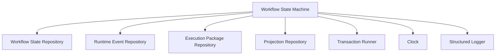

# Workflow State Machine Component Design

Date: 2026-05-13

## Purpose

Define the full Component Design for the V2 `Workflow State Machine` using the PAA glossary's 15 Component Design elements.

This note turns the earlier system-level and data-model work into a concrete logic-component contract that can be implemented with injected repositories instead of ad hoc SQL, file reconstruction, or queue-derived pseudo-state.

## Related Notes

Read alongside:
- `/Users/billyweisberg/Repos/billyweisberg/paa-platform/docs/terminology/paa-engineering-terminology-glossary.md`
- `/Users/billyweisberg/Repos/billyweisberg/paa-platform/docs/2_Design/2026-05-13-paa-system-component-diagram-v2.md`
- `/Users/billyweisberg/Repos/billyweisberg/paa-platform/docs/2_Design/2026-05-13-paa-v2-component-relationships.md`
- `/Users/billyweisberg/Repos/billyweisberg/paa-platform/docs/2_Design/2026-05-13-final-workflow-state-entity-design.md`
- `/Users/billyweisberg/Repos/billyweisberg/paa-platform/docs/2_Design/2026-05-13-workflow-state-repository-contract.md`
- `/Users/billyweisberg/Repos/billyweisberg/paa-platform/docs/2_Design/2026-05-13-runtime-event-repository-contract.md`
- `/Users/billyweisberg/Repos/billyweisberg/paa-platform/docs/2_Design/2026-05-13-execution-package-repository-contract.md`
- `/Users/billyweisberg/Repos/billyweisberg/paa-platform/docs/2_Design/2026-05-13-component-design-repository-contract.md`
- `/Users/billyweisberg/Repos/billyweisberg/paa-platform/docs/2_Design/2026-05-13-projection-repository-contract.md`

## 1. Role

`Workflow State Machine` owns the authoritative current workflow truth for each work item and applies legal state transitions proposed by runtime lifecycle paths.

Authority boundary:
- owns workflow stage, owner, lineage state, terminal decision, blocking state, and transition history semantics
- does not execute role work
- does not own queue transport
- does not own issue or PR lifecycle
- does not author projections
- does not infer truth from repo-local files or queue residue

## 2. Component State Model

The component is stateful through DB-primary records, but runtime instances should remain process-local and stateless between calls.

### Persistent state owned semantically by this component
- `paa.workflow_states`
- `paa.workflow_transitions`

### Adjacent persistent state required for consistency decisions
- `paa.queue_claims`

### Runtime state owned in memory only
- validated transition intent under evaluation
- loaded current-state snapshot
- loaded supporting claim context
- computed legal-transition decision
- computed compensation / repair intent when needed

### State model summary

For each `work_item_id`, the component maintains exactly one canonical current state plus append-only transition history.

Current state dimensions:
- workflow stage
- current owner role
- lineage state
- consistency state
- blocking reason
- terminal decision
- active execution context references
- active transport references

### State machine categories
- pre-assignment
- role-assigned
- role-review-pending
- QA-pending
- acceptance-pending
- terminal
- blocked / repair-required

### Core state rule
The `Workflow State Machine` is the only component allowed to turn a transition intent into new workflow truth.

## 3. Service Contract

The `Workflow State Machine` exposes a logic-level service contract, not a transport contract.

### Inputs
- transition intent
- current work-item identity
- supporting source/result references
- execution context references
- optional repair or compensation reason

### Outputs
- updated current workflow state
- recorded workflow transition
- legality / rejection decision
- optional repair instruction
- optional normalized transition event for downstream projection

### Guarantees
- current workflow truth is read from DB-primary state, not reconstructed from files or queue residue
- every applied state mutation records a corresponding transition row
- illegal transitions are rejected explicitly
- repair-required conditions are surfaced as workflow truth, not hidden in logs
- terminal states remain queryable as canonical current state

### Invariants
- one `workflow_states` row per `work_item_id`
- append-only `workflow_transitions`
- legal state changes only through this component
- no projection or report file may redefine workflow truth
- no queue message alone may redefine workflow truth

## 4. Data Contract

### Primary owned records
- `WorkflowStateRecord`
- `WorkflowTransitionRecord`

### Consumed records
- `QueueClaimRecord`
- selected runtime event references
- selected execution package context references

### Intent input contract
A `WorkflowTransitionIntent` must carry:
- `project_id`
- `work_item_id`
- `transition_type`
- `actor_role_id`
- `actor_agent_id` when available
- expected `from_workflow_stage` when known
- desired `to_workflow_stage`
- source references:
  - `source_handoff_id`
  - `source_queue_message_id`
  - `source_message_id_external`
  - `source_packet_schema_type`
  - `source_packet_role_id`
- result references when applicable:
  - `result_handoff_id`
  - `result_queue_message_id`
  - `result_message_id_external`
  - `result_packet_schema_type`
  - `result_role_id`
- execution context:
  - `automation_run_id`
  - `current_issue_number`
  - `current_pr_number`
  - `canonical_branch`
  - `active_role_branch`
- narrative context:
  - `reason`
  - `notes`
  - `metadata_json`

### Response contract
A `WorkflowTransitionResult` should provide:
- applied / rejected status
- resulting current workflow state
- resulting workflow transition row
- rejection code if not applied
- repair-required indicator
- normalized transition summary for projections

## 5. Injected Services

The component should be constructed with injected services only.

Required injected services:
- `WorkflowStateRepository`
- `RuntimeEventRepository`
- `ExecutionPackageRepository`
- `ProjectionRepository` for explicit projection refresh requests only
- `Clock` abstraction
- `IdGenerator` abstraction when component-generated IDs are needed
- `TransactionRunner` or equivalent unit-of-work boundary
- `StructuredLogger`

Optional injected services:
- `ComponentDesignRepository` when workflow transitions must resolve stable component or realization context
- `WorkflowTransitionPolicy` if transition legality logic is broken into a dedicated policy object

### Injection rule
The component must not instantiate repositories, read SQL directly, or read repo-local report files directly.

## 6. Interfaces

### Provided interfaces
- `WorkflowStateMachine`
- optional narrower interfaces:
  - `WorkflowStateReader`
  - `WorkflowTransitionApplier`
  - `WorkflowRepairService`

### Required interfaces
- `WorkflowStateRepository`
- `RuntimeEventRepository`
- `ExecutionPackageRepository`
- `ProjectionRepository`
- `Clock`
- `TransactionRunner`
- `StructuredLogger`

### Implementation pattern
Recommended code realization:
- interface / protocol:
  - `workflow_state_machine_interface`
- concrete implementation:
  - `default_workflow_state_machine`

## 7. Functions

Minimum concrete functions:
- `get_current_state(work_item_id)`
- `create_initial_state(intent)`
- `validate_transition(intent, current_state)`
- `apply_transition(intent)`
- `record_failed_transition(intent, reason)`
- `mark_blocked(intent, blocking_reason)`
- `record_terminal_decision(intent, terminal_decision)`
- `record_manual_repair(intent, repair_reason)`
- `refresh_projection_views(work_item_id)`

Helper functions:
- `resolve_expected_current_state(intent)`
- `validate_claim_context(intent)`
- `derive_next_owner(intent)`
- `derive_lineage_state(intent)`
- `derive_consistency_state(intent)`
- `build_transition_row(intent, current_state)`
- `build_state_update(intent, current_state)`

## 8. Messages Received

The component accepts command-style messages from logic callers, not direct RabbitMQ packets.

Primary commands:
- `CreateInitialWorkflowState`
- `ApplyWorkflowTransition`
- `RecordWorkflowTransitionFailure`
- `MarkWorkflowBlocked`
- `RecordWorkflowTerminalDecision`
- `RecordWorkflowManualRepair`
- `RefreshWorkflowProjection`

Primary queries:
- `GetCurrentWorkflowState`
- `ListWorkflowTransitionHistory`
- `GetWorkflowRepairStatus`

## 9. Messages Published

The component may publish logic-level messages or callbacks to downstream projection and orchestration layers.

Outgoing messages:
- `WorkflowTransitionApplied`
- `WorkflowTransitionRejected`
- `WorkflowRepairRequired`
- `WorkflowTerminalDecisionRecorded`
- `WorkflowProjectionRefreshRequested`

These are internal service-level messages, not queue transport packets.

## 10. Message Data Contracts

### `ApplyWorkflowTransition`
Carries:
- `WorkflowTransitionIntent`

### `WorkflowTransitionApplied`
Carries:
- `work_item_id`
- `workflow_state_id`
- `workflow_transition_id`
- `from_workflow_stage`
- `to_workflow_stage`
- `from_owner_role_id`
- `to_owner_role_id`
- `lineage_state`
- `terminal_decision`
- `state_consistency`
- `applied_at`

### `WorkflowTransitionRejected`
Carries:
- `work_item_id`
- `transition_type`
- `rejection_code`
- `rejection_reason`
- `current_workflow_stage`
- `current_owner_role_id`

### `WorkflowRepairRequired`
Carries:
- `work_item_id`
- `repair_code`
- `repair_reason`
- `current_state_consistency`
- supporting source references

## 11. Event Subscriptions

The component should subscribe only to internal application-level events or service callbacks, not directly to RabbitMQ.

Subscribed events:
- `AssignmentPacketSent`
- `RoleResultReturned`
- `QAVerificationRecorded`
- `AcceptanceCloseoutCompleted`
- `QueueClaimAcknowledged`
- `QueueClaimRepairDetected`

Subscription rule:
- subscriptions are mediated through the `Runtime Lifecycle Engine` or application service layer
- the state machine does not bind directly to transport primitives

## 12. Events Published

The component publishes internal domain events when workflow truth changes.

Published events:
- `WorkflowStateInitialized`
- `WorkflowStageChanged`
- `WorkflowOwnerChanged`
- `WorkflowBlocked`
- `WorkflowRepairRequired`
- `WorkflowClosed`
- `WorkflowSuperseded`

## 13. Event Data Contracts

### `WorkflowStageChanged`
Carries:
- `project_id`
- `work_item_id`
- `workflow_state_id`
- `workflow_transition_id`
- `from_workflow_stage`
- `to_workflow_stage`
- `from_owner_role_id`
- `to_owner_role_id`
- `occurred_at`

### `WorkflowClosed`
Carries:
- `project_id`
- `work_item_id`
- `workflow_state_id`
- `terminal_decision`
- `closed_at`

### `WorkflowRepairRequired`
Carries:
- `project_id`
- `work_item_id`
- `workflow_state_id`
- `repair_code`
- `repair_reason`
- `state_consistency`
- `occurred_at`

## 14. Component Lifecycle

### Construction
- repositories and infrastructure services are injected
- no DB mutation occurs at construction time
- implementation verifies required services are present

### Steady-state operation
- accept transition intents
- load current authoritative state
- validate transition legality
- commit state mutation and transition history atomically
- trigger projection refresh request when required

### Recovery
- read DB-primary state first
- use runtime event and claim records only as supporting evidence
- if evidence conflicts, mark `manual_repair_required` instead of guessing

### Shutdown
- no special shutdown state is required beyond standard dependency cleanup

### Replay / repair behavior
- repair paths remain first-class lifecycle operations
- component must support explicit repair transitions and terminal compensation recording

## 15. Component Configuration

Required configuration:
- projection refresh mode:
  - synchronous
  - deferred
- transition strictness mode:
  - fail_closed
  - fail_with_repair_marker
- allowed terminal decisions
- repair escalation thresholds
- stale-claim tolerance inputs when claim state is consulted

Configuration rules:
- configuration may change validation strictness and projection behavior
- configuration may not redefine legal workflow stages outside the authoritative data contract without a schema and design update

## Dependency Summary

## Prohibited Dependencies

The `Workflow State Machine` must not depend directly on:
- RabbitMQ client libraries
- GitHub API clients
- repo-local report JSON
- repo-local automation memory markdown
- queue claim files
- direct SQL outside repository boundaries
- installed skill or automation prompt text

Those concerns belong to other components.

## Implementation Guidance

Recommended package placement:
- interface / contract:
  - `/Users/billyweisberg/Repos/billyweisberg/paa-platform/packages/paa-core/src/paa_core/services/workflow_state_machine/contracts.py`
- models:
  - `/Users/billyweisberg/Repos/billyweisberg/paa-platform/packages/paa-core/src/paa_core/services/workflow_state_machine/models.py`
- implementation:
  - `/Users/billyweisberg/Repos/billyweisberg/paa-platform/packages/paa-core/src/paa_core/services/workflow_state_machine/default.py`

Recommended first implementation slice:
1. `get_current_state`
2. `apply_transition`
3. `record_failed_transition`
4. `record_terminal_decision`

That first slice is enough to start replacing ad hoc workflow-state mutation paths in the runtime.

## Design Conclusions

1. `Workflow State Machine` is now a concrete logic component, not just a diagram box.
2. It should depend on repositories, not raw SQL or local files.
3. It owns workflow semantics, not transport or execution behavior.
4. It must fail closed on conflicting evidence instead of reconstructing best-effort truth.
5. This component is the main mechanism for eliminating the old workflow-truth hybrid behavior.
