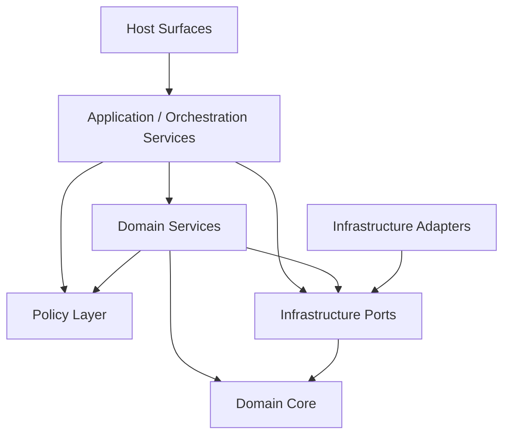

# PAA Layered Architecture Proposal

Date: 2026-05-15

## Purpose

Synthesize the current PAA system-design work into a preferred layered architecture proposal.

This note brings together four prior analysis tracks:
- system decomposition options
- domain object model and OO decomposition
- volatility analysis
- deployment variants and swappable boundaries

The goal is to move from:
- multiple candidate decomposition methods
- several volatility and topology concerns
- a growing domain model

to:
- one preferred architecture direction for `PAA Authority Package 1.0`

## Related Notes

This note synthesizes:
- `/Users/billyweisberg/Repos/billyweisberg/paa-platform/docs/2_Design/2026-05-15-paa-system-decomposition-options.md`
- `/Users/billyweisberg/Repos/billyweisberg/paa-platform/docs/2_Design/2026-05-13-paa-domain-object-model-and-oo-component-decomposition.md`
- `/Users/billyweisberg/Repos/billyweisberg/paa-platform/docs/2_Design/2026-05-15-paa-volatility-analysis.md`
- `/Users/billyweisberg/Repos/billyweisberg/paa-platform/docs/2_Design/2026-05-15-paa-deployment-variants-and-swappable-boundaries.md`

Read alongside:
- `/Users/billyweisberg/Repos/billyweisberg/paa-platform/docs/2_Design/2026-05-15-paa-authority-package-authoring-process.md`
- `/Users/billyweisberg/Repos/billyweisberg/paa-platform/docs/2_Design/2026-05-13-paa-system-component-diagram-v2.md`
- `/Users/billyweisberg/Repos/billyweisberg/paa-platform/docs/2_Design/2026-05-13-paa-v2-component-relationships.md`
- `/Users/billyweisberg/Repos/billyweisberg/paa-platform/docs/terminology/paa-engineering-terminology-glossary.md`

## Problem Statement

PAA cannot safely be designed as:
- a direct expansion of current scripts
- a CLI-first monolith whose internal boundaries are vague
- a queue-driven runtime whose workflow truth is inferred from transport residue
- a laptop-local system that pretends deployment topology does not matter

At the same time, PAA should not become:
- an over-abstract framework with no concrete workflow semantics
- a speculative architecture built entirely around future cloud possibilities

The architecture must do both:
- preserve a stable semantic backbone
- isolate the effects of likely change

## Synthesis Summary

The prior notes lead to four main conclusions.

### Conclusion 1. Domain-centered decomposition is the semantic backbone

The strongest stable concepts in the system are domain objects such as:
- `Project`
- `WorkItem`
- `Workflow`
- `WorkflowTransition`
- `InstalledExecutionPackage`
- `DesignPackage`
- `CoderBrief`
- `BriefTarget`
- `Component`
- `ComponentElement`
- `CodeArtifactTarget`
- `VerificationObligation`
- `AcceptanceEvent`

These objects give the system durable language and ownership rules.

### Conclusion 2. Functional decomposition alone is not enough

Capability-oriented services are helpful, but by themselves they tend to create broad service blobs and can accidentally fossilize today's scripts into tomorrow's architecture.

Functional decomposition is useful, but only when anchored to the domain model.

### Conclusion 3. Volatility is real and must shape the seams

Expected high-volatility areas include:
- persistence backend
- message transport
- execution surface / file-share model
- runtime hosting model
- role execution topology
- policy and decision rules
- projection/reporting shape
- producer-side authoring tooling
- agent execution model

This means repositories, ports, policies, and adapters are not optional abstractions.
They are required isolation seams.

### Conclusion 4. Deployment variation is first-class

PAA must tolerate:
- local CLI use
- Docker Compose
- Docker Desktop
- Kubernetes
- EKS + EFS
- AKS + Azure Files
- split role processes / pods
- future API and UI surfaces
- self-hosted combined producer/consumer installation

So the architecture must remain topology-neutral at its semantic core.

## Preferred Architecture Choice

The preferred architecture for PAA is:
- a **layered hybrid architecture**
- built on a **domain-centered semantic backbone**
- shaped by **volatility isolation seams**
- validated against **multiple deployment variants**

This is not a compromise for its own sake.
It is the architecture that best fits the actual pressures on this system.

## Architecture Overview

The proposed layered architecture has seven layers.

1. `Domain Core`
2. `Domain Services`
3. `Policy Layer`
4. `Application / Orchestration Services`
5. `Infrastructure Ports`
6. `Infrastructure Adapters`
7. `Host Surfaces`

## Layer 1. Domain Core

### Purpose
Provide the stable domain object model and ownership semantics of the system.

### Contains
- `Project`
- `WorkItem`
- `Workflow`
- `WorkflowTransition`
- `QueueClaim`
- `PublishedExecutionPackage`
- `InstalledExecutionPackage`
- `ExecutionOverlay`
- `DesignPackage`
- `CoderBrief`
- `BriefTarget`
- `VerificationObligation`
- `AcceptanceEvent`
- `EvidenceRecord`
- `Component`
- `ComponentElementType`
- `ComponentElement`
- `CodeArtifactType`
- `CodeArtifactTarget`

### Responsibilities
- semantic identity
- ownership boundaries
- invariant language
- stable terminology for the rest of the system

### Must remain stable
This layer should change more slowly than transport, host, storage, or UI concerns.

## Layer 2. Domain Services

### Purpose
Implement business semantics that operate on the domain core.

### Proposed services
- `WorkItem Coordination Service`
- `Workflow Lifecycle Service`
- `Execution Package Resolution Service`
- `Brief Assembly Service`
- `Component Design Planning Service`
- `Verification And Acceptance Service`

### Responsibilities
- workflow semantics
- execution package selection and effective context resolution
- converting component design into brief targets
- evaluating acceptance and verification outcomes

### Important rule
These services should not know about:
- RabbitMQ specifics
- SQS specifics
- CLI specifics
- FastAPI specifics
- EFS or Azure Files specifics

## Layer 3. Policy Layer

### Purpose
Isolate the rules that are expected to evolve faster than the domain model.

### Proposed policies
- `RoutingPolicy`
- `WorkflowTransitionPolicy`
- `AcceptancePolicy`
- `ResetRecoveryPolicy`
- `DeploymentCapabilityPolicy`
- `ProjectionFreshnessPolicy`

### Responsibilities
- choose legal or preferred next routes
- define when resets or repair are required
- define acceptance and gating criteria
- define deployment-specific capability allowances when necessary

### Important rule
Policy should be explicit and injectable.
It should not be hidden in runtime scripts or transport handlers.

## Layer 4. Application / Orchestration Services

### Purpose
Coordinate use-case execution across domain services, policies, and infrastructure ports.

### Proposed services
- `Authority Publication Application Service`
- `TechLead Application Service`
- `Role Return Application Service`
- `Projection Refresh Application Service`
- `Execution Surface Preparation Application Service`

### Responsibilities
- execute user- or automation-triggered use cases
- orchestrate calls across repositories, policies, and domain services
- remain host-agnostic so they can be called by CLI, API, or background workers

### Important rule
These services coordinate use cases but should not absorb domain semantics that belong in domain services.

## Layer 5. Infrastructure Ports

### Purpose
Define stable interfaces for volatile external concerns.

### Proposed ports
- `WorkflowStateRepository`
- `RuntimeEventRepository`
- `ExecutionPackageRepository`
- `ComponentDesignRepository`
- `ProjectionRepository`
- `MessageBus`
- `ExecutionSurfaceProvider`
- `ArtifactStore`
- `GitProvider`
- `ConfigurationProvider`
- `SecretProvider`
- `TransactionRunner`
- `Clock`
- `StructuredLogger`

### Responsibilities
- abstract external systems and runtime environment details
- preserve stable contracts for domain and application layers

### Important rule
Ports must be meaningful seams, not thin wrappers over current implementation scripts.

## Layer 6. Infrastructure Adapters

### Purpose
Implement the ports for actual deployment environments.

### Example adapters
- `PostgresWorkflowStateRepository`
- `PostgresRuntimeEventRepository`
- `PostgresComponentDesignRepository`
- `FileSystemExecutionPackageRepository`
- `RabbitMqMessageBus`
- `SqsMessageBus`
- `AzureServiceBusMessageBus`
- `LocalWorktreeExecutionSurfaceProvider`
- `EfsExecutionSurfaceProvider`
- `AzureFilesExecutionSurfaceProvider`
- `FileSystemArtifactStore`
- `GitHubProvider`
- environment or cloud-backed configuration providers

### Responsibilities
- do the actual IO work
- bind to local, cloud, or container runtime specifics
- remain replaceable without changing the domain model

## Layer 7. Host Surfaces

### Purpose
Expose the system through concrete runtime entrypoints.

### Example hosts
- CLI host
- background worker host
- FastAPI host
- producer UI backend
- consumer UI backend

### Responsibilities
- parse and validate host-level input
- compose application services
- translate host requests into application-service calls
- return host-appropriate responses

### Important rule
Host surfaces must remain thin.
They are not allowed to become the real business logic layer.

## Dependency Direction

The dependency direction should be strictly inward toward stability.

Interpretation:
- hosts call application services
- application services orchestrate domain services and ports
- domain services operate on domain objects and consult policy and ports
- adapters implement ports
- domain core remains the most stable center

## Mapping The Existing V2 Components Into The Proposed Layers

### `Installed Execution Package`
- domain core concept
- resolved through `Execution Package Resolution Service`
- accessed through `ExecutionPackageRepository`

### `Runtime Lifecycle Engine`
- should be decomposed into:
  - application/orchestration services
  - domain services
  - policy components
- not kept as one oversized logic blob

### `Workflow State Machine`
- should not remain a vague single box
- should likely decompose primarily into:
  - `Workflow Lifecycle Service`
  - possibly `WorkflowTransitionPolicy`
  - downstream projection services

### `Reporting And Traceability Projection`
- belongs primarily in projection services plus projection repository
- must remain downstream from primary truth

### DAL repositories
- remain in the `Infrastructure Ports` layer as contracts
- concrete repository classes live in `Infrastructure Adapters`

## Why This Architecture Fits The Earlier Analysis

### From decomposition options
- keeps the domain-centered backbone
- avoids pure functional-service blobs
- incorporates volatility and deployment concerns explicitly

### From the domain object model
- gives domain objects a real architectural home
- prevents them from being flattened into script logic

### From volatility analysis
- provides clear seams for:
  - storage
  - transport
  - execution surface
  - host runtime
  - policy
  - reporting
  - authoring tooling

### From deployment analysis
- keeps the semantic center stable across:
  - laptop
  - compose
  - k8s
  - EKS / EFS
  - AKS / Azure Files
  - split role processes
  - future API / UI hosts

## Producer-Side Tooling Fit

This layered architecture is also a good fit for future producer-side authority tooling.

Producer tooling can be aligned to the same layers:
- domain object authoring
- component catalog authoring
- component element authoring
- code artifact target authoring
- policy selection
- deployment capability annotation
- brief target derivation
- publication orchestration

That means the architecture is not only runtime-friendly.
It is also authoring-friendly.

## What This Proposal Rejects

This proposal rejects these architecture patterns for PAA:

1. script-centered architecture
- current file layout or commands are not the design center

2. transport-centered architecture
- RabbitMQ or any queue is not workflow truth

3. host-centered architecture
- CLI structure does not define the business architecture

4. file-centered architecture
- repo-local files are not allowed to own operational truth by accident

5. giant runtime blob architecture
- `Runtime Lifecycle Engine` should not become a catch-all logic class

## Implementation Guidance

This note is an architecture choice, not a full implementation plan.

But it does imply the next good implementation sequence:

1. refine the decomposed logic services under the preferred layers
2. produce `Component Specs` for the first true domain services
3. continue replacing script-level mixed logic with:
- application services
- domain services
- policy objects
- repository-backed ports

### First likely concrete domain/application services to spec next
- `Workflow Lifecycle Service`
- `Execution Package Resolution Service`
- `Brief Assembly Service`
- `TechLead Application Service`

## Design Decision

**Decision**
PAA should adopt a **layered hybrid architecture** with:
- a domain-centered semantic backbone
- explicit policy layer
- application/orchestration services
- infrastructure ports and adapters
- thin host surfaces

**Reason**
This architecture best balances:
- semantic clarity
- blast-radius control
- deployment adaptability
- producer-side toolability
- future agent/runtime evolution

## Design Conclusion

This proposal is the current preferred architecture direction for `PAA Authority Package 1.0`.

It provides the architecture selection step that follows naturally from:
- decomposition brainstorming
- domain modeling
- volatility analysis
- deployment-variant analysis

From here, the next design work should focus on:
- refining concrete services within this layered model
- producing `Component Specs` for those services
- aligning producer-side authoring tools to this structure
