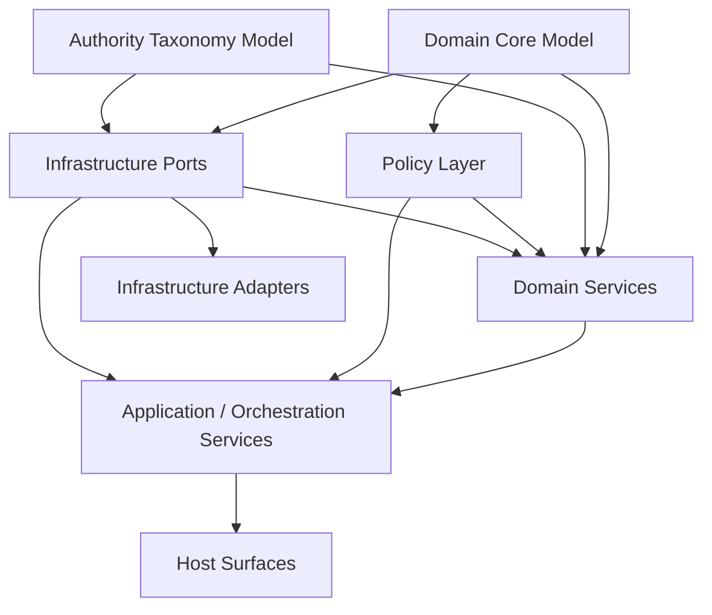

# PAA Layered Component Dependency Graph

Date: 2026-05-15

## Purpose

Establish the first explicit component dependency graph for the preferred PAA layered architecture.

This note answers the immediate design question:
- do we now have enough System Design to derive component dependencies and let the dependency graph, rather than preference, determine build sequencing?

The answer is:
- yes, at the component/service/port/adapter level
- not yet at the full code-artifact-target level inside every component spec

That distinction matters.

## Related Notes

Read alongside:
- `/Users/billyweisberg/Repos/billyweisberg/paa-platform/docs/2_Design/2026-05-03-component-dependency-graph-contract.md`
- `/Users/billyweisberg/Repos/billyweisberg/paa-platform/docs/2_Design/2026-05-15-paa-layered-architecture-proposal.md`
- `/Users/billyweisberg/Repos/billyweisberg/paa-platform/docs/2_Design/2026-05-13-paa-domain-object-model-and-oo-component-decomposition.md`
- `/Users/billyweisberg/Repos/billyweisberg/paa-platform/docs/2_Design/2026-05-15-paa-system-decomposition-options.md`
- `/Users/billyweisberg/Repos/billyweisberg/paa-platform/docs/2_Design/2026-05-15-paa-volatility-analysis.md`
- `/Users/billyweisberg/Repos/billyweisberg/paa-platform/docs/2_Design/2026-05-15-paa-deployment-variants-and-swappable-boundaries.md`
- `/Users/billyweisberg/Repos/billyweisberg/paa-platform/docs/terminology/paa-engineering-terminology-glossary.md`

## Dependency Graph Readiness Assessment

## What is now mature enough

We now have enough System Design to define dependencies between:
- major domain services
- policy components
- application/orchestration services
- infrastructure ports
- infrastructure adapters
- host surfaces

This is enough to determine:
- architectural sequencing
- contract-before-implementation order
- which families can parallelize after contracts stabilize
- which components are upstream prerequisites for others

## What is not mature enough yet

We do not yet have enough detail to derive the full code-artifact-level graph for:
- every `Component Element`
- every `Code Artifact Target`
- every interface/class/function/file realization inside each service

That more granular graph comes after additional component specs are written.

## Design Rule

From this point forward:
- build ordering should be derived from the dependency graph
- not from convenience
- not from whichever service feels most interesting
- not from whichever current script is most painful

## Graph Scope

This note defines the dependency graph for the preferred layered architecture at the level of:
- component families
- concrete services
- ports
- adapters
- hosts

It does not yet attempt to sequence:
- every repository method
- every DTO
- every policy function
- every code artifact realization target

## Node Set

The graph uses the following architecturally meaningful nodes.

## Layer 1. Domain Core Nodes

These are semantic foundation nodes, not host-specific implementations.

- `Domain Core Model`
- `Authority Taxonomy Model`

Where:
- `Domain Core Model` includes the stable domain objects such as `WorkItem`, `Workflow`, `WorkflowTransition`, `InstalledExecutionPackage`, `CoderBrief`, `BriefTarget`, `VerificationObligation`, and `AcceptanceEvent`
- `Authority Taxonomy Model` includes the structured producer-side design taxonomies such as `Component`, `ComponentElementType`, `ComponentElement`, `CodeArtifactType`, and `CodeArtifactTarget`

## Layer 2. Policy Nodes

- `WorkflowTransitionPolicy`
- `RoutingPolicy`
- `AcceptancePolicy`
- `ResetRecoveryPolicy`
- `DeploymentCapabilityPolicy`
- `ProjectionFreshnessPolicy`

## Layer 3. Infrastructure Port Nodes

- `WorkflowStateRepository`
- `RuntimeEventRepository`
- `ExecutionPackageRepository`
- `ComponentDesignRepository`
- `ProjectionRepository`
- `MessageBus`
- `ExecutionSurfaceProvider`
- `ArtifactStore`
- `GitProvider`
- `ConfigurationProvider`
- `SecretProvider`
- `TransactionRunner`
- `Clock`
- `StructuredLogger`

## Layer 4. Domain Service Nodes

- `Workflow Lifecycle Service`
- `Execution Package Resolution Service`
- `Component Design Planning Service`
- `Brief Assembly Service`
- `Verification And Acceptance Service`
- `Work Item Coordination Service`

## Layer 5. Application / Orchestration Service Nodes

- `Authority Publication Application Service`
- `TechLead Application Service`
- `Role Return Application Service`
- `Projection Refresh Application Service`
- `Execution Surface Preparation Application Service`

## Layer 6. Infrastructure Adapter Nodes

- `Postgres Repository Adapters`
- `Transport Adapters`
- `Execution Surface Adapters`
- `Artifact Store Adapters`
- `Git Provider Adapters`
- `Configuration / Secret Adapters`

## Layer 7. Host Surface Nodes

- `CLI Host`
- `Background Worker Host`
- `FastAPI Host`
- `Producer UI Backend`
- `Consumer UI Backend`

## Typed Dependency Rules Used Here

This note uses the typed dependency model already established in:
- `/Users/billyweisberg/Repos/billyweisberg/paa-platform/docs/2_Design/2026-05-03-component-dependency-graph-contract.md`

The most important dependency types here are:
- `depends_on_contract`
- `depends_on_injection`
- `depends_on_state`
- `depends_on_event`
- `depends_on_hosting`

And these sequencing attributes:
- `hard`
- `soft`
- `must_precede`
- `may_parallelize`
- `must_follow_contract_only`

## Primary Dependency Relationships

## 1. Domain Core And Authority Taxonomy Are Foundational

`Authority Taxonomy Model` depends on `Domain Core Model` only softly for shared identity conventions, but both are foundational and should be treated as the base of the graph.

These foundation nodes must precede:
- domain service contracts
- repository contracts that expose domain records
- brief derivation semantics

## 2. Policy Contracts Depend On Domain Semantics

All policy nodes depend on:
- `Domain Core Model`

Because policy evaluates domain states and outcomes.

They may also depend softly on:
- `Authority Taxonomy Model`

when policies consider component, brief, or deployment-authoring metadata.

## 3. Infrastructure Ports Depend On Domain Contracts

Repository and port contracts depend on:
- `Domain Core Model`
- `Authority Taxonomy Model` where applicable

Because the port interfaces must speak in domain and design terms.

Examples:
- `WorkflowStateRepository` depends on `Domain Core Model`
- `ComponentDesignRepository` depends on both `Domain Core Model` and `Authority Taxonomy Model`
- `ExecutionPackageRepository` depends on `InstalledExecutionPackage` semantics from the domain model

## 4. Domain Services Depend On Ports And Policies By Contract

### `Workflow Lifecycle Service`
Depends on:
- `Domain Core Model`
- `WorkflowTransitionPolicy`
- `AcceptancePolicy`
- `ResetRecoveryPolicy`
- `WorkflowStateRepository`
- `RuntimeEventRepository`
- `ExecutionPackageRepository`
- `TransactionRunner`
- `Clock`
- `StructuredLogger`

### `Execution Package Resolution Service`
Depends on:
- `Domain Core Model`
- `ExecutionPackageRepository`
- `DeploymentCapabilityPolicy`
- `StructuredLogger`

### `Component Design Planning Service`
Depends on:
- `Authority Taxonomy Model`
- `ComponentDesignRepository`
- `StructuredLogger`

### `Brief Assembly Service`
Depends on:
- `Domain Core Model`
- `Authority Taxonomy Model`
- `Component Design Planning Service`
- `Execution Package Resolution Service`
- `ComponentDesignRepository`
- `StructuredLogger`

### `Verification And Acceptance Service`
Depends on:
- `Domain Core Model`
- `AcceptancePolicy`
- `RuntimeEventRepository`
- `ProjectionRepository`
- `GitProvider`
- `StructuredLogger`

### `Work Item Coordination Service`
Depends on:
- `Domain Core Model`
- `Workflow Lifecycle Service`
- `Execution Package Resolution Service`
- `Brief Assembly Service`
- `Verification And Acceptance Service`
- `ComponentDesignRepository`
- `RuntimeEventRepository`
- `StructuredLogger`

## 5. Application Services Depend On Domain Services And Ports

### `Authority Publication Application Service`
Depends on:
- `Component Design Planning Service`
- `Brief Assembly Service`
- `ComponentDesignRepository`
- `ExecutionPackageRepository`
- `ArtifactStore`
- `StructuredLogger`

### `TechLead Application Service`
Depends on:
- `Workflow Lifecycle Service`
- `Execution Package Resolution Service`
- `Verification And Acceptance Service`
- `RoutingPolicy`
- `WorkflowStateRepository`
- `RuntimeEventRepository`
- `ExecutionPackageRepository`
- `MessageBus`
- `ExecutionSurfaceProvider`
- `GitProvider`
- `StructuredLogger`

### `Role Return Application Service`
Depends on:
- `Workflow Lifecycle Service`
- `Execution Package Resolution Service`
- `RuntimeEventRepository`
- `WorkflowStateRepository`
- `MessageBus`
- `ArtifactStore`
- `StructuredLogger`

### `Projection Refresh Application Service`
Depends on:
- `ProjectionRepository`
- `WorkflowStateRepository`
- `RuntimeEventRepository`
- `ProjectionFreshnessPolicy`
- `StructuredLogger`

### `Execution Surface Preparation Application Service`
Depends on:
- `ExecutionSurfaceProvider`
- `ExecutionPackageResolution Service`
- `StructuredLogger`

## 6. Infrastructure Adapters Depend On Port Contracts, Not Domain Services

This is a critical rule.

Examples:
- `Postgres Repository Adapters` depend on repository port contracts and domain record shapes
- `Transport Adapters` depend on `MessageBus`
- `Execution Surface Adapters` depend on `ExecutionSurfaceProvider`
- `Artifact Store Adapters` depend on `ArtifactStore`
- `Git Provider Adapters` depend on `GitProvider`
- `Configuration / Secret Adapters` depend on `ConfigurationProvider` and `SecretProvider`

They do not depend on domain services.

## 7. Host Surfaces Depend On Application Services

### `CLI Host`
Depends on:
- application services only
- configuration and composition wiring

### `Background Worker Host`
Depends on:
- application services only
- transport polling or scheduling wrapper logic

### `FastAPI Host`
Depends on:
- application services only
- host DTO translation

### `Producer UI Backend`
Depends on:
- producer-side application services
- projection/query services

### `Consumer UI Backend`
Depends on:
- consumer-side application services
- projection/query services

## Dependency Graph Diagram

This diagram is intentionally compressed at the family level.
The detailed component dependency matrix below carries the more operational meaning.

## Build Sequencing Consequences

## Stratum 0. Foundation Modeling

These must come first:
- `Domain Core Model`
- `Authority Taxonomy Model`

Reason:
Everything else speaks their language.

## Stratum 1. Port And Policy Contracts

These may begin after Stratum 0:
- all infrastructure port contracts
- all policy contracts

Reason:
Domain services should depend on stable contracts, not on concrete adapters or scripts.

## Stratum 2. Parallelizable Mid-Layer Start

After Stratum 1 contracts are stable, the following may begin in parallel where edit surfaces allow:
- `Workflow Lifecycle Service`
- `Execution Package Resolution Service`
- `Component Design Planning Service`
- infrastructure adapter implementations for already-defined ports

This is the first major parallelization point.

Important rule:
These are allowed because they can follow stable contracts rather than waiting for full downstream application-service implementation.

## Stratum 3. Higher-Level Domain Services

These depend on earlier domain services and should follow them:
- `Brief Assembly Service`
- `Verification And Acceptance Service`
- `Work Item Coordination Service`

Reason:
They compose or depend semantically on prior services.

## Stratum 4. Application / Orchestration Services

These follow after the relevant domain services and ports are stable:
- `Authority Publication Application Service`
- `TechLead Application Service`
- `Role Return Application Service`
- `Projection Refresh Application Service`
- `Execution Surface Preparation Application Service`

## Stratum 5. Host Surfaces

These should come after application services are stable enough:
- `CLI Host`
- `Background Worker Host`
- `FastAPI Host`
- future UI backends

Reason:
Host surfaces should wrap stable application-service use cases, not invent them.

## Parallelization Rules

## Safe parallelization after contracts stabilize

These families may often be implemented in parallel after their contracts are fixed:
- domain services in different edit surfaces
- repository adapters for unrelated ports
- host surfaces that depend on already-stable application services
- projection-specific read/query layers after primary-truth services stabilize

## Not safely parallel by default

These should be treated as blocking unless explicitly decomposed further:
- multiple services editing the same unresolved policy area
- multiple services defining the same core domain contract at once
- host implementation before application-service contract stabilizes
- adapter work before port contracts exist

## Current Build-First Conclusion

The next build steps are not “whatever service we choose.”
They are constrained by the graph.

Given current design maturity, the next structurally valid build sequence is:

1. finish any remaining foundation contract normalization in:
- domain core terms
- authority taxonomy terms
- port contracts
- policy contracts

2. then begin the first Stratum 2 services and adapter slices

From the current design state, the first buildable logic-service candidates are:
- `Workflow Lifecycle Service`
- `Execution Package Resolution Service`
- `Component Design Planning Service`

These are not chosen by taste.
They are first because their dependencies are the earliest satisfiable ones in the graph.

## Relationship To Current Repository Work

The current repository implementations already support the graph structurally.

That means the existing DAL work belongs where it should:
- repository contracts in the port layer
- concrete repository classes in the adapter layer

This reinforces that the next step is not random component coding.
It is graph-driven movement into the earliest valid domain-service nodes.

## Unresolved Dependency Questions

The following finer-grained dependency questions remain open for later component-spec work:
- exact internal split between `Workflow Lifecycle Service` and `WorkflowTransitionPolicy`
- whether `Verification And Acceptance Service` should be split further for merge/closeout behavior
- whether `Brief Assembly Service` should depend directly on `Execution Package Resolution Service` or only on package context DTOs
- which read-only projection queries deserve their own query-service nodes

These do not block the current graph.
They affect finer-grained later decomposition.

## Design Conclusion

Yes, we now have enough System Design to establish the component dependency graph for the preferred layered architecture.

That graph says:
- the next implementation work should follow dependency strata
- the first real logic-service implementations should come from the earliest buildable Stratum 2 services
- build order is now a dependency-graph result, not a subjective choice
