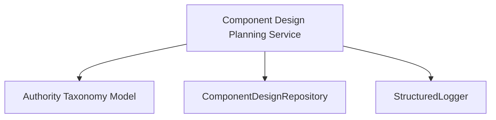

# Component Design Planning Service Component Spec

Date: 2026-05-16

## Purpose

Define the full `Component Spec` for `Component Design Planning Service` using the PAA glossary's component-design discipline and the current layered architecture.

This service is the first fully specified Stratum 2 domain service in the preferred layered architecture.

It exists to convert structured component-design data into planning-friendly outputs that can be used by:
- producer-side authority authoring flows
- brief derivation flows
- component-targeted implementation planning
- future authoring and visualization tooling

## Related Notes

Read alongside:
- `/Users/billyweisberg/Repos/billyweisberg/paa-platform/docs/terminology/paa-engineering-terminology-glossary.md`
- `/Users/billyweisberg/Repos/billyweisberg/paa-platform/docs/2_Design/2026-05-16-component-design-planning-service-pre-spec.md`
- `/Users/billyweisberg/Repos/billyweisberg/paa-platform/docs/2_Design/2026-05-15-paa-layered-architecture-proposal.md`
- `/Users/billyweisberg/Repos/billyweisberg/paa-platform/docs/2_Design/2026-05-15-paa-layered-component-dependency-graph.md`
- `/Users/billyweisberg/Repos/billyweisberg/paa-platform/docs/2_Design/2026-05-15-stratum-2-service-dependency-comparison.md`
- `/Users/billyweisberg/Repos/billyweisberg/paa-platform/docs/2_Design/2026-05-13-component-design-repository-contract.md`
- `/Users/billyweisberg/Repos/billyweisberg/paa-platform/docs/2_Design/2026-05-13-final-component-element-entity-design.md`
- `/Users/billyweisberg/Repos/billyweisberg/paa-platform/docs/2_Design/2026-05-13-component-element-realization-model.md`
- `/Users/billyweisberg/Repos/billyweisberg/paa-platform/docs/2_Design/2026-05-13-paa-domain-object-model-and-oo-component-decomposition.md`

## Architecture Placement

Layer:
- `Domain Services`

Dependency stratum:
- `Stratum 2`

Primary upstream dependencies:
- `Authority Taxonomy Model`
- `ComponentDesignRepository`
- `StructuredLogger`

Primary downstream consumers:
- `Brief Assembly Service`
- `Authority Publication Application Service`
- future producer-side authoring services and UIs

## 1. Role

`Component Design Planning Service` interprets stable component-design structures and produces structured planning outputs that describe what implementation-target options exist for a component and how those targets should be presented to downstream brief-derivation and producer-side authoring flows.

Authority boundary:
- owns planning interpretation of component-design structures
- owns normalization of component elements, realization options, and planning-friendly outputs
- does not own workflow lifecycle semantics
- does not own execution-package resolution
- does not own final brief sequencing or runtime orchestration
- does not own persistence

## 2. Component State Model

The service should be stateless between calls.

### Persistent state
This component owns no primary persistent state.

It consumes persisted design records through `ComponentDesignRepository`, but it does not own the repository state model.

### In-memory working state
During one call, the service may hold:
- loaded component record
- loaded component element set
- loaded realization type options
- loaded realization instances
- loaded brief realization targets when needed for planning context
- assembled planning view DTOs
- validation warnings for incomplete design structures

### State rule
Any planning view produced by this service is a derived interpretation of persisted component-design records.
It is not new primary truth.

## 3. Service Contract

The service provides a planning-oriented contract over stable component-design data.

### Inputs
- project identity
- component identity or component name
- optional component-element filters
- optional realization-type filters
- optional coder-brief context when planning is being shaped for brief derivation
- optional package-scoped dependency/sequencing context when relevant

### Outputs
- component planning views
- component element planning views
- realization-option planning views
- normalized planning payloads for brief assembly
- design-completeness warnings and planning gaps

### Guarantees
- planning outputs are derived from structured component-design records, not from handwritten prose inference alone
- component element and realization vocabulary remain consistent with the controlled taxonomy
- missing design structures are surfaced explicitly as warnings or gaps
- the service does not silently invent implementation targets outside the known component-design model

### Non-guarantees
- this service does not guarantee final execution ordering
- this service does not guarantee workflow readiness
- this service does not guarantee deployment compatibility
- this service does not mutate the component-design model by default

## 4. Data Contract

The service operates on and emits structured planning DTOs.

### Primary consumed records
- `ComponentRecord`
- `ComponentElementTypeRecord`
- `ComponentElementRecord`
- `ComponentElementRealizationTypeRecord`
- `ComponentElementRealizationRecord`
- `CoderBriefRealizationTargetRecord` when brief-context planning is requested

### Primary planning DTOs to expose

#### `ComponentPlanningRequest`
Carries:
- `project_id`
- optional `component_id`
- optional `component_name`
- optional `include_elements`
- optional `include_realization_options`
- optional `coder_run_brief_id`
- optional `design_package_id`
- optional `metadata`

#### `ComponentPlanningView`
Carries:
- component identity
- component role summary when available
- component element planning entries
- design completeness warnings
- planning notes

#### `ComponentElementPlanningView`
Carries:
- component element identity
- element type key / label
- selected or available realization options
- current realization instances
- planning warnings
- downstream-use hints

#### `RealizationOptionView`
Carries:
- realization type key / label
- whether the realization type is allowed for the element
- whether it is default
- whether instances already exist
- whether it is brief-targetable

#### `PlanningGap`
Carries:
- gap code
- severity
- affected component or element
- explanatory note
- recommended next authoring action

### Data contract rule
The service should return stable, structured planning outputs suitable for later UI/API use and brief derivation.
It should not return only prose summaries.

## 5. Injected Services

### Required injected services
- `ComponentDesignRepository`
- `StructuredLogger`

### Optional injected services
- `Clock` if planning outputs need timestamps
- a future `DependencyPlanningHelper` if dependency-edge interpretation grows large enough to split

### Important non-injected collaborators
This service should not depend directly on:
- `MessageBus`
- `WorkflowStateRepository`
- `RuntimeEventRepository`
- `ExecutionPackageRepository`
- `GitProvider`

If those become necessary, the boundary should be reconsidered.

## 6. Interfaces

### Provided interface
- `ComponentDesignPlanningService`

### Required interfaces
- `ComponentDesignRepository`
- `StructuredLogger`

### Recommended code realization
- interface / contract:
  - `component_design_planning_service_interface`
- default implementation:
  - `default_component_design_planning_service`

## 7. Functions

Minimum public functions:
- `plan_component(request)`
- `plan_component_by_name(project_id, component_name)`
- `list_component_element_plans(component_id)`
- `list_realization_options(component_element_id)`
- `build_brief_planning_payload(component_id, coder_run_brief_id | None)`
- `detect_component_design_gaps(component_id)`

Likely internal helper functions:
- `load_component_context(...)`
- `load_component_elements(...)`
- `load_realization_options(...)`
- `load_realization_instances(...)`
- `assemble_element_planning_view(...)`
- `assemble_component_planning_view(...)`
- `derive_planning_gaps(...)`
- `attach_brief_context(...)`

## 8. Messages Received

This component receives service-level commands and queries, not queue packets.

### Primary queries
- `PlanComponent`
- `ListComponentElementPlans`
- `ListRealizationOptions`
- `DetectComponentDesignGaps`

### Primary command-like operation
- `BuildBriefPlanningPayload`

This command-like operation still returns data; it does not imply persistence mutation by default.

## 9. Messages Published

This service should remain mostly request/response oriented.

If events are emitted later, they should remain internal domain/application events such as:
- `ComponentPlanningViewBuilt`
- `ComponentDesignGapDetected`
- `BriefPlanningPayloadBuilt`

For the first implementation, returning structured results is sufficient.

## 10. Message Data Contracts

### `PlanComponent`
Carries:
- `ComponentPlanningRequest`

### `ComponentPlanningViewBuilt`
If emitted later, should carry:
- component identity
- planning completeness summary
- planning gap count
- generated-at timestamp

### `ComponentDesignGapDetected`
If emitted later, should carry:
- component identity
- gap code
- gap severity
- recommended next action

## 11. Event Subscriptions

This service should not directly subscribe to transport events.

If later integrated into an event-driven authoring flow, it may subscribe indirectly to internal events such as:
- component updated
- component element added
- realization target updated

But those should be mediated through producer-side application services, not direct transport binding.

## 12. Events Published

This service does not need external runtime events for its first implementation.

Possible future internal events:
- `ComponentPlanningRefreshed`
- `ComponentDesignGapRegistered`

These are optional and should not be introduced until a real consumer exists.

## 13. Event Data Contracts

If future events are added, they should be simple, stable planning notifications carrying:
- component identity
- planning summary
- planning gap summary
- timestamps

They should not carry raw repository rows.

## 14. Component Lifecycle

### Construction
- repository and logger are injected
- no IO happens at construction time

### Steady-state
- resolve component context
- load component elements and realization context
- build planning views
- emit warnings/gaps if structures are incomplete

### Recovery / failure
- repository read failures surface as explicit service errors
- missing components or missing element structures should return structured not-found or gap results
- the service should fail closed on unknown taxonomy references rather than inventing replacements

### Shutdown
- no special shutdown behavior beyond normal process teardown

## 15. Component Configuration

This service should have minimal configuration.

Possible future configuration:
- warning severity thresholds
- whether to include inactive realization instances in planning views
- whether to include downstream brief-target hints by default

Configuration must not redefine:
- component taxonomy meaning
- realization-type legality
- planning semantics that belong in the model itself

## Responsibility Summary

### This service owns
- planning interpretation of component-design structures
- normalization of element-to-realization options
- structured planning outputs for downstream brief derivation
- detection of design-planning gaps in component structure

### This service does not own
- persistence mutation as a primary role
- workflow state
- package resolution
- runtime orchestration
- transport
- final brief execution sequencing
- deployment policy

## Primary Invariants

1. Planning outputs must be derived from structured component-design records.
2. Realization options must respect the controlled taxonomy.
3. Missing or inconsistent design structures must surface as explicit gaps.
4. The service must not invent implementation targets that are not represented in the structured model.
5. The service must remain domain-level and not absorb orchestration or transport logic.

## Failure Model

The service should fail in explicit, typed ways:
- component not found
- component element structure incomplete
- realization taxonomy missing or inconsistent
- repository access failure
- unsupported planning request shape

Failure outputs should help downstream authoring and brief-assembly flows decide whether to:
- stop
- retry
- request additional authoring work

## Dependency Summary

## Design Fit Within The Layered Architecture

This component fits the preferred layered architecture well because:
- it is anchored to the stable authority taxonomy model
- it uses an already-mature repository boundary
- it has low blast radius
- it produces planning outputs needed by downstream brief and authoring services
- it does not require unresolved workflow or transport semantics

That is why it is the first fully buildable Stratum 2 domain service.

## Initial Implementation Guidance

The first implementation slice should focus on read-oriented planning outputs only.

Recommended first code slice:
1. resolve component by id or name
2. load component elements
3. load realization options and existing realization instances
4. assemble `ComponentPlanningView`
5. detect simple planning gaps

Recommended code placement:
- contract:
  - `/Users/billyweisberg/Repos/billyweisberg/paa-platform/packages/paa-core/src/paa_core/services/component_design_planning/contracts.py`
- models:
  - `/Users/billyweisberg/Repos/billyweisberg/paa-platform/packages/paa-core/src/paa_core/services/component_design_planning/models.py`
- default implementation:
  - `/Users/billyweisberg/Repos/billyweisberg/paa-platform/packages/paa-core/src/paa_core/services/component_design_planning/default.py`

Recommended next integration target after implementation:
- producer-side authoring or brief-assembly flow that currently reads component-design structures directly

## Design Conclusion

`Component Design Planning Service` is a well-bounded domain service that interprets stable component-design structures and emits planning-friendly outputs.

It is ready to be implemented because:
- its upstream contracts are mature
- its repository support is already strongest among the Stratum 2 candidates
- it has minimal unresolved policy dependencies
- it has a clear boundary that does not require transport or workflow semantics
