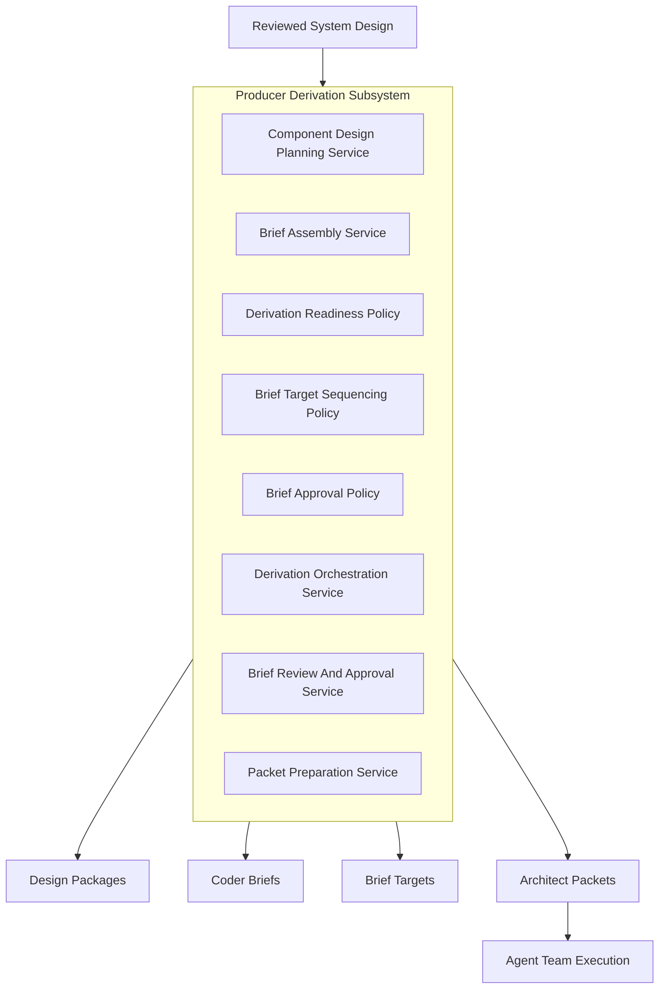

# PAA Producer Derivation Subsystem

Date: 2026-05-16

## Purpose

Make the producer-side derivation subsystem explicit in the PAA architecture.

This note closes the ambiguity between:
- current producer-side tools
- missing producer-side tools
- architectural responsibilities

The system already had:
- a layered architecture
- a domain model
- a derivation method
- a data model
- some real producer-side tooling

What it did not yet have clearly enough was:
- one explicit architectural subsystem that owns the transformation from reviewed System Design into execution authority artifacts

That subsystem is defined here.

## Why This Subsystem Must Be Explicit

Without an explicit producer derivation subsystem, the most important behavior in PAA stays smeared across:
- authority notes
- manifest and task helpers
- packet materialization commands
- partially structured design records
- operator judgment

That creates the exact ambiguity we were trying to eliminate.

The core PAA transformation is:
- `System Design -> Agent Team -> Functioning Software System`

The architectural subsystem that performs that transformation should therefore be visible, named, and decomposed.

## Subsystem Responsibility

The `Producer Derivation Subsystem` owns the producer-side path that:
1. consumes reviewed design authority
2. materializes or refreshes slice-scoped design packages
3. evaluates whether a slice is ready for derivation
4. derives draft coder-agent execution artifacts
5. sequences and constrains implementation targets
6. coordinates review and approval of derived briefs
7. prepares transport-ready execution packets
8. publishes those artifacts as part of the authority package lifecycle

It does not own:
- consumer runtime orchestration
- workflow execution truth
- queue-claim transport behavior
- code execution itself

## Architecture Placement

The subsystem spans four layers of the chosen architecture.

### 1. Domain Core
Owns the semantic objects the subsystem works on:
- `DesignPackage`
- `CoderBrief`
- `BriefTarget`
- `Component`
- `ComponentElement`
- `CodeArtifactTarget`
- `VerificationObligation`
- `WorkItem`

### 2. Domain Services
Own the derivation and interpretation semantics:
- `Component Design Planning Service`
- `Brief Assembly Service`

### 3. Policy Layer
Own the evolving derivation rules:
- `Derivation Readiness Policy`
- `Brief Target Sequencing Policy`
- `Brief Approval Policy`

### 4. Application / Orchestration Services
Own the multi-step producer-side coordination:
- `Derivation Orchestration Service`
- `Brief Review And Approval Service`
- `Packet Preparation Service`

### 5. Infrastructure Ports / Adapters
Provide structured access to the required records and artifacts:
- `Component Design Repository`
- `Execution Package Repository` where package context matters
- future packet publication and artifact-store adapters

### 6. Host Surfaces
Expose the subsystem to operators and automation:
- producer CLI
- future producer API
- future producer UI backend

## Subsystem Decomposition

## A. Domain services

### `Component Design Planning Service`
Role:
- interpret structured component design into planning-ready outputs

### `Brief Assembly Service`
Role:
- convert slice authority, component design, contracts, and realization targets into a draft coder brief and ordered brief-target set

## B. Policies

### `Derivation Readiness Policy`
Role:
- determine whether a slice may enter derivation
- report missing prerequisites explicitly

### `Brief Target Sequencing Policy`
Role:
- determine the required order and dependencies of realization targets within and across briefs

### `Brief Approval Policy`
Role:
- define the conditions under which a draft brief may advance to approved execution authority

## C. Application / orchestration services

### `Derivation Orchestration Service`
Role:
- coordinate the end-to-end derivation flow from design package to draft or approved brief

### `Brief Review And Approval Service`
Role:
- coordinate review, signoff, approval, rejection, and provenance capture for derived briefs

### `Packet Preparation Service`
Role:
- package an approved brief into a transport-ready architect packet with both embedded brief content and durable reference linkage

## Current tools mapped into the subsystem

The subsystem is not starting from zero.
Several current tools already belong here.

### Strong existing surfaces

These current tools already implement parts of the subsystem:
- `paa-producer authority authoring-check`
- `paa-producer authority materialize-task`
- `paa-producer authority materialize-next`
- `paa-producer materialize-readiness`
- `paa-producer materialize-verification-obligations`
- `paa-producer authority materialize-coder-brief`
- `paa-producer authority materialize-architect-packet`
- `paa-producer publish-authority-package`
- `paa-producer load-issue-into-paa`

These provide the current operational shell of the subsystem.

### Current gaps in the subsystem tool surface

The following capabilities are not yet first-class tools or services, even though the architecture and data model now support them directionally:
- `derive-design-package`
- `evaluate-derivation-readiness`
- `assemble-coder-brief`
- `author-brief-targets`
- `review-coder-brief`
- `author-component-design`
- structured volatility and deployment annotation authoring

These are the direct tooling gaps exposed in Phase 5.

## Current architectural rule

Until the missing tools are implemented, manual producer-side work may still bridge some steps.

However, that manual bridging must now be understood as temporary behavior inside this subsystem, not as evidence that the subsystem does not exist.

That is the key correction.

## Data responsibilities inside the subsystem

The subsystem works primarily against these record families:
- `paa.work_items`
- `paa.design_packages`
- `paa.design_package_signoffs`
- `paa.coder_run_briefs`
- `paa.coder_brief_realization_targets`
- `paa.component_dependency_edges`
- `paa.verification_obligations`
- `paa.component_elements`
- `paa.component_element_realizations`

Important rule:
- the subsystem derives execution authority from structured records
- it should not reconstruct that authority from queue packets or repo-local report files

## Relationship to the Authority Package lifecycle

The subsystem sits between:
- reviewed design authority
and:
- published execution authority artifacts

So its lifecycle role is:
1. consume reviewed system-design authority
2. derive slice-scoped execution authority
3. package that authority for transport and publication

This makes it one of the central architectural engines of PAA.

## Subsystem boundary diagram

## Design implications

This subsystem definition changes the interpretation of the architecture in three ways.

### 1. Derivation is no longer an implied byproduct
It is a first-class architectural subsystem.

### 2. Current producer tools can now be evaluated against explicit subsystem responsibilities
This gives us a proper standard for validating whether tooling is sufficient.

### 3. Future implementation should follow subsystem decomposition
New tools and services should be built as explicit realizations of this subsystem rather than as more authority-runtime accretion.

## Immediate impact on the next phase

This note is meant to reduce ambiguity before the Phase 6 derivation dry run.

The dry run should now be interpreted as testing:
- whether the `Producer Derivation Subsystem` can produce a credible implementation brief for `Component Design Planning Service`

not merely:
- whether scattered notes and commands can be coerced into producing something useful

## Final conclusion

The PAA architecture is now refined so that the producer-side derivation path is explicitly modeled as a subsystem.

That means:
- current tools have a clear architectural home
- missing tools have a clear architectural home
- responsibilities are no longer implied only by process notes or command names

This closes the remaining ambiguity between:
- current tools
- missing tools
- architectural responsibilities
