<!-- GENERATED CURRENT AUTHORITY COPY -->
<!-- Source: docs/2_Design/2026-05-30-paa-cli-node-diagram.md -->
<!-- Generated-By: paa_docs.py sync-current -->
<!-- Do not edit this file directly; edit the dated source document and resync. -->

Title: PAA CLI Node Diagram
Doc-ID: paa-cli-node-diagram
Doc-Type: design-note
Status: active
Lifecycle-Stage: design
Created: 2026-05-30
Last-Edited: 2026-06-02
Author: Billy Weisberg
Repo: paa-platform
Component: PAAOperatorCLI
Domain: operator-cli
Keywords: paa, cli, node-diagram, typer, operator, dependency-graph, command-family, runtime
Depends-On: 2026-05-28-paa-cli-system-architecture.md, 2026-05-30-paa-cli-command-inventory-and-migration-map.md, 2026-05-30-paa-modeled-ownership-inventory.md, 2026-05-03-component-dependency-graph-contract.md, 2026-05-03-stage1-design-package-contract.md
Supersedes:
Superseded-By:
Canonical: true
Review-After: 2026-06-30
Summary: Defines the Stage 1 structural node diagram for the unified PAA operator CLI, including command-family nodes, normalization and rendering nodes, and their current modeled dependency owners.

# PAA CLI Node Diagram

## Purpose

Show the Stage 1 structural node diagram for the unified `paa` operator CLI.

This diagram exists to make explicit the nodes that the CLI design depends on before final component-spec materialization begins.

It is intended to answer:
- what are the major CLI nodes?
- which nodes are host-surface shells versus command-family adapters versus supporting runtime nodes?
- which existing modeled owners do those nodes currently depend on?
- which nodes are already backed by governed services versus still backed by modules or scripts?

## Why This Diagram Exists

The unified CLI must not be treated as just one Typer file plus a few command callbacks.

Before `PAAOperatorCLI` can be considered derivation-ready, the Authority Architect must make the CLI node structure explicit enough to support:
- object modeling
- dependency graph authoring
- injection design
- business-object ownership mapping
- later component-spec and implementation-plan authoring

## Current Structural Source Inputs

Primary current sources:
- `/Users/billyweisberg/Repos/billyweisberg/paa-platform/docs/1_Vision/2026-05-28-paa-cli-system-architecture.md`
- `/Users/billyweisberg/Repos/billyweisberg/paa-platform/docs/2_Design/2026-05-30-paa-cli-command-inventory-and-migration-map.md`
- `/Users/billyweisberg/Repos/billyweisberg/paa-platform/docs/2_Design/2026-05-30-paa-modeled-ownership-inventory.md`
- `/Users/billyweisberg/Repos/billyweisberg/paa-platform/packages/paa-producer/src/paa_producer/`
- `/Users/billyweisberg/Repos/billyweisberg/paa-platform/packages/paa-consumer/src/paa_consumer/` as an internal runtime-host package
- `/Users/billyweisberg/Repos/billyweisberg/paa-platform/packages/paa-core/src/paa_core/`

## Node Diagram

```mermaid
flowchart TD
  subgraph HostSurface["Host Surface"]
    CLI["PAAOperatorCLI\nTyper root application"]
    ENV["EnvironmentResolver\nrepo-root / config / runtime path resolution"]
    ROUTER["CommandRouter\nfamily + subcommand dispatch"]
    NORM["CommandResultNormalizer\nstructured command result shaping"]
    RENDER["OutputRenderer\njson / table / summary rendering"]
  end

  subgraph CommandFamilies["Lifecycle Command-Family Adapters"]
    AUTH["AuthorityCommandAdapter"]
    DERIVE["DeriveCommandAdapter"]
    PLAN["PlanCommandAdapter"]
    WORKER["WorkerCommandAdapter"]
    QUEUE["QueueCommandAdapter"]
    VERIFY["VerificationCommandAdapter"]
    ACCEPT["AcceptanceCommandAdapter"]
    REPORT["ReportingCommandAdapter"]
    OPS["OpsCommandAdapter"]
  end

  subgraph ProducerOwners["Current Producer-Aligned Owners"]
    AUTHRT["authority_runtime.py\nproducer authority commands"]
    DPKG["design_package_deriver.py"]
    IMPLDER["implementation_plan_deriver.py"]
    PROGRESS["implementation_plan_progress.py"]
    BRIEF["coder_brief_assembler.py\nbrief_target_author.py\nbrief_reviewer.py"]
    APKT["architect_packet_preparer.py"]
  end

  subgraph ConsumerOwners["Current Consumer-Aligned Owners"]
    INBOX["inbox.py\nqueue command helpers"]
    TECHLEAD["techlead.py\nlegacy runtime shell"]
    SVCMAP["techlead_service_map.py"]
    GUARD["runtime_guardrails.py"]
    AUTHINST["authority_install.py"]
  end

  subgraph CoreOwners["Current Governed Core Owners"]
    PLANPROG["ImplementationPlanProgressService"]
    PLANDER["ImplementationPlanDerivationService"]
    WFLIFE["WorkflowLifecycleService"]
    TLFAMILY["TechLead decision-service family"]
    REPOS["Governed repositories\nimplementation plan / workflow / runtime event / execution package"]
  end

  subgraph FutureRuntime["Planned Runtime Controllers"]
    TLW["TechLeadWorkerService"]
    DEVW["DevWorkerService"]
    QAW["QAWorkerService"]
    QRUNTIME["Queue/Packet Runtime Controller"]
  end

  CLI --> ENV
  CLI --> ROUTER
  ROUTER --> AUTH
  ROUTER --> DERIVE
  ROUTER --> PLAN
  ROUTER --> WORKER
  ROUTER --> QUEUE
  ROUTER --> VERIFY
  ROUTER --> ACCEPT
  ROUTER --> REPORT
  ROUTER --> OPS

  AUTH --> AUTHRT
  AUTH --> AUTHINST
  DERIVE --> DPKG
  DERIVE --> IMPLDER
  DERIVE --> BRIEF
  DERIVE --> APKT
  PLAN --> PROGRESS
  PLAN --> PLANPROG
  WORKER --> TECHLEAD
  WORKER --> TLW
  WORKER --> DEVW
  WORKER --> QAW
  QUEUE --> INBOX
  QUEUE --> QRUNTIME
  VERIFY --> GUARD
  VERIFY --> PLANPROG
  VERIFY --> TLFAMILY
  ACCEPT --> TECHLEAD
  ACCEPT --> TLFAMILY
  REPORT --> SVCMAP
  REPORT --> PLANPROG
  REPORT --> REPOS
  OPS --> GUARD
  OPS --> AUTHRT

  AUTHRT --> REPOS
  IMPLDER --> PLANDER
  PROGRESS --> PLANPROG
  TECHLEAD --> TLFAMILY
  TECHLEAD --> WFLIFE
  TECHLEAD --> REPOS
  INBOX --> REPOS
  GUARD --> REPOS

  AUTH --> NORM
  DERIVE --> NORM
  PLAN --> NORM
  WORKER --> NORM
  QUEUE --> NORM
  VERIFY --> NORM
  ACCEPT --> NORM
  REPORT --> NORM
  OPS --> NORM
  NORM --> RENDER
```

## Node Reading

### Host-surface nodes
These nodes belong to the operator application shell itself:
- `PAAOperatorCLI`
- `EnvironmentResolver`
- `CommandRouter`
- `CommandResultNormalizer`
- `OutputRenderer`

These should remain thin and should not absorb business logic already owned elsewhere.

### Command-family nodes
These nodes represent the lifecycle-oriented command families defined in CLI vision authority:
- `authority`
- `derive`
- `plan`
- `worker`
- `queue`
- `verify`
- `accept`
- `report`
- `ops`

These are the primary operator-facing structural nodes.

### Current modeled owners
The diagram makes explicit that many command families currently terminate in:
- producer modules
- internal consumer-package modules
- governed core services
- planned future runtime controllers

This is now mostly an internal-package integration reality rather than a split-CLI reality.
The unified CLI is the host surface; the consumer package is an internal collaborator package.

## Immediate Design Reading

### Nodes already strongly backed by governed owners
The strongest current downstream owners are:
- `ImplementationPlanProgressService`
- `ImplementationPlanDerivationService`
- `WorkflowLifecycleService`
- the `TechLead` decision-service family
- governed repositories

### Nodes still backed mostly by modules or shell code
The weakest current downstream owners are:
- `AuthorityCommandAdapter`
- `DeriveCommandAdapter`
- `WorkerCommandAdapter`
- `QueueCommandAdapter`
- `VerificationCommandAdapter`
- `OpsCommandAdapter`

These still lean heavily on producer modules, consumer modules, or scripts.

### Most important missing planned nodes
The diagram also makes explicit the missing future controllers that the CLI should eventually target directly:
- `TechLeadWorkerService`
- `DevWorkerService`
- `QAWorkerService`
- `Queue/Packet Runtime Controller`

## Structural Consequences

This diagram implies the next CLI design artifacts should define:
1. the business objects exchanged between the host-surface nodes and command-family nodes
2. the service injection map for each command-family adapter
3. the dependency graph edges between command-family nodes and current modeled owners
4. the ownership split between temporary module-backed adapters and future governed runtime controllers

## Non-Goals

This diagram does not yet define:
- the final object model
- the final command-line flag grammar
- the final package layout
- the final worker runtime flows
- the final acceptance of any one decomposition option

It only defines the current Stage 1 node structure for the unified CLI authority package.
