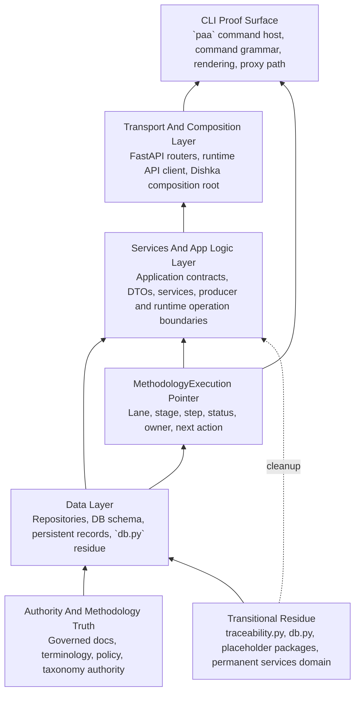

<!-- GENERATED CURRENT AUTHORITY COPY -->
<!-- Source: docs/2_Design/2026-06-04-paa-python-target-structure-diagram.md -->
<!-- Generated-By: paa_docs.py sync-current -->
<!-- Do not edit this file directly; edit the dated source document and resync. -->

Title: PAA Python Target Structure Diagram
Doc-ID: paa-python-target-structure-diagram
Doc-Type: design-note
Status: active
Lifecycle-Stage: design
Created: 2026-06-04
Last-Edited: 2026-06-04
Author: Billy Weisberg
Repo: paa-platform
Component: PaaPythonTargetStructure
Domain: package-architecture
Keywords: paa, python, target structure, data layer, domain layer, api layer, cli, methodology execution, diagram
Depends-On: 2026-06-02-paa-target-package-map.md, 2026-06-04-paa-node-dependency-review.md, 2026-06-04-paa-python-methodology-workflow-and-build-sequence.md, 2026-06-04-paa-python-realization-profile.md
Supersedes:
Superseded-By:
Canonical: true
Review-After: 2026-07-01
Summary: Defines the updated Python target structure for PAA with explicit data, services/app logic, API, CLI, and methodology pointer layers so build sequencing can follow the real system structure.

# PAA Python Target Structure Diagram

## Purpose

This note completes step 2 of the current Python implementation sequence:
- update the target structure diagram with data, domain, API/orchestration, and CLI layers

The target structure must now reflect:
- the real package topology we already built
- the methodology pointer as a governing structure element
- the Python-oriented layering required for the next build phases

## Core Decision

The Python PAA target structure is now defined by five explicit layers plus transitional residue.

Those layers are:
1. authority and methodology truth
2. data layer
3. services and app logic layer
4. transport and composition layer
5. CLI proof surface

The `MethodologyExecution` pointer sits across the workflow as a governing control record, but structurally it is persisted through the data layer and consumed by the application, runtime, API, and CLI surfaces.

## Structural Diagram

## Package-To-Layer Mapping

### 1. Authority and methodology truth

Primary ownership:
- `docs/1_Vision/`
- `docs/2_Design/`
- `docs/3_Plan/`
- `docs/terminology/`
- authority manifests and governed terminology/policy docs

Role:
- define canonical concepts
- define methodology workflow
- define language-profile realization rules
- define governed vocabularies and anti-patterns

### 2. Data layer

Primary ownership:
- `packages/paa-core/src/paa_core/repositories/`
- `packages/paa-core/src/paa_core/sql/`
- `packages/paa-core/src/paa_core/db.py` as transitional residue

Core data nodes:
- `repositories/component_design`
- `repositories/methodology_execution`
- `repositories/implementation_plan`
- `repositories/runtime_event`
- `repositories/runtime_identity`
- `repositories/workflow_state`

Role:
- own persistent truth access
- own schema-facing operations
- own query and mutation boundaries
- persist `MethodologyExecution` state and related records

### 3. Services and app logic layer

Primary ownership:
- `packages/paa-core/src/paa_core/application/`
- `packages/paa-core/src/paa_core/producer/`
- `packages/paa-core/src/paa_core/runtime/`
- permanent business-service packages under `packages/paa-core/src/paa_core/services/`

Sub-layers inside this layer:

#### 4a. Application surface
- `application/contracts`
- `application/dto`
- `application/services`
- `application/operator_router.py`
- `application/operator_command_adapters.py`
- `application/operator_result_normalizer.py`

#### 4b. Producer execution domain
- `producer/*`

#### 4c. Runtime execution domain
- `runtime/hosts`
- `runtime/control`
- `runtime/transport`
- `runtime/orchestration`
- `runtime/workflow`
- `runtime/bridges`
- `runtime/workers`
- `runtime/packets`
- `runtime/support`

#### 4d. Permanent business-service domain
- `services/component_design_planning`
- `services/implementation_plan_derivation`
- `services/implementation_plan_progress`
- `services/techlead_acceptance_decision`
- `services/techlead_assignment_decision`
- `services/techlead_closeout_decision`
- `services/techlead_delivery_review_decision`
- `services/techlead_lineage_decision`
- `services/techlead_reset_recovery_decision`
- `services/techlead_worker_review_routing`

Role:
- coordinate real work
- consume policy, governance, and domain meaning
- read and advance the methodology pointer
- perform producer, component-realization, runtime, verification, and acceptance operations

### 4. Transport and composition layer

Primary ownership:
- `packages/paa-core/src/paa_core/api/runtime/`
- Dishka composition root to be introduced here

Role:
- expose HTTP API transport
- compose the application and runtime services
- manage resource and lifecycle wiring
- expose the runtime API client used by the CLI

Constraint:
- this layer composes the structure
- it does not define the business ownership model

### 5. CLI proof surface

Primary ownership:
- `packages/paa-cli/src/paa_cli/`

Role:
- expose the operator command grammar
- invoke the client/proxy path
- render real system outputs
- act as the main integration proof surface while the Python system is being built

## Methodology Pointer Placement

The `MethodologyExecution` pointer is not a separate package.
It is a governing structure element realized through several layers.

### Persisted in:
- `repositories/methodology_execution`
- the underlying methodology execution tables and projections

### Interpreted by:
- `application/services/*`
- `runtime/workflow/*`
- producer and runtime orchestration services

### Exposed through:
- HTTP API preflight and command operations
- CLI command-family behavior and future preflight enforcement

Rule:
- every later structure update should show where pointer state is persisted, interpreted, and exposed

## Current Transitional Residue

The target structure is not identical to the live file tree yet.
These remain explicit transitional nodes:
- `packages/paa-core/src/paa_core/db.py`
- `packages/paa-core/src/paa_core/traceability.py`
- placeholder packages with little or no active ownership yet:
  - `packages/paa-core/src/paa_core/adapters/`
  - `packages/paa-core/src/paa_core/artifact_store/`
  - `packages/paa-core/src/paa_core/execution_surfaces/`
  - `packages/paa-core/src/paa_core/git_provider/`
  - `packages/paa-core/src/paa_core/message_bus/`
  - `packages/paa-core/src/paa_core/runtime_support/`

These should remain visible in planning until they are either adopted into the target model or removed.

## Immediate Structural Consequences

This updated structure means:
1. `db.py` must be treated as a transitional data-layer node, not as invisible plumbing
2. producer and runtime are no longer separate architectural worlds; they are sibling execution domains inside one application layer
3. the HTTP API and CLI are transport/proof surfaces over the same application layer
4. Dishka belongs in the transport/composition layer, not in the domain or application meaning layers
5. the methodology pointer must be visible in later build sequencing and CLI proof work

## Output Of Step 2

After this step, the system now has:
- an updated dependency review
- a pointer-aware workflow/build note
- a target structure diagram that explicitly includes:
  - data layer
  - services/app logic layer
  - transport/composition layer
  - CLI proof surface
  - methodology pointer placement

This is the structure the next build-sequence derivation should use.
