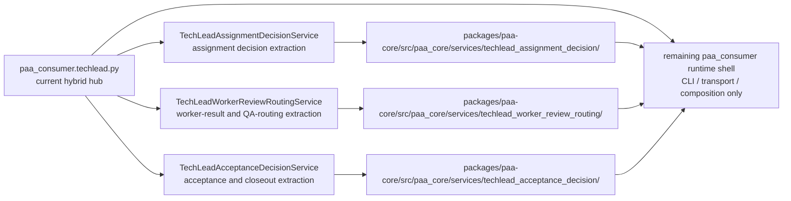

<!-- GENERATED CURRENT AUTHORITY COPY -->
<!-- Source: docs/2_Design/2026-05-22-techlead-decomposition-build-arrow-diagram.md -->
<!-- Generated-By: paa_docs.py sync-current -->
<!-- Do not edit this file directly; edit the dated source document and resync. -->

Title: TechLead Decomposition Build Arrow Diagram
Doc-ID: paa-techlead-decomposition-build-arrow-diagram
Doc-Type: design-note
Status: active
Lifecycle-Stage: design
Created: 2026-05-22
Last-Edited: 2026-05-22
Author: Billy Weisberg
Repo: paa-platform
Component: TechLeadDecompositionBuildArrowDiagram
Domain: techlead-runtime
Keywords: techlead, decomposition, build-arrow, diagram, runtime
Depends-On: 2026-05-18-p0-techlead-runtime-extraction-plan.md, 2026-05-18-techlead-assignment-decision-service-component-spec.md, 2026-05-22-techlead-worker-review-routing-service-component-spec.md, 2026-05-22-techlead-acceptance-decision-service-component-spec.md
Supersedes:
Superseded-By:
Canonical: true
Review-After: 2026-06-22
Summary: Defines the build-arrow decomposition path from the current TechLead monolith to the extracted service boundaries.

# TechLead Decomposition Build Arrow Diagram

## Purpose

Show the intended extraction path from the current `techlead.py` hub into bounded service components without restarting the whole design.

## Current Source

- `/Users/billyweisberg/Repos/billyweisberg/paa-platform/packages/paa-consumer/src/paa_consumer/techlead.py`

## Build Arrow Diagram

## Intended End State

`paa-consumer` should retain:
- runtime shell composition
- packet claim/send integration
- queue and worktree operations
- CLI adapters

`paa-core` should own:
- assignment decision logic
- worker review routing logic
- acceptance decision logic
- typed request / result models for those services

## Non-Goals

This diagram does not introduce new packet families or a new top-level runtime architecture.
It only defines the extraction path inside the existing scaffold.
