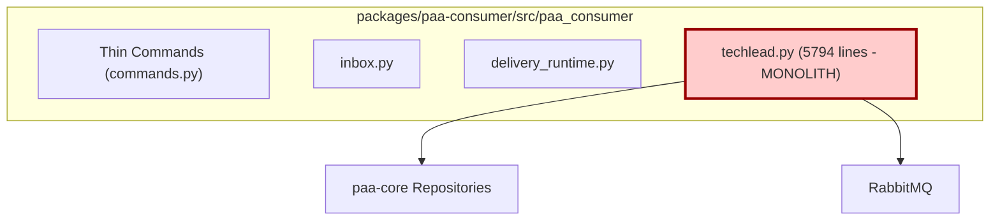
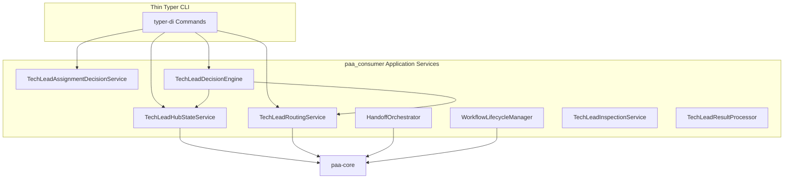

# TechLead Decomposition Proposal

**Date**: 2026-05-22  
**Status**: Approved by Billy  
**Architect**: Grok (Lead Architect)

## Outcome Behavior
Transform the monolithic `techlead.py` (5794 lines) into a clean, OO, service-oriented hub following PAA Engineering Terminology.

## Target Components

1. **TechLeadHubStateService**  
   **Role**: Central authority for current workflow state, lineage view, worktree ownership, and staleness detection.

2. **TechLeadRoutingService**  
   **Role**: Owns all route policy evaluation and allowed next-role determination.

3. **TechLeadAssignmentDecisionService**  
   **Role**: Produces `techlead_assignment_packet` and handles assignment logic.

4. **TechLeadDecisionEngine**  
   **Role**: Core decision-making from spoke results to `techlead_decision_packet`.

5. **HandoffOrchestrator**  
   **Role**: Manages handoff lifecycle, DB, and queue coordination.

6. **WorkflowLifecycleManager**  
   **Role**: Owns terminal states, cleanup, and merge readiness.

7. **TechLeadInspectionService**  
   **Role**: Provides inspection surfaces for role automations.

8. **TechLeadResultProcessor**  
   **Role**: Validates incoming result packets.

## Current-State Component Node Diagram

## Target-State Component Node Diagram

**Next**: Proceed to detailed Component Designs starting with TechLeadHubStateService.