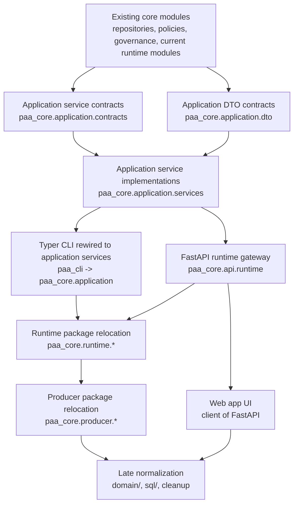

Title: PAA Package Refactor Dependency Order Map
Doc-ID: paa-package-refactor-dependency-order-map
Doc-Type: plan
Status: active
Lifecycle-Stage: plan
Created: 2026-06-02
Last-Edited: 2026-06-02
Author: Billy Weisberg
Repo: paa-platform
Component: PackageRefactorDependencyOrder
Domain: application-architecture
Keywords: paa, package map, dependency order, sequencing, fastapi, typer, runtime
Depends-On: 2026-06-02-paa-target-package-map.md, 2026-06-02-paa-application-api-and-ui-consolidation-plan.md, 2026-06-02-paa-package-refactor-phase-diagram.md
Supersedes:
Superseded-By:
Canonical: true
Review-After: 2026-06-30
Summary: Defines the dependency order for the PAA package refactor, showing which abstractions must exist before higher-level hosts, APIs, and package moves can happen safely.

# PAA Package Refactor Dependency Order Map

## Purpose

This document answers one question only:

What must exist before what?

It is the sequencing map for the target package refactor so we avoid doing file moves before the architectural seams are stable.

## Dependency Principles

1. Service contracts come before service implementations.
2. DTO contracts come before host adapters.
3. Application services come before FastAPI routers.
4. Application services come before Typer rewiring.
5. Runtime and producer package moves come after the service/API seams are stable.
6. The web app depends on FastAPI, not on core internals.

## Ordered Build Graph

## Required Existence Table

### Tier 0. Existing foundation
Already available and usable:
- `paa_cli`
- `paa_core.repositories`
- `paa_core.policies`
- `paa_core.governance`
- current runtime modules at the `paa_core` root
- current producer modules in `paa_producer`

These are the starting substrate.

### Tier 1. Application contracts
Must exist before host rewiring:
- `paa_core.application.contracts.queue_admin`
- `paa_core.application.contracts.runtime_admin`
- `paa_core.application.contracts.runtime_dispatch`
- `paa_core.application.contracts.runtime_status`
- `paa_core.application.contracts.authority_install`
- `paa_core.application.contracts.runtime_validation`
- `paa_core.application.contracts.runtime_report`
- `paa_core.application.contracts.automation_preflight`

### Tier 2. DTO contracts
Must exist before stable host/API boundaries:
- `paa_core.application.dto.queue`
- `paa_core.application.dto.runtime`
- `paa_core.application.dto.authority`
- `paa_core.application.dto.status`
- `paa_core.application.dto.workflow`

These become the shared request/response shapes for:
- Typer adapters
- FastAPI routers
- future web UI payloads

### Tier 3. Application services
Must exist before any adapter is considered correct:
- `paa_core.application.services.queue_admin`
- `paa_core.application.services.runtime_admin`
- `paa_core.application.services.runtime_dispatch`
- `paa_core.application.services.runtime_status`
- `paa_core.application.services.authority_install`
- `paa_core.application.services.runtime_validation`
- `paa_core.application.services.runtime_report`
- `paa_core.application.services.automation_preflight`

These services wrap and coordinate the current lower-level runtime modules.

### Tier 4. Typer rewiring
May happen only after Tiers 1-3 exist.

At this tier:
- `paa_cli` stops calling direct helpers
- `paa_cli` stops mixing router/adapters with ad hoc direct runtime calls
- Typer becomes a consistent host over application services

### Tier 5. FastAPI runtime gateway
May happen only after Tiers 1-3 exist.

At this tier:
- `paa_core.api.runtime.app`
- `paa_core.api.runtime.dependencies`
- router modules for supervisor, queues, packets, workflow, status, reports

FastAPI depends on the same application services Typer uses.

### Tier 6. Runtime relocation
May happen only after Typer and FastAPI are both backed by application services.

At this tier move into:
- `paa_core.runtime.hosts`
- `paa_core.runtime.control`
- `paa_core.runtime.transport`
- `paa_core.runtime.workflow`
- `paa_core.runtime.bridges`
- `paa_core.runtime.workers`
- `paa_core.runtime.packets`
- `paa_core.runtime.support`

### Tier 7. Producer relocation
May happen after runtime relocation proves stable.

At this tier fold:
- `paa_producer.*`
into:
- `paa_core.producer.*`

### Tier 8. Web UI
May happen only after FastAPI exists as the canonical backend.

The web app depends on:
- stable FastAPI route contracts
- stable application DTOs
- stable runtime/report/status service behavior

The web app does not depend on:
- direct repository access
- direct runtime host construction
- CLI adapter code

### Tier 9. Late normalization
After runtime + producer + FastAPI shape is stable:
- normalize `domain/`
- optional `sql/` package cleanup
- residual cleanup and internal renames

## First Executable Chain

The first chain we should execute is:

1. `application.contracts.queue_admin`
2. `application.dto.queue`
3. `application.services.queue_admin`
4. switch Typer queue commands to that service
5. `application.contracts.runtime_admin`
6. `application.dto.runtime`
7. `application.services.runtime_admin`
8. switch Typer runtime commands to that service

That creates the first real application-service seam without waiting for the whole FastAPI layer.

## Sanity Rule

If a proposed refactor step does not clearly fit into one of the tiers above, stop and re-evaluate it before coding.

That is how we avoid another parallel structure or unplanned adapter layer.
