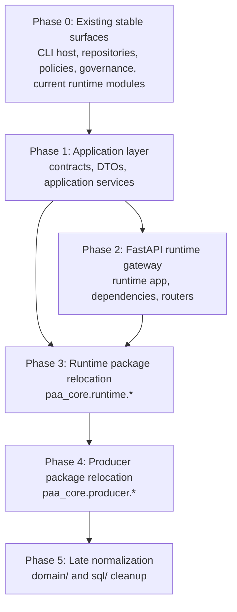

Title: PAA Package Refactor Phase Diagram
Doc-ID: paa-package-refactor-phase-diagram
Doc-Type: plan
Status: active
Lifecycle-Stage: plan
Created: 2026-06-02
Last-Edited: 2026-06-02
Author: Billy Weisberg
Repo: paa-platform
Component: PackageRefactorPhasing
Domain: application-architecture
Keywords: paa, package map, refactor, phases, diagram, fastapi, typer, runtime
Depends-On: 2026-06-02-paa-target-package-map.md, 2026-06-02-paa-application-api-and-ui-consolidation-plan.md
Supersedes:
Superseded-By:
Canonical: true
Review-After: 2026-06-30
Summary: Provides the phased execution diagram for the target PAA package structure, showing which parts already exist, which parts must be built first, and which parts should move only after application and API boundaries are stable.

# PAA Package Refactor Phase Diagram

## Phase Legend

- `Phase 0`: already exists and is usable now
- `Phase 1`: build first, before major package moves
- `Phase 2`: build the FastAPI runtime gateway over the same application services
- `Phase 3`: relocate runtime modules into the target `paa_core.runtime.*` structure
- `Phase 4`: fold producer into `paa_core.producer`
- `Phase 5`: optional/late cleanup once the architecture is stable

## Phase Rules

1. Do not start Phase 3 before Phase 1 exists.
2. Do not build the web UI against raw runtime internals.
3. FastAPI must sit on the same application services used by Typer.
4. Package relocation follows service/API stabilization, not the other way around.
5. Producer commands are part of the same `paa` CLI surface and must follow the same proxy/client -> HTTP API -> controller -> application-service path.
6. Local bootstrap and process-control commands are the only intentional direct path outside the HTTP API because they must be able to start or stop the process that hosts that API.

## Phased Target Tree

```text
packages/
├── paa-cli/                                                    [Phase 0 - exists]
│   └── src/paa_cli/
│       ├── app.py                                              [Phase 0 - exists]
│       ├── router.py                                           [Phase 0 - exists]
│       ├── command_adapters.py                                 [Phase 0 - exists]
│       ├── rendering.py                                        [Phase 0 - exists]
│       ├── normalization.py                                    [Phase 0 - exists]
│       ├── environment.py                                      [Phase 0 - exists]
│       ├── models.py                                           [Phase 0 - exists]
│       └── contracts.py                                        [Phase 0 - exists]
│
└── paa-core/                                                   [Phase 0 - exists]
    └── src/paa_core/
        ├── application/                                        [Phase 1 - build first]
        │   ├── contracts/                                      [Phase 1 - build first]
        │   │   ├── operator_commands.py                       [Phase 1]
        │   │   ├── queue_admin.py                              [Phase 1]
        │   │   ├── runtime_admin.py                            [Phase 1]
        │   │   ├── runtime_dispatch.py                         [Phase 1]
        │   │   ├── runtime_status.py                           [Phase 1]
        │   │   ├── authority_install.py                        [Phase 1]
        │   │   ├── runtime_validation.py                       [Phase 1]
        │   │   ├── runtime_report.py                           [Phase 1]
        │   │   └── automation_preflight.py                     [Phase 1]
        │   │   ├── producer_commands.py                        [Phase 1]
        │   │   ├── producer_authority.py                       [Phase 1]
        │   │   ├── producer_derivation.py                      [Phase 1]
        │   │   └── producer_review.py                          [Phase 1]
        │   ├── dto/                                            [Phase 1 - build first]
        │   │   ├── operator.py                                 [Phase 1]
        │   │   ├── queue.py                                    [Phase 1]
        │   │   ├── runtime.py                                  [Phase 1]
        │   │   ├── authority.py                                [Phase 1]
        │   │   ├── status.py                                   [Phase 1]
        │   │   └── workflow.py                                 [Phase 1]
        │   │   └── producer.py                                 [Phase 1]
        │   └── services/                                       [Phase 1 - build first]
        │       ├── operator_commands.py                        [Phase 1]
        │       ├── queue_admin.py                              [Phase 1]
        │       ├── runtime_admin.py                            [Phase 1]
        │       ├── runtime_dispatch.py                         [Phase 1]
        │       ├── runtime_status.py                           [Phase 1]
        │       ├── authority_install.py                        [Phase 1]
        │       ├── runtime_validation.py                       [Phase 1]
        │       ├── runtime_report.py                           [Phase 1]
        │       └── automation_preflight.py                     [Phase 1]
        │       ├── producer_commands.py                        [Phase 1]
        │       ├── producer_authority.py                       [Phase 1]
        │       ├── producer_derivation.py                      [Phase 1]
        │       └── producer_review.py                          [Phase 1]
        │
        ├── api/                                                [Phase 2 - after application layer]
        │   └── runtime/
        │       ├── app.py                                      [Phase 2]
        │       ├── dependencies.py                             [Phase 2]
        │       └── routers/
        │           ├── operators.py                            [Phase 2]
        │           ├── supervisor.py                           [Phase 2]
        │           ├── queues.py                               [Phase 2]
        │           ├── packets.py                              [Phase 2]
        │           ├── workflow.py                             [Phase 2]
        │           ├── status.py                               [Phase 2]
        │           ├── reports.py                              [Phase 2]
        │           └── producer.py                             [Phase 2]
        │
        ├── runtime/                                            [Phase 3 - move after APIs stabilize]
        │   ├── hosts/
        │   │   ├── techlead.py                                 [Phase 3 - move from techlead_runtime_host.py]
        │   │   ├── dev.py                                      [Phase 3 - move from dev_runtime_host.py]
        │   │   ├── qa.py                                       [Phase 3 - move from qa_runtime_host.py]
        │   │   └── supervisor.py                               [Phase 3 - move from runtime_hosts.py]
        │   ├── control/
        │   │   ├── supervisor.py                               [Phase 3 - move from runtime_control.py]
        │   │   ├── bootstrap.py                                [Phase 3 - extract/build]
        │   │   └── smoke.py                                    [Phase 3 - move from runtime_smoke.py]
        │   ├── transport/
        │   │   ├── rabbitmq.py                                 [Phase 3 - extract from queue_transport.py]
        │   │   ├── queue_admin.py                              [Phase 3 - move from services/runtime_queue_admin.py]
        │   │   ├── claim_ledger.py                             [Phase 3 - move from claim_ledger.py]
        │   │   ├── packet_dispatch.py                          [Phase 3 - move from runtime_packet_dispatch.py]
        │   │   └── packet_envelope.py                          [Phase 3 - move from packet_envelope.py]
        │   ├── workflow/
        │   │   ├── lifecycle.py                                [Phase 3 - extract from services/workflow_lifecycle/]
        │   │   ├── state.py                                    [Phase 3 - extract/build]
        │   │   ├── transitions.py                              [Phase 3 - extract/build]
        │   │   └── methodology.py                              [Phase 3 - extract from methodology services]
        │   ├── bridges/
        │   │   ├── assignment.py                               [Phase 3 - move from services/runtime_assignment_bridge.py]
        │   │   ├── assignment_context.py                       [Phase 3 - move from services/runtime_assignment_context.py]
        │   │   ├── decision.py                                 [Phase 3 - move from services/runtime_decision_bridge.py]
        │   │   ├── acceptance.py                               [Phase 3 - move from services/runtime_acceptance.py]
        │   │   ├── closeout.py                                 [Phase 3 - move from services/runtime_closeout.py]
        │   │   ├── lineage.py                                  [Phase 3 - move from services/runtime_lineage.py]
        │   │   ├── status_report.py                            [Phase 3 - move from services/runtime_status_report.py]
        │   │   ├── role_bridge.py                              [Phase 3 - move from services/runtime_role_bridge.py]
        │   │   ├── worktree.py                                 [Phase 3 - move from services/runtime_worktree.py]
        │   │   └── workflow.py                                 [Phase 3 - move from services/runtime_workflow.py]
        │   ├── workers/
        │   │   ├── techlead.py                                 [Phase 3 - move from services/techlead_worker/]
        │   │   ├── dev.py                                      [Phase 3 - move from services/dev_worker/]
        │   │   └── qa.py                                       [Phase 3 - move from services/qa_worker/]
        │   ├── packets/
        │   │   ├── context_assembly.py                         [Phase 3 - move from services/packet_context_assembly/]
        │   │   └── reference_resolution.py                     [Phase 3 - move from services/packet_reference_resolution/]
        │   └── support/
        │       ├── config.py                                   [Phase 3 - move from config.py]
        │       ├── runtime_paths.py                            [Phase 3 - move from runtime_paths.py]
        │       ├── runtime_guardrails.py                       [Phase 3 - move from runtime_guardrails.py]
        │       ├── runtime_evidence.py                         [Phase 3 - move from runtime_evidence.py]
        │       ├── install.py                                  [Phase 3 - move from install.py]
        │       └── readiness.py                                [Phase 3 - move from readiness.py]
        │
        ├── producer/                                           [Phase 4 - fold top-level producer inward]
        │   ├── commands.py                                     [Phase 4 - move from paa_producer]
        │   ├── authority_support.py                            [Phase 4 - move from paa_producer support extraction]
        │   ├── authority_packet_support.py                     [Phase 4 - move from paa_producer support extraction]
        │   ├── authority_resolution.py                         [Phase 4 - move from paa_producer support extraction]
        │   ├── authority_runtime.py                            [Phase 4 - move from paa_producer]
        │   ├── architect_packet_preparer.py                    [Phase 4 - move from paa_producer]
        │   ├── brief_reviewer.py                               [Phase 4 - move from paa_producer]
        │   ├── brief_target_author.py                          [Phase 4 - move from paa_producer]
        │   ├── component_spec_materializer.py                  [Phase 4 - move from paa_producer]
        │   ├── derivation_readiness.py                         [Phase 4 - move from paa_producer]
        │   ├── derive_artifacts.py                             [Phase 4 - move from paa_producer]
        │   ├── design_package_deriver.py                       [Phase 4 - move from paa_producer]
        │   ├── coder_brief_assembler.py                        [Phase 4 - move from paa_producer]
        │   ├── implementation_plan_activity_state.py           [Phase 4 - move from paa_producer]
        │   ├── implementation_plan_deriver.py                  [Phase 4 - move from paa_producer]
        │   ├── implementation_plan_progress.py                 [Phase 4 - move from paa_producer]
        │   ├── publish.py                                      [Phase 4 - move from paa_producer]
        │   ├── issue_loader.py                                 [Phase 4 - move from paa_producer]
        │   ├── obligation_loader.py                            [Phase 4 - move from paa_producer]
        │   └── smoke_test.py                                   [Phase 4 - move from paa_producer]
        │
        ├── repositories/                                       [Phase 0 - exists]
        │   ├── component_design/                               [Phase 0 - exists]
        │   ├── execution_package/                              [Phase 0 - exists]
        │   ├── implementation_plan/                            [Phase 0 - exists]
        │   ├── methodology_execution/                          [Phase 0 - exists]
        │   ├── runtime_event/                                  [Phase 0 - exists]
        │   ├── runtime_identity/                               [Phase 0 - exists]
        │   └── workflow_state/                                 [Phase 0 - exists]
        │
        ├── policies/                                           [Phase 0 - exists]
        │   ├── acceptance/                                     [Phase 0 - exists]
        │   ├── deployment_capability/                          [Phase 0 - exists]
        │   ├── projection_freshness/                           [Phase 0 - exists]
        │   ├── reset_recovery/                                 [Phase 0 - exists]
        │   ├── routing/                                        [Phase 0 - exists]
        │   └── workflow_transition/                            [Phase 0 - exists]
        │
        ├── governance/                                         [Phase 0 - exists]
        │   ├── component_registry.py                           [Phase 0 - exists]
        │   ├── component_metadata.py                           [Phase 0 - exists]
        │   ├── component_spec_materialization.py               [Phase 0 - exists]
        │   ├── model_code_consistency.py                       [Phase 0 - exists]
        │   ├── projection_code_consistency.py                  [Phase 0 - exists]
        │   └── runtime_evidence_model_consistency.py           [Phase 0 - exists]
        │
        ├── domain/                                             [Phase 5 - late normalization]
        │   ├── core/                                           [Phase 5 - build when domain model is explicit]
        │   └── authority_taxonomy/                             [Phase 5 - build when extracted]
        │
        └── sql/                                                [Phase 5 - optional target]
```

## Dependency Order



## Immediate Build Target

The next implementation slice should start in Phase 1:

1. `paa_core.application.contracts.queue_admin`
2. `paa_core.application.contracts.runtime_admin`
3. `paa_core.application.dto.queue`
4. `paa_core.application.dto.runtime`
5. `paa_core.application.services.queue_admin`
6. `paa_core.application.services.runtime_admin`

Then switch Typer queue/runtime commands to those services before creating the FastAPI layer.
