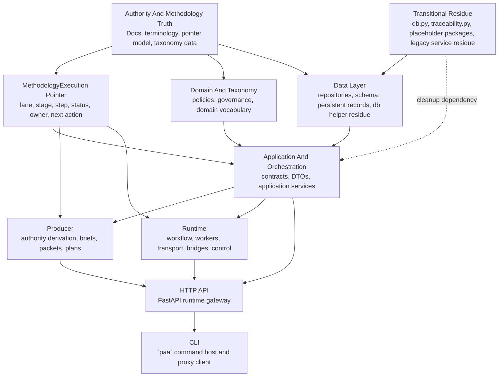

<!-- GENERATED CURRENT AUTHORITY COPY -->
<!-- Source: docs/3_Plan/2026-06-04-paa-node-dependency-review.md -->
<!-- Generated-By: paa_docs.py sync-current -->
<!-- Do not edit this file directly; edit the dated source document and resync. -->

Title: PAA Node Dependency Review
Doc-ID: paa-node-dependency-review
Doc-Type: design-note
Status: active
Lifecycle-Stage: plan
Created: 2026-06-04
Last-Edited: 2026-06-04
Author: Billy Weisberg
Repo: paa-platform
Component: PaaDependencyReview
Domain: implementation-planning
Keywords: paa, dependency review, node graph, python, package topology, methodology execution, cli, api
Depends-On: 2026-06-02-paa-package-refactor-dependency-order-map.md, 2026-06-02-paa-target-package-map.md, 2026-06-04-paa-python-methodology-workflow-and-build-sequence.md
Supersedes:
Superseded-By:
Canonical: true
Review-After: 2026-07-01
Summary: Reviews and updates the current PAA node dependency model for the Python implementation so the next build steps reflect the real package topology, pointer ownership, and transitional nodes.

# PAA Node Dependency Review

## Purpose

This note performs step 1 of the current Python implementation sequence:
- review and update node dependencies

The goal is to replace stale dependency assumptions with the actual current topology and current transitional residue.

## Scope

This is a dependency review only.

It does not yet:
- redefine the full target structure diagram
- derive the final build sequence from that structure
- refactor `db.py`

## Core Conclusion

The earlier dependency map was directionally correct, but it is no longer current enough.

Three big things changed:
1. the application and HTTP/API layers are now real, not planned
2. the runtime and producer package relocations are mostly complete
3. the methodology pointer must now be treated as a first-class governing node in the dependency graph

## Current Dependency Classes

The current Python PAA system is best described through these node classes.

### 1. Authority and methodology truth

Primary nodes:
- authority docs and governed terminology
- `MethodologyExecution` state and projection model
- component and realization taxonomy data

These are the governing truth sources for what can be built, derived, run, verified, or accepted.

### 2. Data and persistence nodes

Primary nodes:
- `paa_core.repositories.component_design`
- `paa_core.repositories.methodology_execution`
- `paa_core.repositories.implementation_plan`
- `paa_core.repositories.runtime_event`
- `paa_core.repositories.runtime_identity`
- `paa_core.repositories.workflow_state`
- residual shared DB helper node in `paa_core.db`

These nodes own persisted truth access.

### 3. Domain and taxonomy nodes

Primary nodes:
- `paa_core.policies.*`
- `paa_core.governance.*`
- `paa_core.domain.*`
- component/element/realization taxonomies as governed data
- methodology pointer vocabulary for lane, stage, step, status, owner, next action

These nodes define meaning and allowed structure.

### 4. Application and orchestration nodes

Primary nodes:
- `paa_core.application.contracts.*`
- `paa_core.application.dto.*`
- `paa_core.application.services.*`
- operator command routing and normalization under `paa_core.application.*`

These nodes coordinate behavior across repositories, runtime collaborators, and producer flows.

### 5. Runtime nodes

Primary nodes:
- `paa_core.runtime.hosts.*`
- `paa_core.runtime.control.*`
- `paa_core.runtime.transport.*`
- `paa_core.runtime.orchestration.*`
- `paa_core.runtime.workflow.*`
- `paa_core.runtime.bridges.*`
- `paa_core.runtime.workers.*`
- `paa_core.runtime.packets.*`
- `paa_core.runtime.support.*`

These nodes execute and advance runtime work.

### 6. Producer nodes

Primary nodes:
- `paa_core.producer.*`

These nodes derive authority outputs, briefs, packets, plans, readiness, and producer-side review artifacts.

### 7. Transport and host nodes

Primary nodes:
- `paa_core.api.runtime.*`
- `paa_cli.*`

These nodes expose the system to operators and future clients.

### 8. Transitional residue nodes

These still exist and therefore still matter in dependency planning:
- `paa_core.db`
- `paa_core.traceability`
- placeholder packages with little or no active ownership yet:
  - `paa_core.adapters`
  - `paa_core.artifact_store`
  - `paa_core.execution_surfaces`
  - `paa_core.git_provider`
  - `paa_core.message_bus`
  - `paa_core.runtime_support`
- permanent `paa_core.services` business-service packages
- residual runtime bridge wrappers under `paa_core.services/` that still need an explicit final decision

## Updated Node Graph

## Key Dependency Updates

### Update 1. The application layer is no longer hypothetical

Older maps treated the application layer as a build target that had to exist before everything else.

That is outdated.

Current rule:
- the application layer exists now
- future build sequencing must treat it as an active dependency anchor

### Update 2. The runtime and producer package relocations are mostly done

Older maps treated `paa_core.runtime` and `paa_core.producer` as upcoming moves.

That is outdated.

Current rule:
- runtime and producer are mostly established package domains
- remaining work is now normalization, not initial relocation

### Update 3. The methodology pointer must be elevated in the graph

Older maps mentioned methodology execution indirectly.

That is no longer enough.

Current rule:
- `MethodologyExecution` must be treated as a first-class dependency node
- CLI, API, producer, and runtime flows should increasingly read and advance this pointer instead of inferring flow from artifacts alone

### Update 4. The data layer is not just repositories

Current reality includes a still-active shared DB helper node:
- `paa_core.db`

Current rule:
- dependency planning must treat `db.py` as a transitional data-layer node, not invisible plumbing
- extraction must happen after the target data-layer ownership map is explicit

### Update 5. `paa_core.services` is split, not singular

The prior cleanup work established that `paa_core.services` contains two different kinds of nodes:
- permanent business-service packages
- transitional residue or wrappers

Current rule:
- dependency planning must not pretend `services/` is one thing
- each remaining `services` node must either be declared permanent or scheduled for removal

## Permanent Service-Domain Nodes

These still act as real business-service dependencies:
- `paa_core.services.component_design_planning`
- `paa_core.services.implementation_plan_derivation`
- `paa_core.services.implementation_plan_progress`
- `paa_core.services.techlead_acceptance_decision`
- `paa_core.services.techlead_assignment_decision`
- `paa_core.services.techlead_closeout_decision`
- `paa_core.services.techlead_delivery_review_decision`
- `paa_core.services.techlead_lineage_decision`
- `paa_core.services.techlead_reset_recovery_decision`
- `paa_core.services.techlead_worker_review_routing`

These should remain explicit nodes in the dependency model until a later deliberate redesign says otherwise.

## Transitional Nodes Requiring Care

These are still in the graph and must be handled deliberately in later steps:
- `paa_core.db`
- `paa_core.traceability`
- `paa_core.services.runtime_acceptance`
- `paa_core.services.runtime_assignment_bridge`
- `paa_core.services.runtime_assignment_context`
- `paa_core.services.runtime_closeout`
- `paa_core.services.runtime_decision_bridge`
- `paa_core.services.runtime_lineage`
- `paa_core.services.runtime_role_bridge`
- `paa_core.services.runtime_status_report`
- `paa_core.services.runtime_workflow`
- empty or placeholder capability packages until proven otherwise

## Immediate Dependency Implications

Before step 2 of the sequence, the system should now be treated as depending on these ordered anchors:
1. authority and methodology truth
2. methodology pointer truth
3. data and taxonomy persistence
4. domain and policy vocabulary
5. application and orchestration surfaces
6. producer and runtime execution domains
7. HTTP API
8. CLI proof surface

That is the corrected dependency stack for the Python implementation effort.

## Output Of This Review

This review establishes three requirements for the next step:
1. the target structure diagram must include the methodology pointer as an explicit governing node
2. the target structure must show the data layer separately from the application layer
3. the build sequence must be derived from the updated dependency classes above, not from the older package-refactor-only phases
