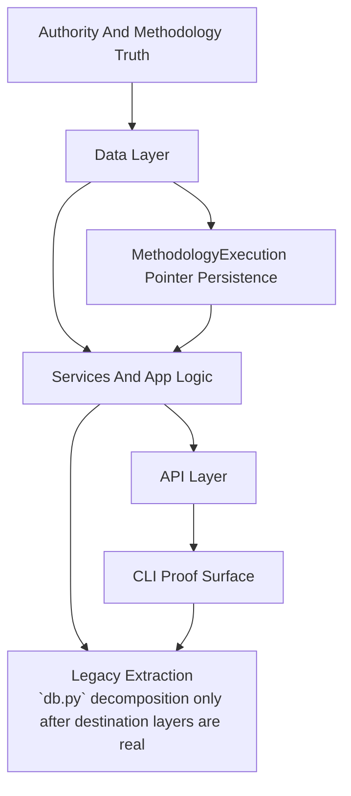

<!-- GENERATED CURRENT AUTHORITY COPY -->
<!-- Source: docs/3_Plan/2026-06-04-paa-python-build-sequence-from-structure.md -->
<!-- Generated-By: paa_docs.py sync-current -->
<!-- Do not edit this file directly; edit the dated source document and resync. -->

Title: PAA Python Build Sequence From Structure
Doc-ID: paa-python-build-sequence-from-structure
Doc-Type: design-note
Status: active
Lifecycle-Stage: plan
Created: 2026-06-04
Last-Edited: 2026-06-04
Author: Billy Weisberg
Repo: paa-platform
Component: PaaPythonBuildSequenceDetail
Domain: implementation-planning
Keywords: paa, python, build sequence, cli, api, services, data layer, methodology execution, dishka
Depends-On: 2026-06-04-paa-node-dependency-review.md, 2026-06-04-paa-python-target-structure-diagram.md, 2026-06-04-paa-python-methodology-workflow-and-build-sequence.md
Supersedes:
Superseded-By:
Canonical: true
Review-After: 2026-07-01
Summary: Derives the concrete Python build sequence for PAA from the simplified structure of data layer, services/app logic, API, CLI, and the governing methodology pointer.

# PAA Python Build Sequence From Structure

## Purpose

This note completes step 3 of the current Python implementation sequence:
- derive the build sequence from the corrected target structure

The build sequence in this note is driven by the simplified structural model:
- `cli -> api -> services/app logic -> data layer`

with the `MethodologyExecution` pointer governing valid transitions across the workflow.

## Core Rule

Build from persistent truth upward, and prove through `paa` as each slice becomes real.

That means:
1. define or normalize the data the system depends on
2. expose that data through the services/app-logic layer
3. expose those services through the API
4. exercise those operations through the CLI
5. only then extract legacy ownership such as `db.py`

## Governing Sequence

## Sequence Overview

### Sequence 0. Governing truth lock

Required before coding:
- methodology workflow note
- node dependency review
- target structure diagram
- Python realization profile
- terminology framework

Purpose:
- prevent building against stale assumptions

Current status:
- complete

### Sequence 1. Data-layer normalization for governed taxonomy and pointer truth

Build here first.

Primary targets:
- component taxonomy persistence
- realization-type persistence
- element-to-realization mapping persistence
- methodology execution persistence coverage
- repository reads/writes needed for CLI-driven management

Expected outputs:
- repository coverage for realization type list/add/update/show flows
- repository coverage for element-realization mapping list/add/update flows
- repository coverage for methodology pointer reads/writes where missing
- explicit identification of which responsibilities still live only in `db.py`

Rule:
- no direct SQL as the normal operating path for governed taxonomy management
- use repository-backed operations

CLI proof target:
- `paa` can list and mutate the governed realization taxonomy through real code paths

### Sequence 2. Services/app-logic layer for taxonomy and pointer-aware operations

Build here second.

Primary targets:
- application DTOs for taxonomy operations
- application service operations for realization types and mappings
- pointer-aware preflight or transition checks for the relevant command families

Expected outputs:
- one service/app-logic path for taxonomy management
- one service/app-logic path for pointer-aware command validation where applicable
- no new bypasses directly from CLI into repositories

Rule:
- the services layer is where policy/governance/domain meaning is interpreted
- the CLI and API must not own that logic

CLI proof target:
- `paa` command exercises the new service operations through the normal path

### Sequence 3. API exposure for the same operations

Build here third.

Primary targets:
- HTTP routes over the same service/app-logic operations
- no duplicate logic in controllers

Expected outputs:
- API routes for realization-type and mapping management
- request/response translation only at the controller layer

Rule:
- API is a transport surface, not a business owner

CLI proof target:
- `paa` can call through the runtime API client/proxy path where that command family is meant to use the API

### Sequence 4. CLI proof surface for governed taxonomy work

Build here fourth.

Primary targets:
- `paa` commands for realization type management
- `paa` commands for element-realization mapping management
- render proof-worthy outputs from the real system path

Expected outputs:
- governed taxonomy operations are performed by the system itself
- no hidden seed-script dependency for normal evolution

Rule:
- once a CLI path exists, use it as the main integration proof harness for later slices

CLI proof target:
- real add/list/show/update operations through `paa`

### Sequence 5. `db.py` extraction by destination ownership

Only after Sequences 1-4 are real.

Primary targets:
- move one coherent responsibility cluster at a time out of `db.py`
- relocate that cluster into the already-defined data layer destination

Expected outputs:
- smaller `db.py`
- explicit data modules with clear repository or low-level support ownership

Rule:
- do not extract a `db.py` function until its destination module and caller path are already defined by the structure above

CLI proof target:
- the relevant `paa` command still works after each extraction slice

### Sequence 6. Runtime and producer continuation against the same structure

After the taxonomy and data-layer foundation is real, continue:
- producer derivation work
- component realization work
- runtime execution work
- verification and acceptance work

Rule:
- all of those must continue to use the same stack:
  - data layer
  - services/app logic
  - API
  - CLI proof surface

## Immediate Ordered Build List

The next concrete coding sequence should be:

1. inspect and extend `repositories/component_design` for any missing realization-type and mapping operations
2. inspect and extend `repositories/methodology_execution` only where pointer operations needed by the new CLI path are missing
3. add application DTOs for realization-type and mapping operations
4. add service/app-logic operations for those flows
5. add API routes over those operations
6. add `paa` CLI commands to drive those operations
7. prove the new commands through the real CLI path
8. then start extracting the first matching responsibility cluster from `db.py`

## Dishka Placement In The Sequence

Dishka belongs after the service/app-logic boundaries for these operations are clear.

That means:
- do not start by introducing Dishka into taxonomy work
- first define the real data and service boundaries
- then let Dishka compose those boundaries at the API and CLI edges

Practical placement:
- optional during Sequence 3 if the API composition starts getting noisy
- more useful by Sequence 4 when CLI and API are both wiring the same operations

## Non-Negotiable Proof Rule

Each sequence must be proven through the real system surface as soon as that surface exists.

Preferred proof order:
1. `paa` CLI path
2. HTTP/API path where relevant
3. `basedpyright`
4. lint and compile checks

Do not treat helper-only unit tests as sufficient proof of this sequence.

## Output Of Step 3

After this step, the Python PAA plan has:
- the dependency review
- the target structure diagram
- the pointer-aware workflow note
- a concrete build order derived from that structure

That is enough to begin step 4:
- build and prove through `paa` as we go
