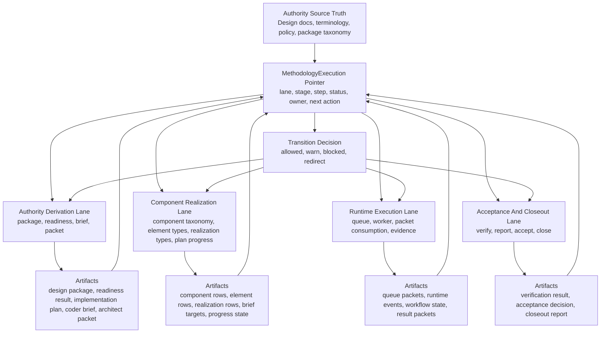
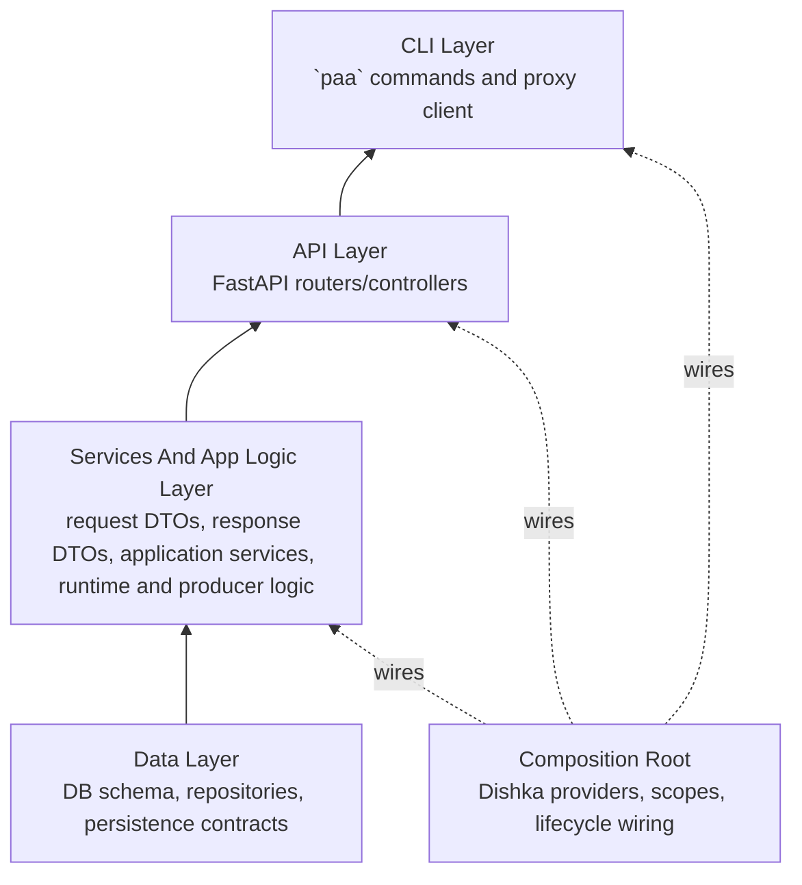

<!-- GENERATED CURRENT AUTHORITY COPY -->
<!-- Source: docs/3_Plan/2026-06-04-paa-python-methodology-workflow-and-build-sequence.md -->
<!-- Generated-By: paa_docs.py sync-current -->
<!-- Do not edit this file directly; edit the dated source document and resync. -->

Title: PAA Python Methodology Workflow And Build Sequence
Doc-ID: paa-python-methodology-workflow-and-build-sequence
Doc-Type: design-note
Status: active
Lifecycle-Stage: plan
Created: 2026-06-04
Last-Edited: 2026-06-04
Author: Billy Weisberg
Repo: paa-platform
Component: PaaPythonBuildSequence
Domain: implementation-planning
Keywords: paa, python, methodology, workflow, build-sequence, dependency-graph, cli, fastapi, dishka
Depends-On: 2026-05-30-paa-methodology-lane-and-command-model.md, 2026-05-30-paa-methodology-execution-state-model.md, 2026-06-02-paa-target-package-map.md, 2026-06-04-paa-python-realization-profile.md, 2026-06-04-paa-language-profile-terminology-framework.md
Supersedes:
Superseded-By:
Canonical: true
Review-After: 2026-07-01
Summary: Defines the Python-oriented PAA methodology workflow, dependency-aware build sequence, CLI-first integration proof path, and the constrained role of Dishka in system composition.

# PAA Python Methodology Workflow And Build Sequence

## Purpose

This note resets the Python implementation plan around the actual PAA methodology workflow instead of isolated refactor slices.

The build order must be driven by:
- methodology workflow order
- dependency order
- target package structure
- CLI-first integration proof

It must not be driven by:
- local convenience
- isolated refactor appetite
- ad hoc CRUD surface work
- speculative DI abstractions

## Core Decision

For the Python implementation of PAA, build in this order:
1. methodology workflow map
2. dependency graph and node review
3. package and module ownership decomposition
4. target structure update including data, services/app logic, API, and CLI layers
5. build sequence derived from dependencies and workflow order
6. implementation in that sequence
7. integration proof through `paa` as the system surface
8. extraction of legacy ownership from `db.py` into the new structure only after the destination structure is defined

The governing control record for this workflow is the persisted `MethodologyExecution` pointer.

That pointer must be treated as the system answer for:
- where this execution thread is in the methodology
- which lane is active
- which stage is active
- which step is active
- who owns the next action
- what command family is valid now
- what transition is allowed, blocked, or waiting

The Python build and runtime surfaces must increasingly operate against this pointer rather than inferring current state from scattered artifacts alone.

## Governing Pointer Model

The methodology workflow is not only conceptual.
It is governed by the persisted `MethodologyExecution` thread defined in:
- `/Users/billyweisberg/Repos/billyweisberg/paa-platform/docs/2_Design/2026-05-30-paa-methodology-execution-state-model.md`
- `/Users/billyweisberg/Repos/billyweisberg/paa-platform/docs/2_Design/2026-05-30-paa-methodology-lane-and-command-model.md`

The minimum governing fields are:
- `lane`
- `stage`
- `step`
- `status`
- `current_owner_role`
- `next_action_key`

Supporting records:
- `MethodologyExecutionEvent`
- `MethodologyExecutionBinding`
- `MethodologyExecutionProjection`

Rule:
- the pointer is the canonical answer to `where are we?`
- artifacts such as design packages, briefs, plans, packets, workflow state, and runtime evidence remain specialized truth
- those artifacts do not replace the pointer

## Methodology Workflow

The workflow below is the implementation-driving process model.

## Pointer Transition Rule

Every meaningful CLI or API operation should eventually do one or both of these:
- read the `MethodologyExecution` pointer before acting
- update or append pointer state after a valid transition

This means:
- preflight is pointer-aware
- command-family validity is pointer-aware
- build sequencing is pointer-aware
- runtime transition and acceptance logic are pointer-aware

If a path does not yet consult the pointer, that path should be treated as transitional.

## Implementation Dependency Model

The Python system should be built from the bottom of governed truth upward.

## Target Layer Responsibilities

### Data layer

Owns:
- schema truth
- repository operations
- taxonomy persistence
- DB-facing query and mutation boundaries
- persisted methodology execution truth

Examples:
- component tables
- component element tables
- component realization tables
- implementation-plan persistence
- methodology execution persistence

### Services and app logic layer

Owns:
- request and response DTOs
- orchestration of repositories, policy, and runtime collaborators
- operation boundaries used by CLI and HTTP
- pointer-aware transition coordination

Examples:
- taxonomy management operations
- brief generation operations
- plan progress operations
- queue and runtime operations
- methodology-execution state reads and writes

### API layer

Owns:
- FastAPI transport adaptation only
- controller-to-application translation
- request parsing and response shaping

Does not own:
- business logic
- persistence logic
- domain truth

### CLI layer

Owns:
- `paa` command grammar
- CLI argument normalization
- output rendering
- client or proxy invocation into the system
- pointer-visible operator flow

Does not own:
- producer logic
- runtime logic
- taxonomy logic
- persistence logic

Important rule:
- the CLI is not just a launcher
- it is the main integration proof surface for whether the pointer-governed methodology is actually operable

## Dishka Placement

Dishka is a Python implementation tool, not a methodology concept.

Dishka should be used only in the composition root role.

Approved responsibilities:
- construct application services
- provide repository and resource lifecycles
- wire FastAPI request and app scopes
- wire CLI command composition
- manage DB/resource finalization where appropriate

Not approved:
- replacing package ownership rules
- substituting for DTO contracts
- becoming the place where business logic lives
- hiding unclear architectural ownership behind container wiring

### Dishka adoption point in the build sequence

Dishka should be introduced after:
- the methodology workflow map is explicit
- package ownership is defined
- the target structure is updated
- the first data and service boundaries are known

That means Dishka belongs in the composition stage of the build, not the discovery stage.

## Build Sequence

### Phase 1. Workflow and dependency mapping

Build outputs:
- methodology workflow map
- explicit `MethodologyExecution` pointer placement in that workflow
- dependency node review
- Python ownership decomposition
- updated target structure including data layer, services/app logic layer, API layer, and CLI layer

Proof:
- governed docs only

### Phase 2. Data layer normalization

Build outputs:
- component taxonomy audit
- realization taxonomy extension for Python-valid realizations
- repository coverage for component, element, realization, and mapping operations
- repository coverage for methodology execution pointer reads and writes where missing
- initial extraction targets identified inside `db.py`

Proof through CLI:
- `paa` commands for listing and mutating governed taxonomy truth
- no ad hoc SQL as the normal operating path

### Phase 3. Domain and application operation surfaces

Build outputs:
- DTOs for taxonomy operations
- application services for taxonomy management and derivation operations
- explicit operation boundaries for producer and component-realization flows
- explicit pointer-aware preflight and transition surfaces

Proof through CLI:
- `paa` commands execute the new application operations against the real data layer

### Phase 4. Composition and transport wiring

Build outputs:
- Dishka providers and scopes
- FastAPI controller wiring through Dishka
- CLI composition through Dishka where it improves lifecycle management
- pointer-aware service composition that does not bypass methodology state

Constraint:
- Dishka must wire the structure already chosen
- Dishka must not define the structure

Proof through CLI:
- `paa` commands route through the intended client, API, controller, application, and repository path where appropriate

### Phase 5. `db.py` extraction

Build outputs:
- move one responsibility cluster at a time out of `db.py`
- relocate query and mutation helpers into the real data-layer modules already defined by the target structure
- keep methodology execution persistence and non-pointer data concerns distinct while extracting

Constraint:
- do not extract from `db.py` until the destination module is already defined by the target structure and dependency model

Proof through CLI:
- each extraction slice must preserve the relevant `paa` command path

### Phase 6. Runtime and verification continuation

Build outputs:
- runtime lane wiring continues against the clarified data and application layers
- verification and acceptance surfaces continue against the same governed structure
- the runtime path increasingly reads and advances the persisted pointer instead of inferring flow from artifacts alone

Proof through CLI:
- runtime and producer commands continue to execute through `paa`
- validation remains integration-first

## Immediate Implementation Rule

The next coding work should follow this order:
1. update the workflow and dependency diagrams
2. make the `MethodologyExecution` pointer explicit in those diagrams and the target structure
3. update the target structure to include the data layer and services/app logic layer explicitly
4. identify the first Python realization types to add to governed taxonomy
5. expose those operations through `paa`
6. only then begin extracting the relevant ownership from `db.py`

## Non-Negotiable Proof Rule

As the Python system is built, test through the CLI as each slice lands.

Preferred proof order:
1. `paa` integration path
2. pointer-aware CLI preflight and transition proof
2. HTTP integration path where relevant
3. `basedpyright`
4. lint and compile checks

Do not treat helper-only unit tests as proof of architecture.
